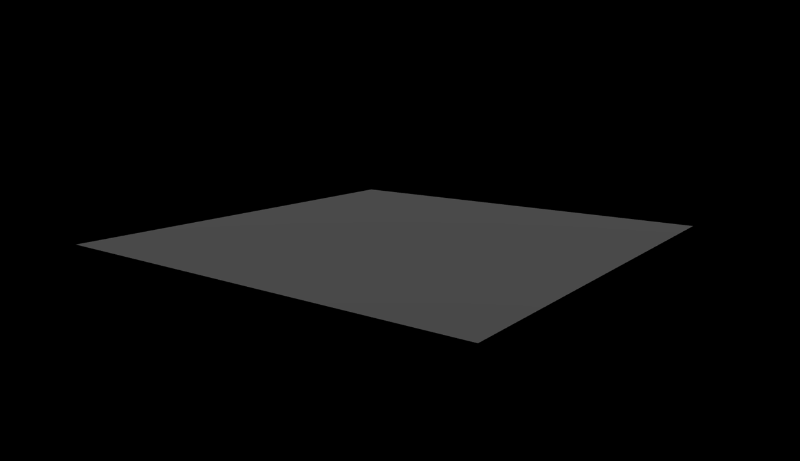

# Hosting 3D models on a Website

The world of 3D modelling has evolved a lot since the early days of AutoCAD. With improved graphics processing, compression techniques, and web engines being more powerful than ever, we can now view entire 3D models directly in the browser. With this improvement in web computation, the door is open to improving the performance of 3D modelling over the internet. This could help address a significant drawback to the current workflow for 3D modelling, namely file compatibility.

## The GLTF file type

The gltf file format is an open standard for the efficient transmission and loading of 3D scenes and models by engines and applications. gltf model are lightweight and can be quickly openend and viewed over a browser. Luckily Blender software allows for the export of 3D models and scenes to .gltf file format, which is what I shall be using for this testing purpose. I have a model `piperacks_lod-100.glb` which I shall attempt to load to a scene in the browser as a first step for further experimentation. Quick note: The .glb file extension is just a binary version of the gltf file format, it is more condensed and contains both the scene, as well as the materials, mesh details etc. It should function exactly the same as the gltf file.

## Setting up index.html

We need a boilerplate index.html file to serve as our root for the website. I attach here the basic code template which I derived from Dan Greenheck (Check out their YouTube channel here. https://www.youtube.com/@dangreenheck)

```html
<!DOCTYPE html>
<html lang="en">
    <head>
        <meta charset="utf-8">
        <title>piperacks</title>

        <link rel="stylesheet" href="public/index.css">
        
        <script async src="https://unpkg.com/es-module-shims@1.6.3/dist/es-module-shims.js"></script>
        <script type="importmap">
            {
                "imports":{
                    "three":"https://unpkg.com/three@v0.153.0/build/three.module.js",
                    "three/addons/": "https://unpkg.com/three@v0.153.0/examples/jsm/"
                }
            }
        </script>
    </head>
<body>
  <div id="heading">
    <h1>piperacks</h1>
    <div class="border"></div>
  </div>
  <script type="module" src="./scripts/main.js"></script>
</body>
</html>
```

I need to make a few imports from three.js which I download to this instance for the time being. These are found in the </script> tag of the metadata. I call a javascipt file called main.js in my main document folder. This file is saved in `/scripts/main.js`.

And the rest is just text. Opening the `index.html` file will open a localhost version of my webpage which for now, only contains a single line of text saying 'piperacks'.

## main.js

`main.js` is a javascript file containing the code to set up the scene. Thes main scene contents are created using the `three.js` library. 

Here are my imports.

```js
import * as THREE from 'three';
import { GLTFLoader } from 'three/addons/loaders/GLTFLoader.js';
import { OrbitControls } from 'three/addons/controls/OrbitControls.js'
```

The concept behind using `three.js` is to create a scene. This involves the camera, background, the model and the lighting.

Lets start by loading a camera and some lights to the scene. This is the code to load a camera.

```js
const camera = new THREE.PerspectiveCamera(45, window.innerWidth / window.innerHeight, 1, 1000);
camera.position.set(40,20,50);
```

And here is the code to set up the lighting.

```js
const light_1 = new THREE.DirectionalLight(0xffffff, 1);
light_1.position.set(150, 150, 150);
scene.add(light_1);

const light_3 = new THREE.DirectionalLight(0xffffff, 1);
light_3.position.set(-150, -150, -150);
scene.add(light_3);
```

There used to be a `light_2` in the scene, but I commented it out to experiment a little more with it's effects. The lighting needs some work.

Here is the code to set up my background, which in this case is just a black screen with a basic rectangle.

```js
const groundGeometry = new THREE.PlaneGeometry(60, 60, 2, 2);
groundGeometry.rotateX(-Math.PI /2);
const groundMaterial = new THREE.MeshStandardMaterial({
    color:  0x555555,
    side: THREE.DoubleSide
});

const groundMesh = new THREE.Mesh(groundGeometry, groundMaterial);
scene.add(groundMesh);
```

If we see the scene now, this is what it looks like.



Let's add the model and see what it looks like.


This is the code for the `loader()` object which loads the model to the scene.

```js
const loader = new GLTFLoader().setPath('models/piperack/');
loader.load('piperacks_lod-100.glb', (gltf) => {
    const mesh = gltf.scene;
    mesh.position.set(0,0,0);
    scene.add(mesh);
})
```

We need to also enable user movement controls. This can be done using the following code.

```js
const controls = new OrbitControls(camera, renderer.domElement);
controls.enableDamping = true;
controls.enablePan = true;
controls.minDistance=5;
controls.maxDistance=100;
controls.minPolarAngle=0.5;
controls.maxPolarAngle=1.5;
controls.autoRotate=false;
controls.target = new THREE.Vector3(0,1,0);
controls.update()
```

Perfect. We can now pan and zoom around the model.

The last step is to add the `animate()` function which is essentially a loop which will run over the page. For now, it loads the scene, and only responds to user zoom and movement.

```js
function animate() {
    requestAnimationFrame(animate);
    controls.update();
    renderer.render(scene, camera);
};

animate();
```

Later iterations of this project will involve listening for user interaction with individual model elements, like clicking on a selected object. I would also like to prove a concept where 2 different versions of the model are loaded to memory, and depening on the zoom level of the user, the engine dynamically switches between the 2.

## Benefits

Opening the index.html file in a browser now shows us our scene. An important thing to note is that this model is small, and so navigating around it is fairly easy. For the time being, the funcitonality of the model is limited to only viewing, but just by being able to view this model in a web environment opens the door to so many benefits.

1) GLTF provides the ability to open 3D models on a webpage, and is an open source file format. This means once files are converted to this format, they can be shared extremely easily, and converted from proprietary format can be done, perhaps with some use intermediary steps.

2) GLTF files can be converted into plain text, whereby each object in the scene is listed in `json` format. This allows the computer to navigate through every object in the scene, potentially allowing users to control which objects to see, and dynamically change their color.

3) Offline view. Once the model has been loaded to memory, you can open the webpage and interact with it fully locally. You can verify this yourself by cloning this repo locally to your computer. Turn on airplane mode and double click the file `index.html`. The model should now open as you would see it on a webpage. This unlocks powerful possibilites, particularly interacting with the model in areas with poor internet connectivity like on site.

4) With majority of platform-based apps being built using Javascript, the compute capabilities in this domain will be around for the forseeable future. This means the infrastructure we build for viewing and sharing these models is (at least for now), future proof.

## Conclusion

We live in a world where moving data across the internet is increasingly becoming ever more powerful. 3D models by virtue, have large file sizes and not a lot of widespread adoption in web based applications. However, taking advantage of these internet data pipelines can help streamline the creation and sharing of these files, such that they become more normalized and as easy to open as a PDF.

In this paper, I attempt to host a 3D model on a web server to measure it's performance capabilites and optimize it wherever I can for efficiency. In future work, I will explore the possibility of interacting with the model, dynamically changing attributes within an object, editing an object's material properties (like transparency, color etc.), and I will look into the idea of fitting this within a data retrieval pipeline.

You can navigate to this website https://suryashch.github.io/3d_modelling/ to see a live version of my current hosted model. I might edit this over time.

### Credits

1) Dan Greenheck (https://www.youtube.com/@dangreenheck)