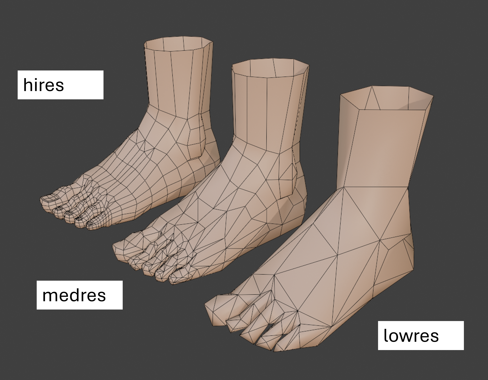
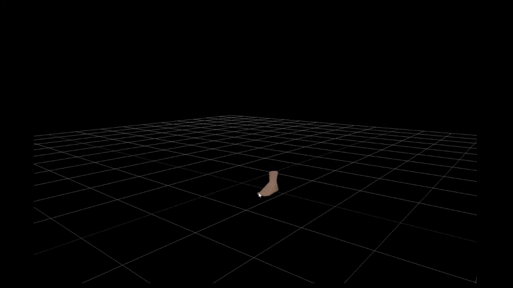
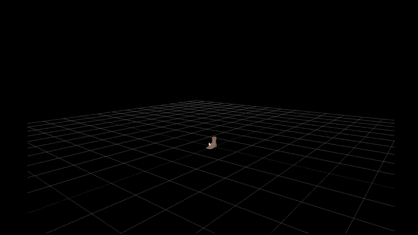

# Basic LOD Control with ThreeJS

I wish to use this space to understand the basics of loading a LOD object to a ThreeJS scene. `Three.LOD` is a library which provides the tools necessary to load multiple versions of a mesh and determine distance thresholds at which each mesh is active in the scene. This dynamic swithching allows you to define a low quality mesh for when the user is far away from the camera, and a high quality mesh for when the user zooms in.

## LOD Basics

In this project, I work with our standard `human-foot-in-blender` model. I have applied a decimate modifier to create two copies of the mesh with compression levels of 0.4 (medium resolution) and 0.1 (low resolution) respectively.

Here is what the three models look like.



Let's start by setting the scene. We add `lights`, `cameras`, `backgrounds` and `controls` as previously explained [here](analysis_threejs.md).

LOD containers work by storing different versions of the same mesh and implementing distance calculations to determine which one needs to be active. This requires passing both a mesh, and a distance threshold to the LOD object. We do so using the `LOD.addlevel()` method.

```js
const lod = new THREE.LOD()

lod.addlevel(hires_mesh, 0)
lod.addlevel(lowres_mesh, 10)
```

In the code block above, we define our LOD object, and assign two different meshes to be activated based on the distance. If the user is betweenm 0-10 units from the object, the `hires` mesh is activated, whereas if the user is further than 10 units from the object, it switches to the `lowres` version.

Since our `glb` file contains both the high and low res meshes in the same file, we need to do some logical pre-work. We create three arrays- one to store the high res mesh, one for the medium res mesh and one for the low res mesh.

```js
const hires_meshes = []
const medres_meshes = []
const lowres_meshes = []
```

We then traverse through the scene and add meshes to these arrays depending on the object's name. If the name ends with `hires`, add to `hires_meshes` and so on.

```js
gltfScene.traverse((child) => {
    if (child.isMesh) {
        if (child.name.endsWith("hires")) {
            hires_meshes.push(child)
        } else if (child.name.endsWith("medres")) {
            medres_meshes.push(child)
        } else {
            lowres_meshes.push(child)
        }
    }
})
```

We now have three arrays containing meshes for our different levels. We can assign these to our LOD object as follows.

```js
hires_meshes.forEach((mesh) => {
    lod.addLevel(mesh, 0)
})

medres_meshes.forEach((mesh) => {
    lod.addLevel(mesh, 5)
})

lowres_meshes.forEach((mesh) => {
    lod.addLevel(mesh, 10)
})
```

In the code block above, we define our switching points to be 5 units for the `medres` mesh and 10 units for the `highres` mesh.

Finally, we add the `lod` object to our scene.

```js
scene.add(lod)
```

Here are the final results. We observe as we zoom in, the active model switches between the low, medium and high resolution versions.



## Copying Properties

An important next step is to access the properties of the main object. I would like to specifically access the `location`, `rotation`, and `scale` attributes of the HQ mesh, to apply to the lower quality meshes. This way, when I zoom in, the meshes will appear as one object that gets progressively more detailed.

I append the code block above by first, creating new variables for the `location`, `rotation`, and `scale` attributes of the HQ mesh, then editing the traversal loop, and editing the `lod.addLevel` sction. 

Here are the new variables, `hires_pos`, `hires_rot` and `hires_scale` which track the position, rotation and scale of the HQ mesh respectively.

```js
let hires_pos = null
let hires_rot = null
let hires_scale = null
```

Here is the new traversal loop.

```js
gltfScene.traverse((child) => {
    if (child.isMesh) {        
        
        if (child.name.endsWith("hires")) {
            hires_pos = child.position
            hires_rot = child.rotation
            hires_scale = child.scale
            
            hires_meshes.push(child)
        } else if (child.name.endsWith("medres")) {
            medres_meshes.push(child)
        } else {
            lowres_meshes.push(child)
        }
    }
})
```

The main addition here is that for the `hires` mesh, I save the object's position, rotation and scale attributes to our variable.

Now, when loading these LOD's to the scene, I need to manually change the position of each one to be the extracted attributes from the HQ model.

```js
hires_meshes.forEach((mesh) => {
    lod.addLevel(mesh, 0)
})

medres_meshes.forEach((mesh) => {
    mesh.position.copy(hires_pos)
    mesh.rotation.copy(hires_rot)
    mesh.scale.copy(hires_scale)
    lod.addLevel(mesh, 5)
})

lowres_meshes.forEach((mesh) => {
    mesh.position.copy(hires_pos)
    mesh.rotation.copy(hires_rot)
    mesh.scale.copy(hires_scale)
    lod.addLevel(mesh, 10)
})
```

Finally, we add our model to the scene.

```js
scene.add(lod)
```

Here are the new results.



The results are even clearer if we change the color of the base mesh. Here I set the low quality mesh to be red, the med quality mesh to be blue and the default hq mesh to be skin colored.


We can clearly see that the active LOD model is dynamically being switched, but by syncing the positions of the mesh we create the illusion that the model is getting more detailed as we zoom in.


