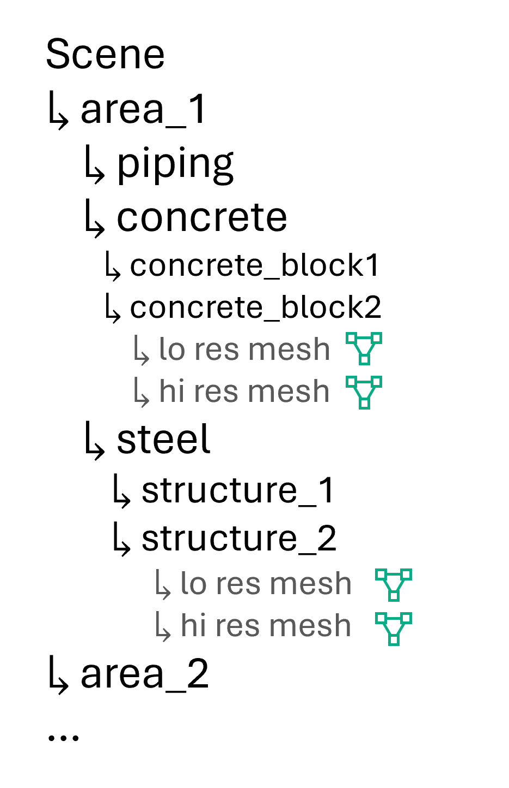

# Understanding LOD Compression with Blender API (bpy)

Blender's API allows you to modify objects in a scene in bulk. This is useful for BIM models that tend to have lots of objects. I would like to use the API to eventually build a pipeline that compresses our model down into lower `Level of Detail` (LOD), such that our rendering engine can swap between low res, med res and hi res versions of the same object on the fly. To do so, we will be using the Blender API library `bpy`.

This work is built on work done by (Mina Pechaux).

## Basic Scripting With bpy

This is how to access all objects in a scene

```py
import bpy

for obj in bpy.data.objects:
    if obj.type == 'MESH':
        print(obj.name)
```

Here we add the check `if obj.type == 'MESH'` to only list objects in our scene. This will not include items like lights or cameras. The output will be printed to console as a list of all objects in the scene.

Here is how you can access a `collection` (group of objects) in a scene:

```py
collection = bpy.data.collections.get('Collection')

if collection:
    for obj in collection.objects:
        print(obj.name)
```

In this code, we print out all objects' names within our specified collection.

Now, let's access specific data attributes within our object.

```py
collection = bpy.data.collections.get('Collection')

if collection:
    for obj in collection.objects:
        print(obj.location)
```

In this code block, we access the `location` attribute of our object. This will print out the vector coordinates of the center of our object.

Let's try navigating through every `object` in our scene and duplicating it. This process involves first looping through every `object` in the `collection` and copying its `mesh` data. In Blender, `objects` act as containers that store `data` which is typically a mesh.

```py
import bpy
from bpy import context

collection = bpy.data.collections.get('test')

if collection:
    for obj in collection.objects:
        if obj.type == 'MESH':
            me = obj.data.copy()
```

Once we have the mesh copied, we need to copy the object's properties, like it's name, rotation and scale. Certain transformations may be saved on the global scale too so we should account for those.

Appending to the script above:

```py
if collection:
    for obj in collection.objects:
        if obj.type == 'MESH':
            me = obj.data.copy()
            me.name = f"{obj.data.name}_copy"
            
            new_ob = bpy.data.objects.new(f"{obj.name}_copy", me)
            
            new_ob.matrix_world = obj.matrix_world
```

`obj.matrix_world` controls the global rotation and transformation settings. One last step is to now add this model to the scene. Here is the final script:

```py
import bpy
from bpy import context

collection = bpy.data.collections.get('test')

if collection:
    for obj in collection.objects:
        if obj.type == 'MESH':
            me = obj.data.copy()
            me.name = f"{obj.data.name}_copy"
            
            new_ob = bpy.data.objects.new(f"{obj.name}_copy", me)
            
            new_ob.matrix_world = obj.matrix_world
            
            context.scene.collection.objects.link(new_ob)
```

Looking at the results, we see two versions of our object.


An important consideration. We cannot save our newly created object to the same collection, as we will run into an infinite loop. Blender will continue looping through the newly created objects in the scene. Here I am just saving the new objects to the default scene tree.


## Adding Modifiers to Meshes

Modifiers like `decimate` are basically instructions that the engine applies to specific meshes to modify them in a certain way. These modifiers do not affect the object in-place, i.e. the original mesh data is retained. On render, the engine applies these modifications and the resulting mesh can be seen in the scene. These instructions are saved to an internal Blender data structure known as a `dependency graph`.

In order to apply a modifier to a mesh, we must first define it, and then update the `dependency graph` to get the final result. Let's use this workflow along with the previously defined ones to first apply a modifier on an object, then save it's evaluated result to another mesh. This way we can essentially create a duplicate of our object with only a `decimate` modifier applied to it.

I start by defining a `apply_decimate_modifier()` function as follows:

```py
def apply_decimate_modifier(obj, depsgraph, ratio=0.4):
    mod = obj.modifiers.new(name='Decimate', type="DECIMATE")
    mod.ratio = ratio
    
    depsgraph.update()
    
    obj_eval = obj.evaluated_get(depsgraph)
    
    me = bpy.data.meshes.new_from_object(
            obj_eval, 
            preserve_all_data_layers=True, 
            depsgraph=depsgraph
        )
    
    me.name = f"{obj.data.name}_copy"
    
    obj.modifiers.remove(mod)
    return me
```

Here we first define our modifier object `mod`. It's important to note that this modifier is linked specifically to our passed object. We can apply other modifiers on this object if needed, but they will be limited in scope only to this object.

Once the modifier is defined, we call `depsgraph.update()` to re-render the scene (without UI updating), and get our evaluated object from the end of the `depsgraph`. The resulting mesh data is copied and saved to a variable `me`, and given a name `f{obj.name}_copy`.

As a last step, we remove the `decimate` modifier from our original object, as a cleanup.

We return the newly created mesh back to the main function.

Here is what the main loop looks like:

```py
dg = bpy.context.evaluated_depsgraph_get()
collection = bpy.data.collections.get('test')

if collection:
    for obj in collection.objects:
        if obj.type == 'MESH':
            me = apply_decimate_modifier(obj, dg, 0.4)
            
            new_ob = bpy.data.objects.new(f"{obj.name}_copy", me)
            
            new_ob.matrix_world = obj.matrix_world
            
            context.scene.collection.objects.link(new_ob)
```

A few new considerations. We define our `dependency graph` as `dg`, and pass this into the `apply_decimate_modifier` function. The rest of the script works mainly the same as shown in previous sections.

Another key consideration, `obj_eval` only exists in memory and needs to be linked to the scene as a last step. That's where these two code lines come into play:

```py
new_ob = bpy.data.objects.new(f"{obj.name}_copy", me)
            
context.scene.collection.objects.link(new_ob)
```

The last few lines of the main loop, these code blocks, first create a new object to save our newly created mesh, then links the object to the main scene tree such that its visible in the scene.

Here are the results of this test run.


## Data Management

An important consideration here will be to manage our data accurately. We want our scene tree to be navigable by both humans and computers. The goal with this tree will be to mimic what the `selection tree` may look like in a BIM project, except with two meshes at the leaf node- one for high resolution , one for low. Here is what the ideal tree will look like:

{width=30%}

For testing purposes, let's try to simplify it down to this. Still navigable, at the expense of being slightly less readable.

{width=30%}

Test


### References

Mina Pecheux: https://www.youtube.com/@minapecheux
