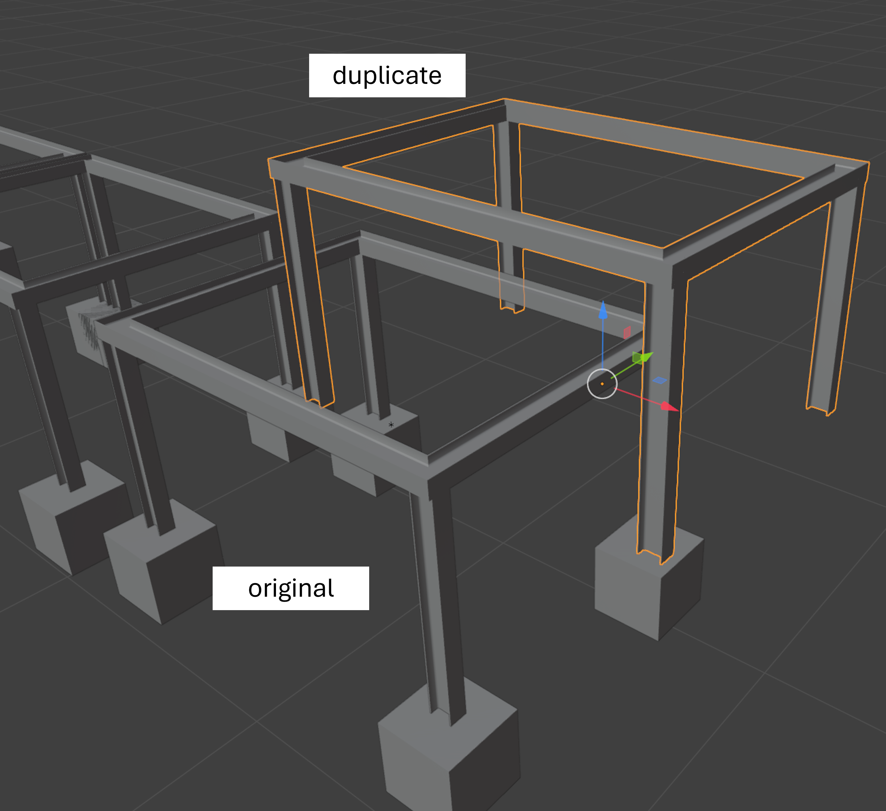

# Understanding LOD Compression with Blender API

Blender's API allows you to modify objects in a scene in bulk. This is useful for BIM models that tend to have lots of objects. I would like to use the API to eventually build a pipeline that compresses our model down into lower `Level of Detail` (LOD), such that our rendering engine can swap between low res, med res and hi res versions of the same object on the fly. To do so, we will be using the Blender API library `bpy`.

This work is built on work done by (Mina Pechaux).

## Basic Scripting With bpy

This is how to access all objects in a scene

```py
import bpy

for obj in bpy.data.objects:
    if obj.type == 'MESH':
        print(obj.name)
```

Here we add the check `if obj.type == 'MESH'` to only list objects in our scene. This will not include items like lights or cameras. The output will be printed to console as a list of all objects in the scene.

Here is how you can access a `collection` (group of objects) in a scene:

```py
collection = bpy.data.collections.get('Collection')

if collection:
    for obj in collection.objects:
        print(obj.name)
```

In this code, we print out all objects' names within our specified collection.

Now, let's access specific data attributes within our object.

```py
collection = bpy.data.collections.get('Collection')

if collection:
    for obj in collection.objects:
        print(obj.location)
```

In this code block, we access the `location` attribute of our object. This will print out the vector coordinates of the center of our object.

Let's try navigating through every `object` in our scene and duplicating it. This process involves first looping through every `object` in the `collection` and copying its `mesh` data. In Blender, `objects` act as containers that store `data` which is typically a mesh.

```py
import bpy
from bpy import context

collection = bpy.data.collections.get('test')

if collection:
    for obj in collection.objects:
        if obj.type == 'MESH':
            me = obj.data.copy()
```

Once we have the mesh copied, we need to copy the object's properties, like it's name, rotation and scale. Certain transformations may be saved on the global scale too so we should account for those.

Appending to the script above:

```py
if collection:
    for obj in collection.objects:
        if obj.type == 'MESH':
            me = obj.data.copy()
            me.name = f"{obj.data.name}_copy"
            
            new_ob = bpy.data.objects.new(f"{obj.name}_copy", me)
            
            new_ob.matrix_world = obj.matrix_world
```

`obj.matrix_world` controls the global rotation and transformation settings. One last step is to now add this model to the scene. Here is the final script:

```py
import bpy
from bpy import context

collection = bpy.data.collections.get('test')

if collection:
    for obj in collection.objects:
        if obj.type == 'MESH':
            me = obj.data.copy()
            me.name = f"{obj.data.name}_copy"
            
            new_ob = bpy.data.objects.new(f"{obj.name}_copy", me)
            
            new_ob.matrix_world = obj.matrix_world
            
            context.scene.collection.objects.link(new_ob)
```

Looking at the results, we see two versions of our object.




## Adding Modifiers to Meshes


### References

Mina Pecheux: https://www.youtube.com/@minapecheux
