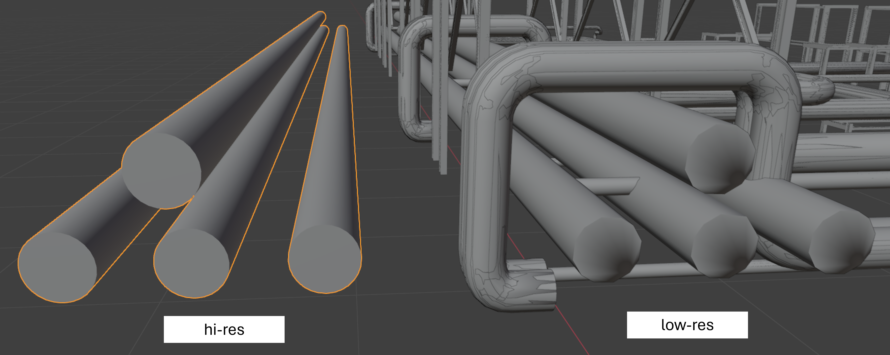
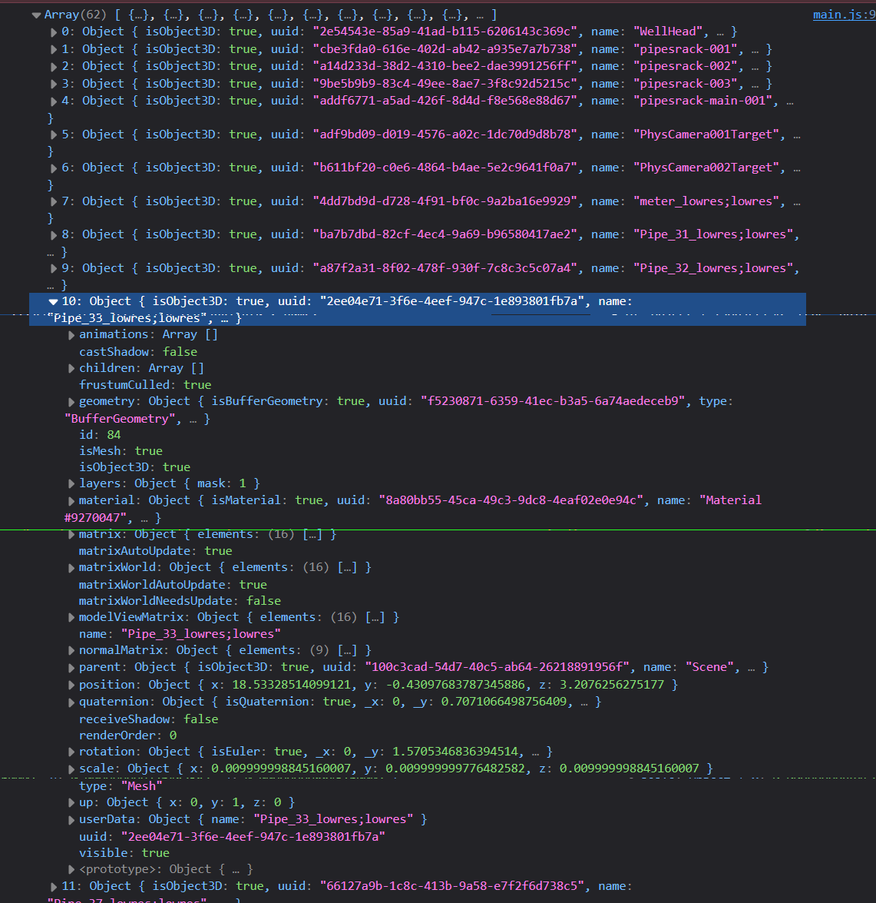
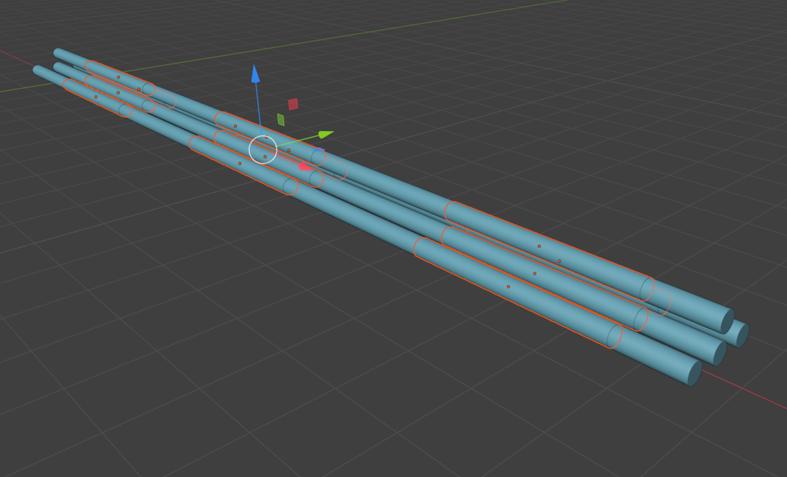
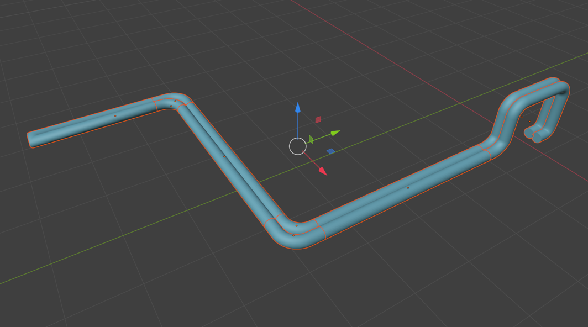
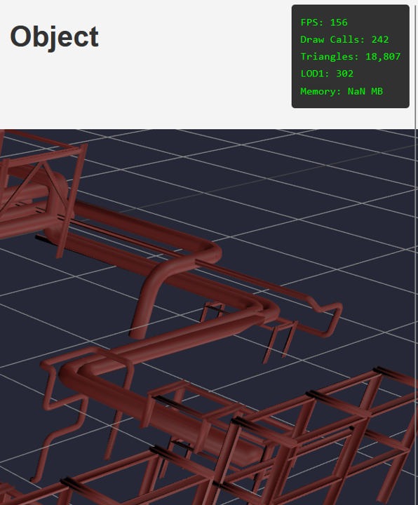
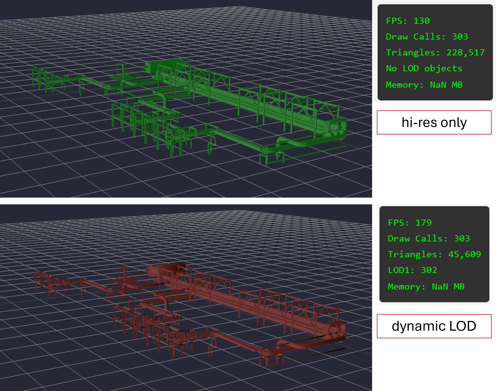
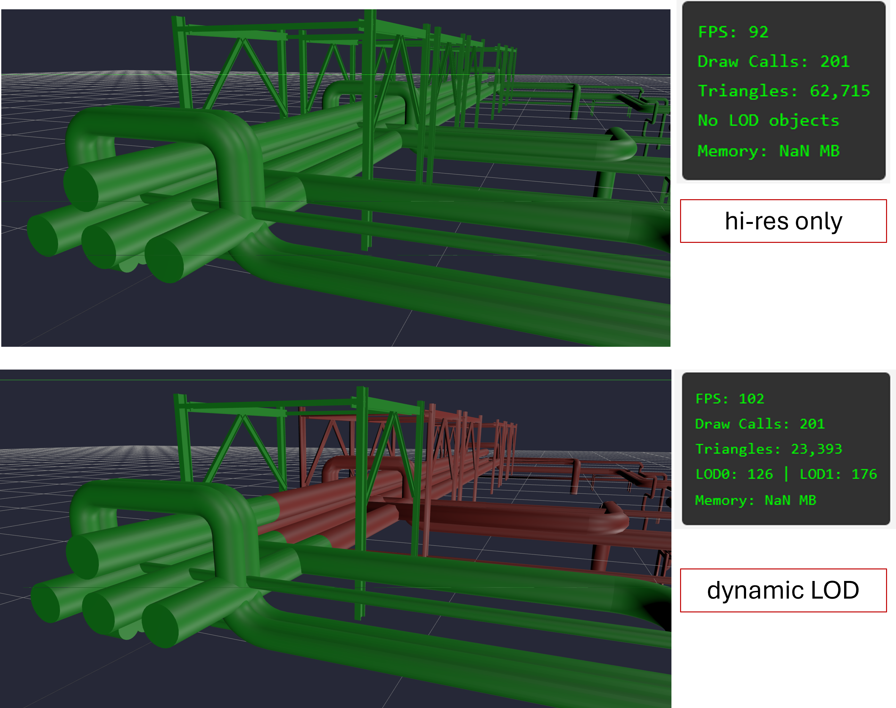
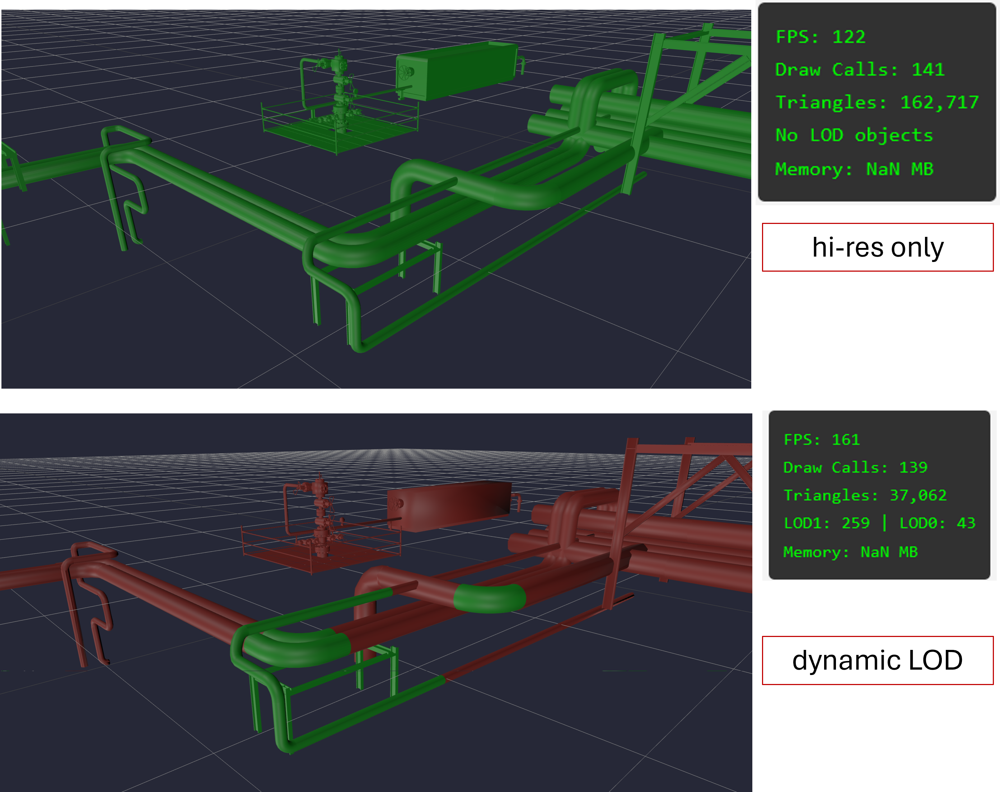

# Per Object LOD Control with ThreeJS

Threejs provides useful tools for viewing 3D models in a web environment. One of those tools is `three.LOD`, which allows you to define multiple versions of your mesh, and switch between them depending on the camera's distance from the object. This way, objects that are far away from the user can load in low-resolution, easing the strain on the GPU. When the user zooms into an object, the LOD controller dynamically swaps the low-res mesh to high resolution again. This type of switch is called LOD (Level of Detail) switching.

Let's see if we can implement this using our `piperacks` model.

## Setting the Scene

The model we are working with is a [GLTF](analysis_threejs.md) export from `Blender`. Using the [Decimate](../reducing-mesh-density/analysis_decimate.md) technique, we were able to superpose two versions of the model on top of one another, one `lowres` and one `highres`. The `DecimateRratio` being used here is 0.4. This is illustrated in the figure below. The object has been moved to the side to show the superposition.



When defining the LOD objects, we will need a way to accurately identify the same object's low and hires meshes. The structure of the data here is key, as this is what will give us the ability to traverse the model's different objects. I have specifically defined the naming convention for this 3D model, wherein for both the low and high resolution of mesh, the object name is the same, the only appendage is the string `hires` and `lowres`.

First, we need to get comfortable with navigating around our 3D model file. We can view what the glb file looks like by outputing its contents to the console. Here I show the basic code needed, to view the contents of our glb file.

```js
const loader = new GLTFLoader();

loader.load('../models/piperack/piperacks_lod_working_1.glb', (gltf) => {
    console.log(gltf.scene)
})
```

We define our `loader` object which is an instance of the `GLTFLoader()` class. We then load our model by providing the full path to the `loader.load()` function. We have the opportunity to pass a callback function, to which we pass our row context as `gltf`. Calling `console.log()` will print stuff to the browser's console window. This can be accessed by right clicking on the webpage and selecting `inspect`.

Calling this `gltf.scene` object will print the contents of the binary file to the sceen. I show here a screenshot of what this might look like.


We can go one step down, and view the children of our high level `scene` object.

```js
loader.load('../models/piperack/piperacks_lod_working_1.glb', (gltf) => {
    console.log(gltf.scene.children)
})
```



The metadata is stored in `JSON` style format. We can see data about the transformations (`position`, `scale`, `rotation`), as well as data about the `material`, `uuid`, and others. This will be useful down the line.

First, we need a reliable way to traverse our scene.

## Traversing the Scene

Basic scene traversal is done using the `.traverse` method. The root node of our object is usually called `scene`, and we shall assign that path to a variable `gltfScene`.

```js
loader.load('models/piperack/piperacks_lod_working_1.glb', (gltf) => {
    const gltfScene = gltf.scene;

    gltfScene.traverse((child) => {
        if (child.isMesh) {
            const mesh = gltf.scene;
            scene.add(mesh)
        }
    })
})
```

The `.traverse` method accepts a callback function, to which we pass our row context as `child`. In this simple example, we first loop through the scene and for each object, check to see if the attribute `isMesh` is `true`. This is a good practice step that ensures we're only working with mesh objects and nothing extra like animations, cameras, or other noise.

We then define our `mesh` object as the specific mesh which our model is currently on, and add that mesh to the scene.

We run into some problems here. When I try this method, the function breaks and does not load our selection properly to the screen.

```js
gltfScene.traverse((child) => {
    if (child.name.startsWith("Pipe_")) {
        const mesh = child;
        scene.add(mesh)
    }
})
```

Looking into the `threejs` [docs](https://threejs.org/docs/#Object3D.traverse) for the `.traverse` method we see it explicitly says not to modify the scene graph within the callback function. In our current development, we are calling `scene.add(mesh)` which edits the scene graph and breaks the iterative integrity of the traversal loop.

Another option, and temporary fix would be to load our entire model to scene and use `.traverse` to manage which objects are visible at any time (instead of adding the entire object to scene). We try that here.

```js
gltfScene.traverse((child) => {
    if (child.isMesh && !child.name.startsWith("Pipe_")) {
        const mesh = child;
        mesh.visible = false
    }
})

```

Here are our results.


As expected, we get only the results that start with the string 'Pipe_'.

In this code block, the key thing to keep in mind is that we first need to check if the child is a mesh using `child.isMesh`. This addition specifies to the `.traverse` function that we are currently working with a leaf node.

If the condition was not included, the function would check to see if the first object in the entire scene tree had the string 'Pipe_' in it. Since most likely not, it would have set that object's `.visible` property to `false`. Our meshes are set up as children of these objects, and are structured to inherit properties from their parents. Setting the parent's property to `.visible = false` would have set the same for all children. `child.isMesh` ensures that we only work with leaf nodes.

This method will work well to apply live filters to our objects in the scene, which we shall revisit later.

To drive the conceptual understanding home, I perform the same function above, but only filtering for items whose names end with `hires` or `lowres` respectively.

```js
gltfScene.traverse((child) => {
    if (child.isMesh && child.name.endsWith("hires")) { // "lowres"
        const mesh = child;
        mesh.visible = false
    }
})
```


We note the familiar pointed circles on the cross section of the pipe from the `decimate` modifier, implying that this is now working as expected.

## LOD Control

Let's tackle the main issue in this endeavour- loading low and high resolution versions of the same mesh to the scene and dynamically switching between them based the user's distance from the camera.

We build on the work done [here](basic-lod-control-with-threejs.md).

Instead of arrays, lets work with a `Map()` which stores key value pairs (similar to dictionaries in python).

I wrote this code that creates a `Map()` object to store the individual object names, and then creates another nested map to store the `hires` and `lowres` versions of the mesh.

```js
const objects = new Map()

gltfScene.traverse((child) => {
    if (child.isMesh) {
        const [obj, res] = child.name.split(';')

        if (!objects.has(obj)) {
            objects.set(obj, new Map())
            objects.get(obj).set(res, child)

        } else {
            objects.get(obj).set(res, child)
        }
    }
})
```

Within the main `traverse()` loop, we are first splitting our object's name into `obj` and `res`. `obj` is the variable to store our object name and `res` is the variable to store the resolution (`lowres` or `hires`). If the object does not exist in our `Map()`, we first create a new entry for the object, and assign its value to be a new `Map()`. Then, in the nested map we set the `res` key to be our 3D object.

The result of this mapping step will create a nested `Map()` that contains object names, and their corresponding `lowres` and `hires` meshes. If we print the results to console, this is what we see.

```js
console.log(objects)
```


We see that each object in our scene is saved as an individual entry in the map, which contains separate values for the lowres and hires meshes.

The next step is to build our LOD containers. The logic behind this step is to create one `LOD` instance per object. Within this instance, the `LOD` will contain two `levels`, one for the `hires` version of the mesh and one for `lowres`.

Here is the main code loop that achieves this.

```js
objects.forEach((res_map, object_id) => {
    const lod = new THREE.LOD()

    let hires_pos = res_map.get('hires').position
    let hires_rot = res_map.get('hires').rotation
    let hires_scale = res_map.get('hires').scale

    res_map.forEach((mesh, resolution) => {
        if (resolution === 'hires') {
            lod.addLevel(mesh, 0)
        } else {
            mesh.position.copy(hires_pos)
            mesh.rotation.copy(hires_rot)
            mesh.scale.copy(hires_scale)
            
            lod.addLevel(mesh, 50)
        }
    })

    scene.add(lod)
})
```

In this code block, we first loop through each item in our outer `Map()`, to return the key (`object_id`) and value (`res_map`). Here, our `res_map` variable is another map. Before we can loop through the second list, we first create an instance of our LOD class, and define variables which contain the `position`, `rotation` and `scale` of our `hires` mesh. This is for superposition purposes, and [explained more here](basic-lod-control-with-threejs.md).

We then loop through our inner map, saving each value to a variable called `mesh`.
- If the `resolution` is determined to be `hires`, no transformation is needed and we can add the mesh to the LOD level as is.
- If the `resolution` is `lowres`, we assign the transformation parameters `position`, `rotation` and `scale` to be the variables `hires_pos`, `hires_rot` and `hires_scale` respectively, before adding to our level. We also define the distance threshold to be 50 units.

Here are the results of this code block.


Unfortunately, we see some scaling issues. This, I suspect, is due to a global transformation that may exist at one of our object levels, which gets transferred down through the children (as we discussed earlier in this document). However, at a high level glance, we can see that the `LOD` container is working as expected, and we can see that the pipe object changes from low-resolution to high-resolution as we zoom in. This is promising.

Instead of trying to fix the global transformations, I shall simply bake our [dependency graph](bpy_with_lod.md) to mesh. This will convert all global transformations into object metadata, thereby removing the need to keep track of any scaling, rotation, or translation that is done later.

One caveat- we cannot bake our objects' location to mesh data as this will remove our ability to control the per-object LOD control. We shall keep these transformations separate. To only apply rotation and scaling transformations to our scene, we select all object in the scene, and type Ctrl A. This will `apply transformations`, and we select the option `rotation and scale` only. This will bake the rotation and scale transformations to our mesh, and will not be accessible later.

We also color code our models so we can quickly see which ones are active at any time. The `red` mesh is our low quality one, and our `green` mesh is the high quality.


The models have been adjusted for position to show the different colors.

We also tweak our code as follows.

```js
objects.forEach((res_map, object_id) => {
    const lod = new THREE.LOD()

    let hires_pos = res_map.get('hires').position
    let worldPos = new THREE.Vector3();
    let worldRot = new THREE.Quaternion();
    let worldScale = new THREE.Vector3();
    
    res_map.get('hires').updateMatrixWorld(true)

    res_map.get('hires').matrixWorld.decompose(worldPos, worldRot, worldScale);
    
    lod.position.copy(hires_pos)
    lod.quaternion.copy(worldRot);
    lod.scale.copy(worldScale);

    res_map.forEach((mesh, resolution) => {
        mesh.position.set(0, 0, 0);
        mesh.quaternion.set(0, 0, 0, 1);
        mesh.scale.set(1, 1, 1);

        if (resolution === 'hires') {
            lod.addLevel(mesh, 0)
        } else {
            lod.addLevel(mesh, 5)
        }
    })

    scene.add(lod)
})
```

Let's break this down.

We are effectively copying the `location`, `rotation`, and `scale` data from our mesh and applying it to our `LOD` container. The `rotation`, and `scale` data have been baked into the scene, and so we will need to access these from the `worldMatrix`. The variables `worldRot` and `worldScale` contain these values. The location data for each object is saved to our object itself, and so we access it from the object metadata using the `object.position()` attribute.

2 important notes here. You must ensure that there are no nested structures in the scene. For example, if you have objects sitting in groups, you run into the risk of certain transformations being done unknowingly. As discussed above, a child will inherit the tranformations from a parent regardless of what the `.position` attribute says.

Another note: While `worldPos` is being defined in the code, it is only used for decomposition purposes, and not being used to load our Container.

Once we acquire our necessary transformations, we assign them to our LOD container, using `lod.position.copy()`, `lod.quaternion.copy` and `lod.scale.copy` method. Our LOD now contains all the transformations needed to accurately represent our mesh. As a result, we must reset all the transformations on our meshes to default. This means, location at 0,0,0; rotation at 0,0,0 and scale at 1,1,1.

Once loaded to scene, this is what we're greeted with.


On load, our scene only shows the low quality mesh (`red`). However, when we zoom into objects, we see that green meshes pop up as we get closer. Not every mesh is green at any one time, and this depends on how far the object is from the camera. This is exactly the result we wanted.

## Refinements

We notice that certain objects are too long to be accurately affected by the LOD. For example, straight pipes may be several meters long, and as a result won't dynamically switch their LOD until you zoom in right to their center. I will fix this by breaking up these long objects into smaller ones. This serves a dual purpose of measuring performance too since we're increasing the number of unique objects in the scene.

The main piperack in the scene used to be modelled as one continuous object, here we split it up into smaller `spools`.



Another key consideration would be to change our object's origin point. The origin can be thought of as the 'Center of Rotation' of an object, and is used to calculate the LOD's distance on rendering to the scene. We need to make sure these origins are accurate, to give the desired effect of "zooming in". To change the object origin, we select all objects in the scene, right click --> Set Origin --> Origin to Geometry.

We should see small orange dots at the center of each object now, implying that our objects have their origin points set up and ready.

Before (Look for orange dot in axes indicator):


After (Each object in the scene has its own origin):



With these refinements in place, we go back to our original scene and observe the effect that these changes had to our final scene.


Navigating around the scene appears to be a lot smoother than before. We see that each individual object changes its mesh quality based on how much we zoom into it. Specific aspects of our scene turn green indicating that their high quality mesh is active, while the rest of the scene loads in low quality, GPU friendly mode. This is the result we hoped for, lets see how it stacks up, vis-a-vis performance measurements.

## Measuring the Performance

I implement this simple `PerformanceMonitor` webpage element that tracks the number of `triangles` present in the current scene, along with the number of objects in each LOD level, as well as `Draw Calls`. If you would like to see the whole code block, it is saved in the `scripts` folder. I attribute this code block partially to Claude 4.5 Sonnet.

We import this custom performance monitor to our scene as follows.

```js
import { PerformanceMonitor } from './performance_monitor.js'

const perfMonitor = new PerformanceMonitor()

function animate() {
    requestAnimationFrame(animate);
    controls.update();
    renderer.render(scene, camera);

    perfMonitor.update(renderer, scene);
};
```

The performance monitor shows up on the webpage like so.



As we navigate around the scene, the numbers change in real time, and we can see the total number of objects active in any LOD at any time. `LOD-0` corresponds to the hi-res version of the mesh, and `LOD-1` corresponds to the low-res. I devise a high-level experiment to measure performance as follows.

1) I have two versions of the 3D model, one that only contains the `hires` mesh, and one that contains both `lowres` and `hires` versions superposed. An important caveat here is that the total number of unique objects in each scene is the same, i.e. the same pipe splitting that we did to our LOD-scene exists in our basic scene.

2) We navigate around our scene and observe how `draw calls` and `triangles` change in different locations. `draw calls` is a proxy for CPU performance and refers to how many objects are being rendered to our scene at any time. `triangles` refers to the number of `faces` that we have in our scene, and is a direct measurement of the [vertices and edges](../reducing-mesh-density/analysis_decimate.md) that are active at any time in the scene. This will be a proxy measure of our GPU performance.

We create the code block to load our strictly `hires` model as follows.

```js
const loader = new GLTFLoader().setPath('models/piperack/');
loader.load('piperacks_lod_working_4_onlyhires.glb', (gltf) => {
    const mesh = gltf.scene;
    mesh.position.set(0,0,0);
    scene.add(mesh);
})
```

Swapping between our two models involves commenting these specific code blocks out and conducting measurements. We observe the following results.



At a 50ft view, we see the same number of `Draw Calls`- 303 corresponding to 302 objects in our scene + 1 additional drawcall for our grid. Since we aren't zoomed into any objects, we see a drastic reduction in the number of `triangles` in our scene (~228,000 vs ~45,000), implying a roughly 5x GPU performance improvement.



As we zoom into the wellhead, we see the number of `triangles` in the scene jump drastically for our dynamic LOD model. It appears that most of the model complexity in the scene comes from the intricate valves and geometry that exists in this wellhead. Even though we have the `hires` model active for both versions of our scene, we observe a ~1.3x reduction in the total triangles, as the piperack in the background is rendered in lower quality for our dynamic scene.



Here is where we observe the best results. Since our intricate wellhead geometry is too far away from the user, it gets rendered in `lowres` in our dynamic version, drastically improving the triangle count in the scene. We see an ~4x improvement in GPU performance for almost no visual difference between the two images.


Lastly, we test a scene with lots of objects in the background and a long piperack as the main focus. This scene shows ~3x GPU performance improvements due to the `lowres` rendering of our background objects. This is likely the main performance improvement we can expect in everyday use.

## Conclusion

We have seen that dynamically switching the active mesh in a scene is possible. Through this endeavour, we hvae explored concepts related to `dependency graphs`, global v local transforms, containers, mesh compression and much more. The combined result of these individual concepts and final version of the scene can be found [here](https://suryashch.github.io/3d_modelling/).

A formal experiment to test performance gains is still yet to be done, and further optimization can be implemented by cleaning our scene tree, working with materials, compressing meshes even more, and editing the swap distance on a per object basis, but for now this looks like a good start.

In further research I will explore more CPU friendly methods of LOD swapping, including batching of LOD's, higher compression ratios, and better controller options for the distance based switching.

## References

[Hosting 3D models on a Website](analysis_threejs.md)

[Understanding LOD Compression with Blender API (bpy)](bpy_with_lod.md)

[Basic LOD Control with ThreeJS](basic-lod-control-with-threejs.md)

[Reducing Mesh Density of 3D Objects in Blender](../reducing-mesh-density/analysis_decimate.md)

[drcmda](https://codesandbox.io/p/sandbox/12nmp?file=%2Fsrc%2FApp.js)

[three.object3d.traverse](https://threejs.org/docs/#Object3D.traverse)