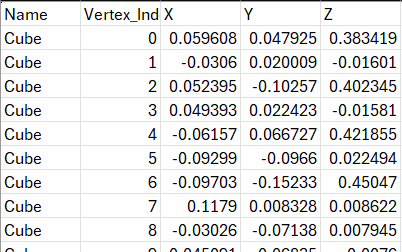
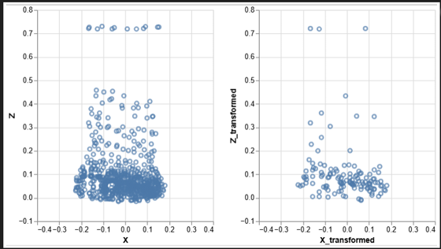
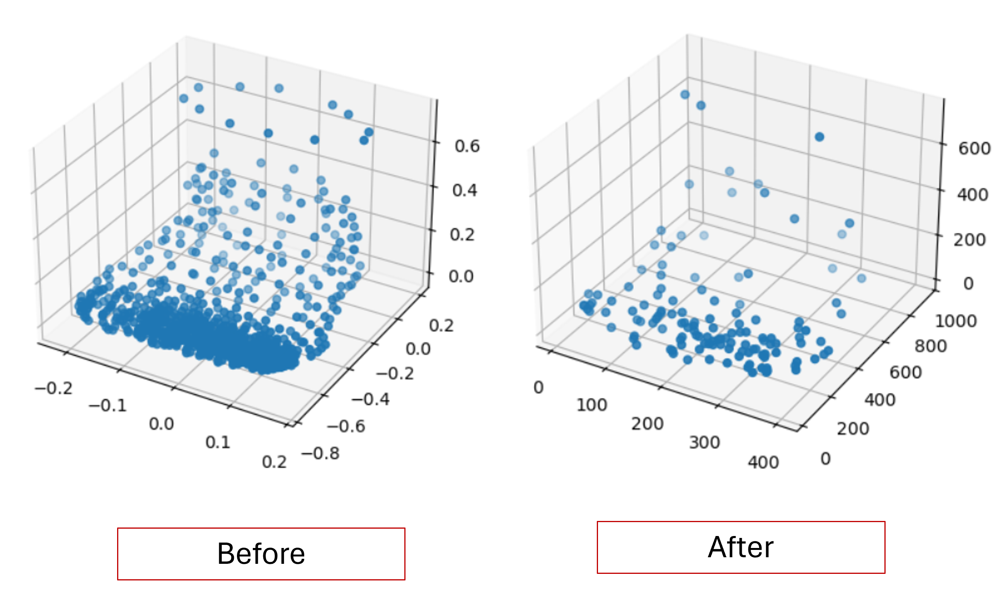

# Mean Pooling Function on a 3D Model

How can we compress the mesh density of a 3D model? [We have established](https://github.com/suryashch/3d_modelling/blob/main/reducing-mesh-density/analysis_decimate.md) that using the `decimate` modifier in Blender provides a quick and easy way to reduce the vertex counts of the object. I would like to do this in a more predictable way. My plan is to conduct some mean pooling on the vertex coordinates.

## Getting the Coordinates for the Vertices From the Model

Blender provides the ability to export vertex information from the model. For this test I shall be working with the `human-foot-base-mesh` model. This is what the model looks like.


FIrst, we need to extract the vertex information from the model. Here is the script I ran in the blender interface to extract this information.

```py
import bpy
import csv
import os

# define the output path
filename = "vertexcoordinates.csv"
file_path = "reducing-mesh-density/data"
output_path = os.path.join(file_path, filename)

# get mesh data, applying any modifiers
mesh = obj.evaluated_get(bpy.context.evaluated_depsgraph_get()).to_mesh()

# export to csv
with open(output_path, "w", newline='') as output_file:
    writer = csv.writer(output_file, delimiter=',')
    # write the header row
    writer.writerow(["Name", "Vertex_Index", "X", "Y", "Z"])

    # write vertex data
    for i, v in enumerate(mesh.vertices):
        # Get world coordinates
        world_coords = obj.matrix_world @ v.co
        writer.writerow([obj.name, i, world_coords.x, world_coords.y, world_coords.z])
```

This code will output a csv that looks like this.



Now we can import this into a dataframe and do some operations on it.

## Process and Methods

If you would like to see the whole code and process I used to get these results, you can see the analysis notebook [here](https://github.com/suryashch/3d_modelling/blob/main/reducing-mesh-density/notebooks/vertex_coord_analysis.ipynb). The high level process which I used to work with this data is follows.

1) Import the raw coordinates into a pandas dataframe
2) Data Cleaning -->
    a) Truncate the data upto a cutoff decimal point (ex: round to 3 decimal places)
    b) Normalize the data: Multiply by 1000 to convert all floating point numbers into integers
    c) Shift the data to only the positive quadrant: this involves shifting our coordinates such that the smallest one is 0,0,0
3) Convert the dataframe to a Numpy Array
4) Divide our array into smaller cubes (say, 10x10x10) and replace all the individual points within them with a single Center of Mass coordinate (Center of Mass Pooling Function).
5) Inverse transform our data to get it back to standard form
6) Compare the results.

Here is a Gif explaining how the Center of Mass function works.


This step turned out to be quite computationally expensive, so run with caution.

## Results

I was able to achieve a ~6x compression in the number of vertices in the object through this method, while still retaining the visual cues relating to the object. Here are some charts showing the distribution of the points in 3 Dimensions, both before and after compression.




Here is a 3D plot showing the vertices of the object both before and after the Center of Mass function was applied on it.



The input array had 800 vertices, and the output array had 130, so the final compression ratio turned out to be roughly 6.15 (not accounting for edges).

## Conclusion and Next Steps

The results from this endeavour show that you can run certain ML algorithms on 3D models for various purposes. In this example, we run a compression algorithm on a 3D model to reduce the number vertex counts, thereby reducing the overall size of the model, but still retianing the shape of the object. This technique allows us to create a low resolution version of our model to superpose onto our scene, [reducing the strain on the GPU when the user zooms out far enough](https://github.com/suryashch/3d_modelling/blob/main/hosting-3d-model/analysis_superposing-models.md). Dynamically writing some logic to switch the active model based on this zoom distance will allow us to host increasingly large models on a web interface, while still retaining a high level of performance.

In future work, I will explore further ML algorithms on the model, and develop libraries for easy conversion of model objects to data science-friendly structures. I will also explore how to incorporate edge information from the model into our array.


