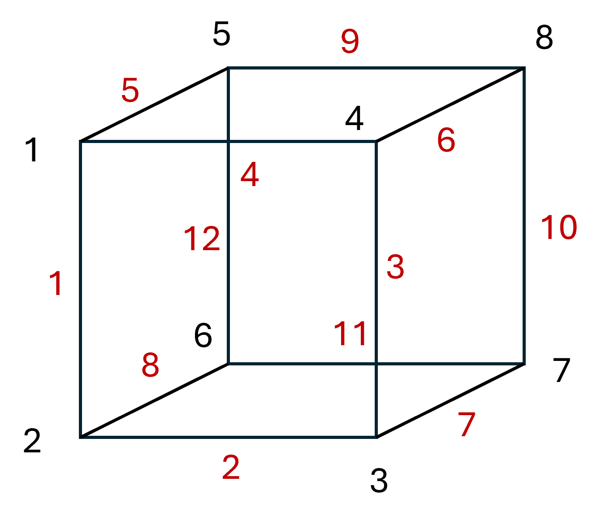

# Improving 3D Model Performance With LOD Control

In the construction industry, 3D models provide a level of context to the user that cannot be matched with a spreadsheet. However, Building Information Modelling (BIM) is slow to be adopted by the North American market. One of the many issues for this slow adoption I believe, is the lack of standardized tools. Autodesk is the industry standard, and provide a suite of tools that encompass the entire construction lifecycle. But their services often come at a hefty cost and require downloading bulky software. Most users of the 3D model require it for quick viewing and mark-up capabilities. Why then, is there such a large barrier to entry?

In this paper, I propose a proof of concept whereby 3D models can be hosted on any webpage and viewed on any device with a web browser- no downloads needed. I explore the basics of 3D modelling, mesh compression techniques, setting scenes in `three.js`, and swapping between different versions of a mesh depending on how far away the user is from the object.

Through this effort, I was able to load a 3D model containing XXX objects to a webpage, and achieved a XXX improvement in GPU performance and XXX improvement in CPU performance over standard scenes.

## 3D Modelling Basics

The fundamental building blocks of 3D models are `vertices` and `edges`. `vertices` can be thought of as 'corners' while `edges` are what connect the corners to each other. In a cube, we have 8 `vertices` and 12 `edges`, as you can see in the image below (in no praticular order).

As the total number of vertices and edges in your scene increase, so does the strain on your GPU, and as a result the scene becomes laggy when you try to move around. Reducing the number of vertices and edges in the scene will improve the performance.

A fundamental building block of construction models are pipes, which are modelled as cylinders in the scene. However, circles don't have any corners. A circle can be thought of as infinitely many corners that all connect to each other. It is impossible to model a perfect circle, so we approximate it using a large number of vertices. The more vertices, the more the object starts looking like a circle.

Hence, when we extrude all these individual edges and vertices into the page, we get a cylinder (pipe), which is hilariously inefficient for how simple of a shape it is.

Each of these edges and vertices need to be kept track of by your computer's GPU. In large models, this is usually what causes the lag- especially when your GPU is not powerful enough. Let's see if we can compress the total number of edges and vertices in an object.

## Reducing the Density of the Mesh

The `density` of a mesh is a measure of how many individual `vertices` and `edges` exist within it. We can reduce the density of the mesh by removing unnecessary data points in it. By removing these data points however, we trade density for details and as you see in the image below, the finer details of our mesh is lost.

Before:

After:

## Credits

