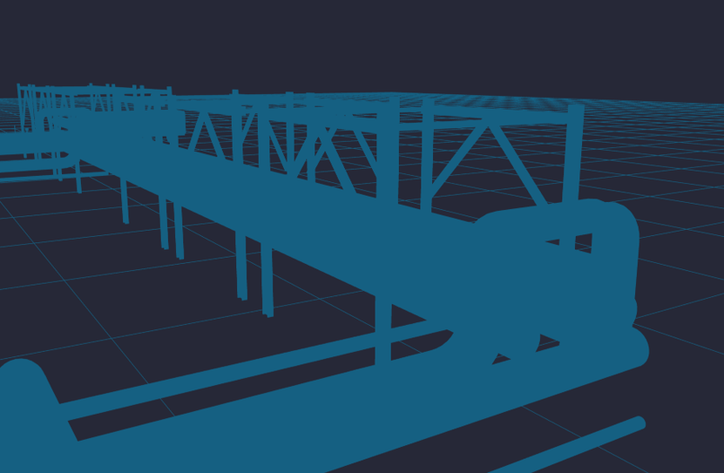

# Optimizing Material Selection for Web Rendering

In large 3D models an often overlooked aspect of memory and computational usage is the material of the 3D object. GPU `shaders` are basic functions that rely on this information and determine how light is reflected / scattered / absorbed by the surface of the object. If not optimized, this can lead to bottlenecks in GPU usage. This paper provides a quick analysis of the basics of material selection in 3D models.

## Exploring Different Materials in three.js

The model we will be working with is the `piperacks-merged.glb` model. This is fundamentally the same model that we have used in our [dynamic LOD](../hosting-3d-model/per-object-lod-control-with-threejs.md) project, except that we merged all objects into one giant mesh, to measure [draw call](../optimizing-the-scene/draw-calls-in-scenes.md) performance. Since we only have one object in the scene, it will be easier to apply the different materials and measure their performance.

### MeshBasicMaterial

[MeshBasicMaterial](https://threejs.org/docs/#MeshBasicMaterial) is a simple GPU firendly material that can be applied to a 3D object. It allows for basic coloring, and is not affected by lights in the scene.

We load our object with this material using the following code.

```js
const loader = new GLTFLoader().setPath('models/piperack/');
loader.load('piperacks_merged.glb', (gltf) => {
    const mesh = gltf.scene;
    mesh.position.set(0,0,0);
    scene.overrideMaterial = new THREE.MeshBasicMaterial({
        color:"#156082",
    });
    scene.add(mesh);
})
```

This code is unchanged from our original model loading code, except for the line `scene.overrideMaterial`. This line allows us to manually change the material of our loaded object to `MeshBasicMaterial`.

What does this material look like in action?



Not good. We have lost the ability to discern individual objects. This is becuase while `MeshBasicMaterial` does not require a light source, it also does not reflect / absorb / disperse or otherwise interact with the light. So we lose this ability to discern our objects.

### UV's and Normals

While conducting [EDA on our .obj file](../reducing-mesh-density/notebooks/obj-eda.ipynb), we noticed a section of data labelled `vt`, or `vertex textures` and `vn` or `vertex normals`. These data points relate to how our material interacts with light. 

The `normal` vector `vn`, provides us with a face's angle and can be used to measure how light will interact with the surface- ex: what angle it will reflect back, how much light will be pass basck into the camera, etc.

The `vt` coordinates refer to 2D coordinates that relate to a UV Map


## Vertex Colors

## Selecting the Optimal Material


## Implementing to the Scene


## Conclusion


## Links

[EDA on our .obj file](../reducing-mesh-density/notebooks/obj-eda.ipynb)

[dynamic LOD](../hosting-3d-model/per-object-lod-control-with-threejs.md)

[draw call](../optimizing-the-scene/draw-calls-in-scenes.md)

[MeshBasicMaterial](https://threejs.org/docs/#MeshBasicMaterial)