# Shader Programming in Three.js

Three.js provides a bunch of powerful open-source tools for 3D modelling. Most work exceptionally well out of the box and acn be used for most general tasks. However, to truly unlock the power of the GPU, we must move down a level into the heart of the GPU- Shaders.

Shaders are commands that run native on GPU hardware. They are optimized to work especially well with parallelized operations, capable of running multiple million operations at once, and every frame. Typically, Shaders are written in C++ and require advanced compilers to view and create. This is the heart of heavy-duty game development, and is still how hardware-centric games are programmed today.

We won't be going down to that level rather, running these Shaders natively within three.js and exploring their capabilities.

## Introduction to Shaders

As mentioned above, a Shader is program that runs natively on the GPU. There are many different types of Shaders, each with their own unique functionality. For the purpose of introduction, we shall be focusing on 2- the Vertex Shader and the Fragment Shader.


Its important to note that these names may be different based on the language and framework used, but ultimately the functionality will be the same. We will be programming our Shaders using [OpenGL programming API](https://www.opengl.org/). This API is built using a C++ based language known as [GLSL](https://wikis.khronos.org/opengl/OpenGL_Shading_Language), or OpenGL Shader Language.

### The Vertex Shader

As mentioned earlier, Shaders are programmed to conduct multiple parallelized operations. The Vertex Shader is responsible for managing the positions of every vertex in the scene, and how they translate from world-space to view-space. This means keeping track of each individual vertex coordinate, the position of the camera, and the size of the window. Each of these factors will affect how our scene looks on the screen.


Here is a very simple example of a Vertex Shader in action.

```cpp
// Vertex Shader
void main() {
    gl_Position = vec4( pos, 1.0 );
}
```

The code above looks daunting. Let's break it down.

All the code is doing above is creating a vector from our supplied vertices (`pos`) and assigning it to the variable `gl_Position`. GLSL provides a standard list of predefined variables that enable parallelized operations- `gl_Position` is one of them.

In standard C++ terminology, a function is defined by stating what type of value it returns, and the name of the function. In the example above, we return `void`, implying that our function named `main` is not returning anything- only setting an internal variable.

If we had a test function that did some operation and returned an integer, this is how we would define it -->

```cpp
int testFunction() {
    
    // Function code 
    
    return ;
}
```

`vec4` in the code above is a standard C++ object, a vector that contains 4 values. I like to think of a vector as a table, where each row corresponds to a unique object, and columns reference its data. In the case of our supplied vertices, each vertex will have an X coordinate, a Y coordinate and a Z coordinate. Hence, we will need a `vec3`, or vector with 3 dimentions to store this data. So why are we defining this data with a `vec4`? This boils down to the matrix math required to move an object on the screen, and is quite in depth. For now, just note that we need our vertex data to contain 3 columns (X, Y, Z) and a fourth column that will always be equal to 1.

Hence, we build our `vec4` object by passing `pos`, a 3 dimensional vector (or table) of vertex data and appending another column of 1's at the end of it.

### The Fragment Shader

A lot of GPU optimization techniques focus on streamlining data going into the Vertex Shader (reducing geometry LOD, draw calls etc.). However, the Fragment Shader is equally influential in the final scene. The Fragment Shader is responsible for adding color to the scene, and is run once for every pixel on the screen. A traditional 1080p display is 1080 pixels high and 1920 pixels wide. This means is we run our Fragment Shader on every pixel, we're coducting 1920 * 1080 = 2,073,600 calculations every frame. This is where the parallelization capabilities of GPU's *really* shine through.


At a high level, the Fragment Shader is responsible for identifying which pixels on the screen need to be colored, and how. Here is an example of a basic Fragment Shader.

```cpp
// Fragment Shader
void main() {
    gl_FragColor = vec4( 1.0, 0.0, 0.0, 1.0 );
}
```

This function looks similar to our Vertex Shader with a few key differences. Firstly, we define a new standardized variable here- `gl_FragColor`. This is another GLSL specific variable and defines the color that needs to be applied to our fragment or pixel.

Here, we also have another `vec4` being defined and used. Rather than X, Y, Z coordinates, this `vec4` tracks Red, Green, Blue (RGB) values to identify color. The fourth value here refers to `alpha`, and tracks the transparency of the applied color (0 = fully transparent, 1 = opaque). We observe that every item in the scene is being applied the same value `vec4(1.0, 0.0, 0.0, 1.0)`. This corresponds to Red = 1, Green = 0, Blue = 0, Alpha = 1; a fully red opaque object.


If we instead assign our color to `vec4(0.0, 1.0, 0.0, 1.0)`, this will set our object to the color Red = 0, Green = 1, Blue = 0, Alpha = 1; a fully green opaque object.


Now that we have the basic syntax down, let's expand this knowledge out to three.js.

## Shaders in Three.js

The best part about working with Shader in three.js is the readily available access to experimentation. To work with Shaders in three.js, we only need 3 things-

1) A scene.
2) Some geometry.
3) A `ShaderMaterial`.

We start by creating a basic boilerplate scene with some lights and a camera. To this scene, we add a cube.


Traditionally, to add a cube in three.js we need to create a new `Mesh` object that has geometry and a material. Here is the boilerplate code to add a simple cube to the scene- straight from the [three.js docs](https://threejs.org/docs/?q=mesh#Mesh). 

```js
const geometry = new THREE.BoxGeometry( 1, 1, 1 );
const material = new THREE.MeshBasicMaterial({ color: 0xffff00 });
const mesh = new THREE.Mesh( geometry, material );
scene.add( mesh );
```

We create a cube using `BoxGeometry` and `MeshBasicMaterial`, setting the color to yellow. Here is what this basic scene looks like.

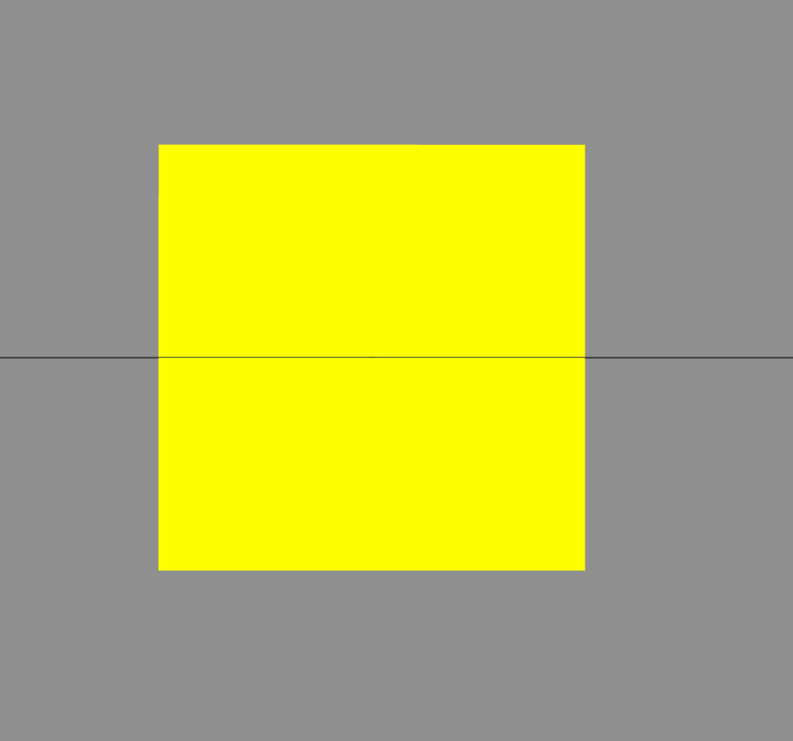

Simple. Now, instead of `MeshBasicMaterial`, let's swap this out for `ShaderMaterial`. As mentioned above, this material requires 2 arguments- the `vertexShader` and the `fragmentShader`.

Unfortunately, since we're in JavaScript land, we cannot compile using C++. Hence, we need to pass the Shader code to this Material as a text string. Its a little janky, but it works. Let's create the vertex and fragment shaders as follows.

```js
const vertexShader = `
    void main() {
        gl_Position = vec4(position, 1.0);
    }
`

const fragmentShader = `
    void main() {
        gl_FragColor = vec4(1.0, 1.0, 0.0, 1.0);
    }
`
```

In the code block above, we have essentially created 2 variables `vertexShader` and `fragmentShader`. These are strings, that contain the exact text required to make our vertex and fragment shaders work. In JavaScript, you can create a mulit-line string by wrapping the block within backticks ``.

Now, we pass these 2 variables to our `ShaderMaterial`.

```js
const geometry = new THREE.BoxGeometry( 1, 1, 1 );
const material = new THREE.ShaderMaterial({
    vertexShader,
    fragmentShader
});
const mesh = new THREE.Mesh( geometry, material );
scene.add( mesh );
```

Hence, when we pass these 2 variables to our `ShaderMaterial`, this is what we see.

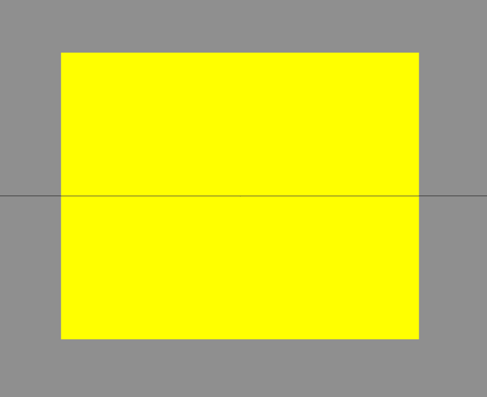

Looks the same! This is good news, but it begs the question- why? Why not just use `MeshBasicMaterial` and call it a day? Well, we are just scratching the surface here. The true value of shaders comes from the calculations which we run within them.

As we move forth, we will be working with functions in both the Vertex and Fragment Shaders to create cool visuals, and slight animations. What we have just set up here is a template which will allow us to experiment.

## Basic Functions with Shaders

The code in this section is heavily influenced by 2 sources - The Book of Shaders, written by Patricio Gonzales, and various YouTube videos (listed in the links).

### View and Projection Matrix

The first thing you might have noticed (or maybe not, that's ok too) in our current scene is that our cube looks like its a different size. This boils down to projection matrices. As mentioned in the Vertex Shader section above, we note that this program is responsible for positioning our vertices on the screen, and needs to account for a host of different factors- camera position, screen size, projection type etc. In our current `vertexShader` implementation, we're only passing in the raw coordinates. Hence, when we move the camera or resize the window, nothing happens.


To address this, we need to add some code to our `vertexShader`. Here is the code, and we shall describe its purpose below.

```js
const vertexShader = `
    void main() {
        gl_Position = projectionMatrix * modelViewMatrix * vec4(position, 1.0);
    }
`
```

Essentially, we need to multiply the existing `vec4` object by 2 matrices- the `projectionMatrix` and the `modelViewMatrix`. These matrices represent the transformations required to place our object in its final location in the scene.

The `modelViewMatrix` represents the screen size. If we have a smaller window, our object will be a lot smaller on the screen. The `modelViewMatrix` contains this information.

The `projectionMatrix` represents the camera projection and position in the scene. If we move our camera around, we would like the position of our object to change. This information is captured in this matrix.

These matrices are standard values passed from three.js to our vertex shader every frame, and their names must match exactly. With these matrices added to our scene, this is what we observe.

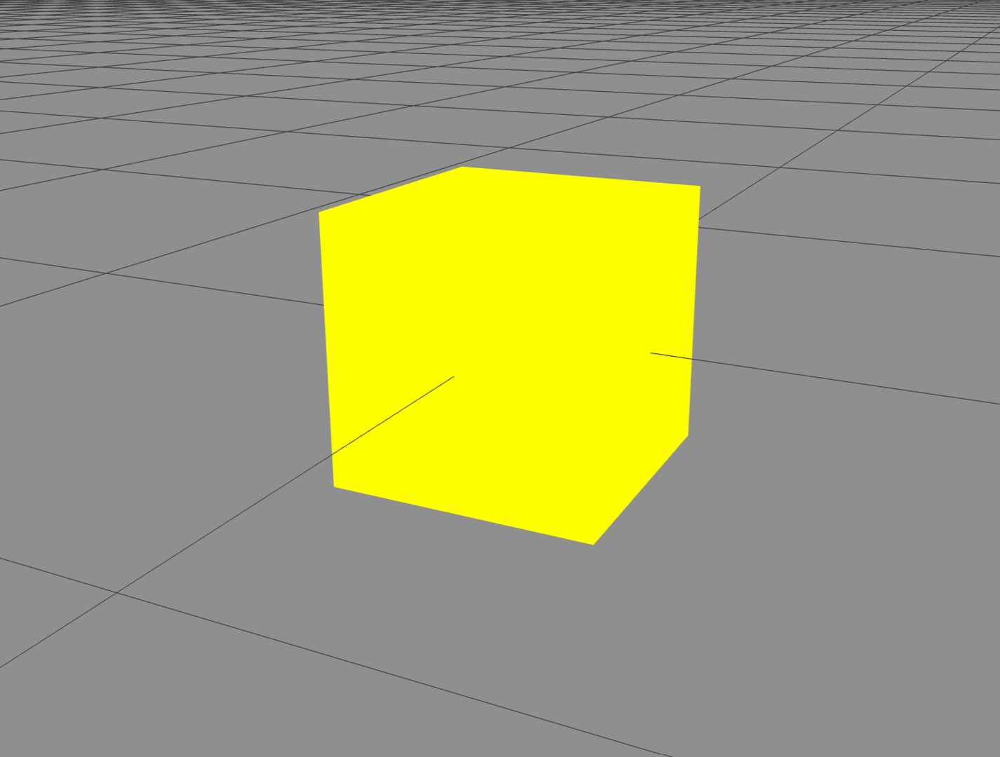

This is what we expected. Now our cube changes dynamically with camera movement, and with window resize.

Cool. But still, not that impressive. Let's step it up.

### Color Gradients with Uniforms

So far we have been working with solid colors in three.js. Using the Fragment Shader, we can apply a color gradient to our object- but first we need to introduce a new concept- Uniforms. Uniforms are used to save data on the GPU and can be quickly accessed by both our Shaders. Uniforms are called so because the data saved within them is the same every time the shader is run- i.e. it does not change between frames. This will become apparent when we contrast with 'varyings' a little later.


Let's create our first uniform- `u_Resolution`, which we shall use to track our drawing screen size. This uniform shall be of type `vec2`, and will save information related to the width and height of our screen.

```cpp
uniform vec2 u_Resolution;
```

Since we have declared this uniform at the top, we will also need to pass data into it via three.js `ShaderMaterial`. Hence we need to also add a new argument to the initialization code as follows.

```js
const material = new THREE.ShaderMaterial({
    uniforms: {
        u_Resolution: {
            value: [ window.innerWidth, window.innerHeight ]
        }
    },
    vertexShader,
    fragmentShader
});
```

The uniforms need to be passed to our `ShaderMaterial` as a dictionary object, with the keys named exactly the same. Since we've defined the uniform as a `vec2`, we will need to pass an array of size 2 into it. We pass the values of the window `innerWidth` and `innerHeight` to this object.

Let's work with this uniform data in our Fragment Shader. To start with, we need to normalize our screen space such that the values run from 0 to 1. This corresponds nicely with the color scale we're currently using (RGB = 1.0, 0.0, 1.0). To normalize, we need to divide our screen-space coordinates by the input window size. This will give us a `vec2` of values ranging from 0 to 1 where 0 is the absolute left edge of the screen and 1 is the absolute right. We save these values to a variable called `st`.

```cpp
// Fragment Shader
uniform vec2 u_Resolution;

void main() {
    vec2 st = gl_FragCoord.xy / u_Resolution; 
    gl_FragColor = vec4(st.x, st.y, 0.0, 1.0);
}
```

Now, we acn set the color of our Shader to be the first 2 values returned from our newly created variable `st`. We access these values by calling `st.x` and `st.y`- even though these values do not have anything to do with X or Y. This is just the shorthand notation for accessing values in a vector. As seen in the line above it, we can access the first 2 values of `gl_FragCoord` by calling `gl_FragCoord.xy`. This will now return a `vec2` instead of just a single value.

> Side note, you can access any of the 4 values in a `vec4`, by calling `myTestVec4.x`, `.y`, `.z`, or `.w`, or any combination thereof- regardless of what data is actually being stored.

Back to the code above, now that we have normalized X and Y coordinates for screen space, we can just set these values to be the first 2 values in our `gl_FragColor` variable. Now, since these values vary with position on the screen, we should see different colors show up on our object.

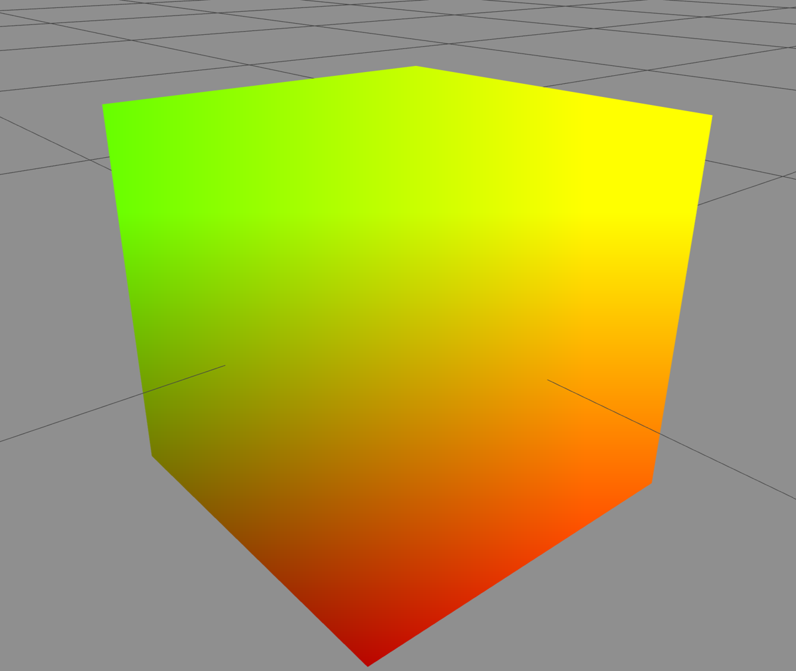

Perfect. We do see the color gradient as expected. Let's work through what we just did. Since we set the first 2 channels of our `gl_FragColor` variable to be the normalized screen width and height, these 2 channels will change with x and y. Essentially, we have mapped our screen's X axis to the Red Channel, and y axis to the Green Channel.


An increase in X results in an increase in Red. An increase in Y results in an increase in Green.


An increase in both results in an increase in both Red and Green, which combined, makes Yellow.


An interesting observation we note here is that the color of the cube changes based on where in the screen it is.

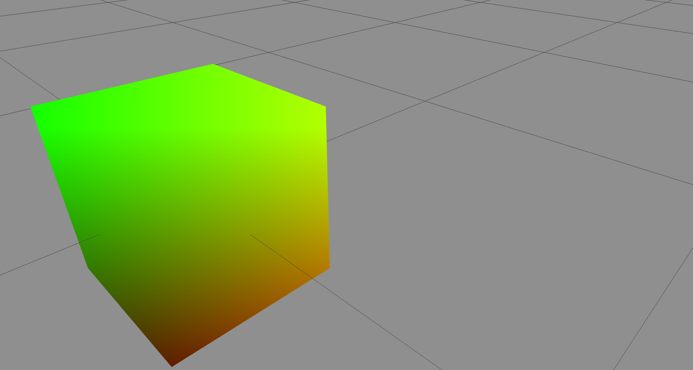

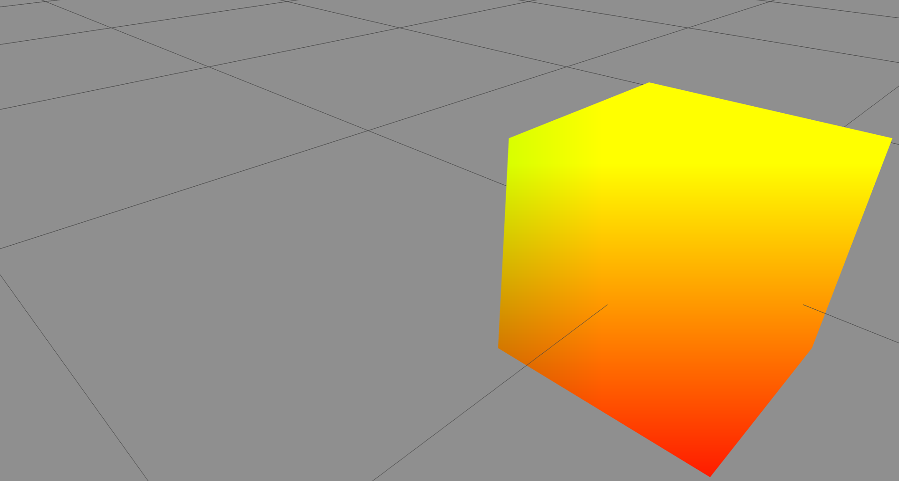

We observe that as the cube gets positioned further to the left, it tends to contain more green, and on the right it tends to contain more red/yellow. This makes perfect sense since our FragmentShader is normalized to screen coordinates. If we take a look at the code above, we see that we're normalizing the data based on the input screen size. Since our object only occupies a certain portion of this screen size, it will pick up the applied color that is set for that portion of the screen. This graphic should be explain this concept further.


To absolutely drive this point home, we zoom out to make our object smaller on the screen. Here, since the object is right in the center of our color plane it should only pick up the color in the absolute center of the screen- yellow.

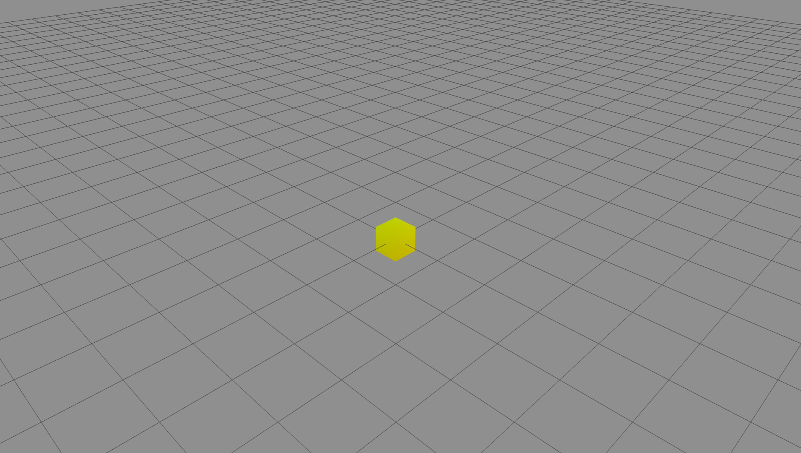

Lastly, let's change our Shader to map to different colors. Here we swap the Green and Blue channels.

```cpp
// Fragment Shader
uniform vec2 u_Resolution;

void main() {
    vec2 st = gl_FragCoord.xy / u_Resolution; 
    gl_FragColor = vec4(st.x, 0.0, st.y, 1.0);
}
```

Now, instead of green we will have blue color on the screen. Hence, the top right corner of our screen will correspond to max Red and max Blue channels- making purple.

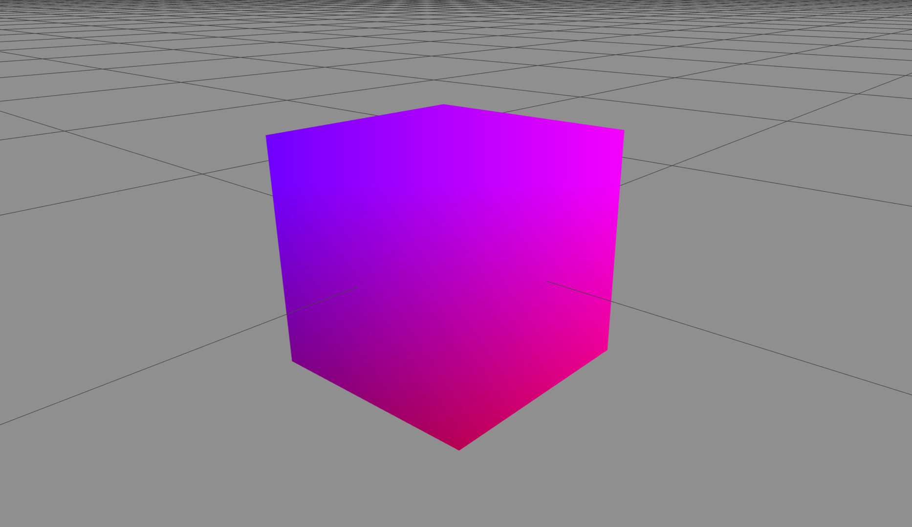

### Time Based Functions

Another Uniform we can pass to our Shader is that of time. This will allow us to change the values outputted by our Shaders over time. Let's start with the Fragment Shader.

First, we need to create a new Uniform to store the value of time elapsed.

```cpp
// Fragment Shader
uniform float u_Time;
uniform vec2 u_Resolution;

void main() {
    // ...
}
```

Note that since time will only contain one value (the amount of time elapsed), it will be initialized as a `float` instead of a `vec`.

To view the effect of time on our shader, we wrap our red channel (which is currently mapped to our x coordinate in screen space) to a `sin` function. This will oscillate the value between 1.0 and -1.0 over time.

```cpp
// Fragment Shader
uniform float u_Time;
uniform vec2 u_Resolution;

void main() {
    vec2 st = glFragCoord.xy / u_Resolution;
    gl_FragColor = vec4((sin(st.x + u_Time)), 1.0, 0.0  1.0);
}
```

Note that for the sake of this example, we do not have any oscillations on the Green, Blue and Alpha channels. Now, loading this up this is what we see.

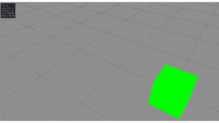

The color changes over time, as the red channel becomes more prevalent.

We can make the oscillation more apparent by also wrapping the sin function within an `abs()` function. This will ensure that all negative numbers (which currently default to 0), will be converted to positive- ensuring the red always cycles through.

```cpp
// Fragment Shader
uniform float u_Time;
uniform vec2 u_Resolution;

void main() {
    vec2 st = glFragCoord.xy / u_Resolution;
    gl_FragColor = vec4((abs(sin( st.x + u_Time ))), 1.0, 0.0  1.0);
}
```

The `sin()` function accepts radians as the measurement for angles, hence no matter how large our `elapsedTime` value gets, the function's output will always be constrained.

## Advanced Functions with Shaders

### UVs

We can pass another variable to our shader to convert from screen space to object space - `uv`. This configures our Fragment Shader to run only across the surface of our object. In this example, let's map our color gradient over the cube, instead of over the screen space.


### Noise Functions


### Textures


### Data Textures


## InstancedMesh with ShaderMaterial

Our next goal will be to implement our new `ShaderMaterial` within an `InstancedMesh` object. As a reminder, the `InstancedMesh` class of three.js objects allows us to define a geometry once and pass it to multiple objects in the scene. This method allows us to place a large number of objects in the scene without overwhelming memory or draw call size.


We will use our same geometry from earlier- the `IcosahedronGeometry`. Let's see what the `InstancedMesh` object looks like with standard materials. Here, we create 100 instances of the geometry and place them randomly in the scene.

```js
const geometry = new THREE.IcosahedronGeometry( 5, 1 );
const material = new THREE.MeshBasicMaterial({ color: 0xffff00, wireframe: true });
const nInstances = 100;
const instancedMesh = new THREE.InstancedMesh( geometry, material, nInstances );

scene.add( instancedMesh );

let dummy = new THREE.Object3D();

for (let i = 0; i<nInstances; i++){
    dummy.position.set(
        Math.round((Math.random() - 0.5) * 100),
        Math.round((Math.random() - 0.5) * 100),
        Math.round((Math.random() - 0.5) * 100)
    );
    
    dummy.updateMatrixWorld();
    
    instancedMesh.setMatrixAt( i, dummy.matrix);
};
```

Loading this basic `instancedMesh` to our scene, this is what we see.

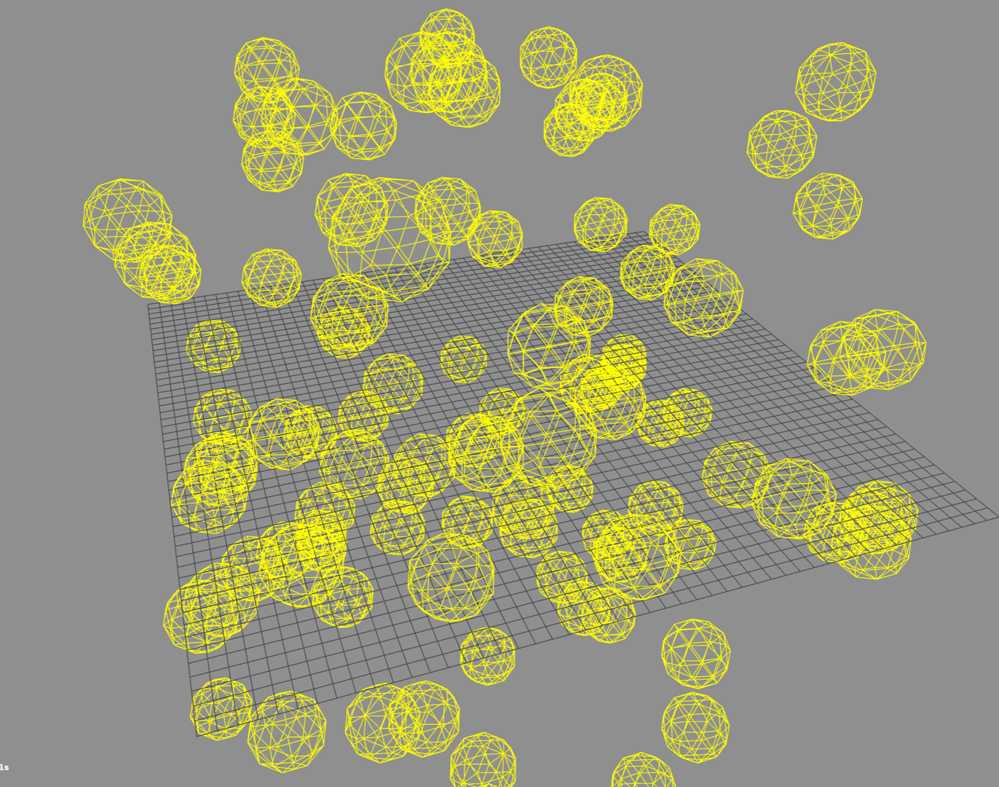

Looks basic enough. Now, if we want to recreate the same option with our `ShaderMaterial`, we need to tweak some code. Firstly, all the `positions` being passed to our Vertex Shader will now be the same (just one set of positions for our object). Instead, three.js sends an attribute to the vertex shader `instanceMatrix`, which contains all the positions of our instances. This is a named variable and can be accessed like so in the vertex Shader. We just need to tweak the code as follows.

```cpp
// Vertex Shader

void main() {
    vec4 instancedPos = instanceMatrix * vec4(position, 1.0);
    gl_Position = projectionMatrix * modeViewMatrix * instancedPos;
}
```

All that's changed is that we have multiplied our initial position vector by the `instanceMatrix` variable. We keep our Fragment Shader to be a simple yellow color (R=1, G=1, B=0) for now.

```cpp
// Fragment Shader

void main() {
    gl_FragColor = vec4(1.0, 1.0, 0.0, 1.0);
}
```

Here is what the results look like.

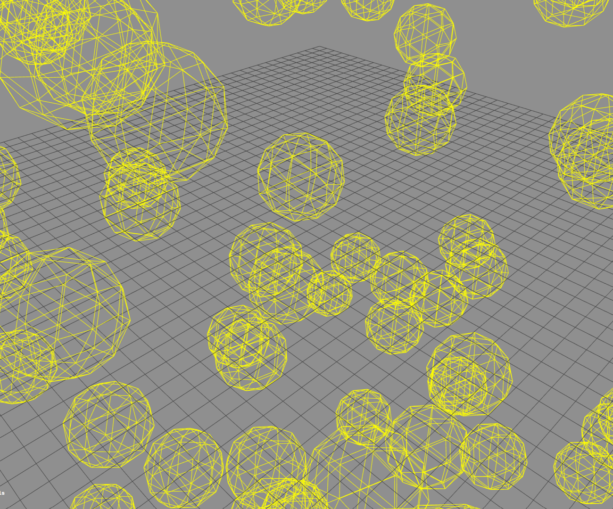

Once again, looks pretty ordinary, but here we can once again add our time based color oscillations in the fragment shader to truly unlock the power.

```cpp
uniform float u_Time;

varying vec2 vertexUv;

void main() {
    gl_FragColor = vec4(abs(sin(vertexUv.x + u_Time)), 1.0, 0.0, 1.0);
}
```

Here, we oscillate the red channel of our final output color to be between 0 and 1. As a result, the spheres on the screen change color periodically between Yellow (R=1, G=1) and Green (R=0, G=1).

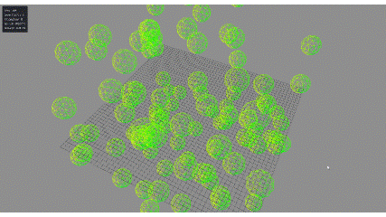

Looks good, but there's another functionality I'd like to test- setting per-instance attributes. Say we want to adjust the color of each individual instance. This is possible in the default `InstancedMesh` class through the method `instancedMesh.setColorAt()`. This method sets the color of a specific index, but only works for one instance at a time. If we need to bulk set the color of specific instances in the scene, our function will need to loop over every single one.

Instead, we use something called an `InstancedBufferAttribute`. This array-like object is uploaded to the GPU memory and can be used to bulk set the color of objects in the scene. To demonstrate how it works, let's work with a sensible number of instances - 10.

We first need an array to define the exact colors which we want our instances to be. For the purpose of this example, let's create the following order -->

```js
const redColor = new THREE.Color(0xff0000); // Red
const greenColor = new THREE.Color(0x00ff00); // Green
const blueColor = new THREE.Color(0x0000ff); // Blue
const magentaColor = new THREE.Color(0xff00ff); // Magenta

const colors = [
    redColor, greenColor, blueColor, magentaColor,
    blueColor, greenColor, redColor, magentaColor,
    redColor, greenColor
]
```

10 instances, 10 colors. Now, we construct our array. We need to deconstruct the red, green and blue channels of each color separately.

```js
const i_ColorArray = new Float32Array(nInstances * 3)  // Multiply by 3 to account for color channels

for (let i=0; i < nInstances, i++) {
    i_ColorArray[ i * 3 + 0 ] = colors[i].r
    i_ColorArray[ i * 3 + 1 ] = colors[i].g
    i_ColorArray[ i * 3 + 2 ] = colors[i].b
}
```

Now, we create a `InstancedBufferAttribute` which we can pass to our Shaders by tacking on directly to our `geometry` object.

```js
const i_Colors = new THREE.InstancedBufferAttribute(i_ColorArray, 3)  // 3 represents the stride length, i.e need to skip 3 entries to get to the next attribute

geometry.setAttribute('a_InstanceColor', i_Colors);
```

The name of the attribute is important and must represent the value set in the Shaders. Which, let's address now. Here is our updated vertex shader.

```cpp
// Vertex Shader
attribute vec3 a_InstanceColor;

varying vec3 v_InstanceColor;

void main() {
    v_InstanceColor = a_InstanceColor;

    vec4 instancedPos = instanceMatrix * vec4(position, 1.0);
    gl_Position = projectionMatrix * modelViewMatrix * instancedPos;
}
```

First we must define a new concept -  attributes. These variables are passed down from three.js and can be used to assign additional information to the geometry / vertices. We have seen examples of attributes earlier- `position`, and `uv`. Both these varaibles are internal to three.js and passed automatically to the Vertex Shader. Since the attribute is applied directly on the geometry, we do not need to pass it as a uniform via our `ShaderMaterial`. 

However, since this information is required for the fragment shader, we do need to create a varying `v_InstanceColor` and assign it to the value of `a_InstanceColor` such that it can be accessed within the fragment shader. Attributes can only be accessed within the vertex shader. The rest of the code is the same.

And, here is what the Fragment Shader code looks like.

```cpp
// Fragment Shader
varying vec3 v_InstanceColor;

void main() {
    gl_FragColor = vec4(v_InstanceColor, 1.0);
}
```

All we need to do here is pass the `instancedBufferAttribute` as the first 3 arguments of our color argument. Now for each vertex and object in the scene, the fragment shader will look through the array and derive the color.

Loading this to our scene, this is what we observe.

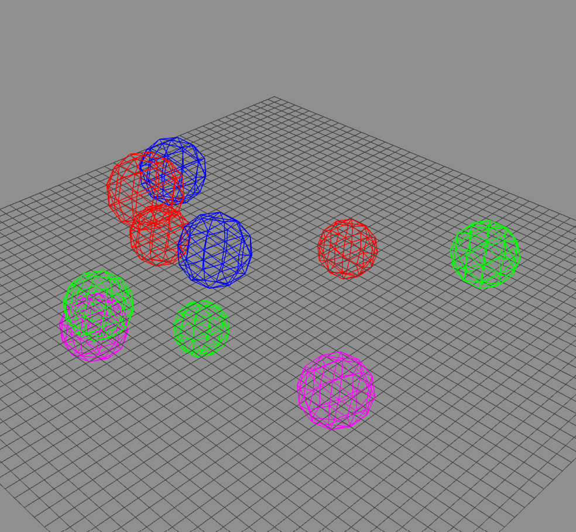

No matter how many times we refresh the screen, we should see exactly 3 red, 3 green, 2 blue and 2 magenta spheres, indicating that we have fine control over the color of each individual instance.

As seen before, we can implement time-based oscillations in the color of the spheres directly in the fragment shader.

```cpp
// Fragment Shader
uniform float u_Time;

varying vec3 v_InstanceColor;

void main() {
    gl_FragColor = vec4(abs(sin(v_InstanceColor)), 1.0);
}
```

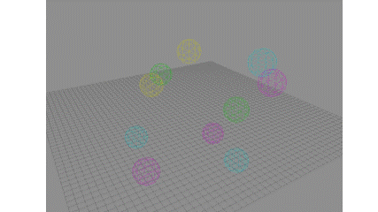

## Camera Matrix Control


## Links

[OpenGL programming language](https://www.khronos.org/opengl/)

[GLSL](https://wikis.khronos.org/opengl/OpenGL_Shading_Language)


## Helpful YouTube Videos

