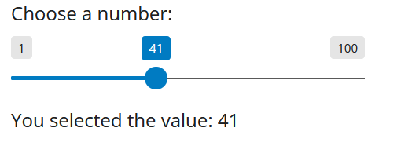
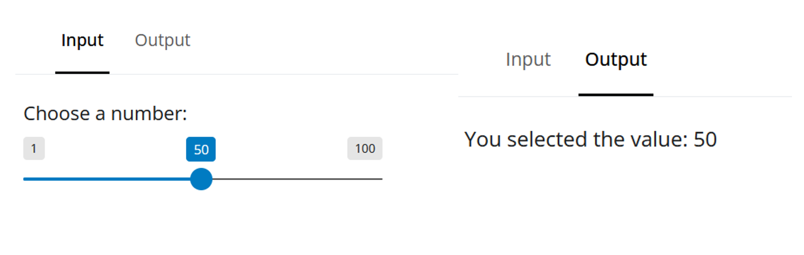
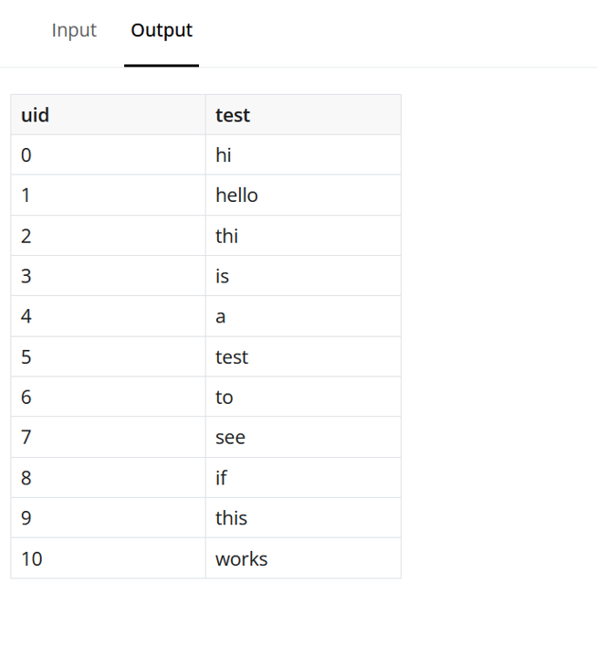
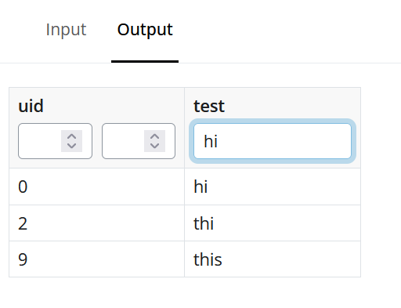
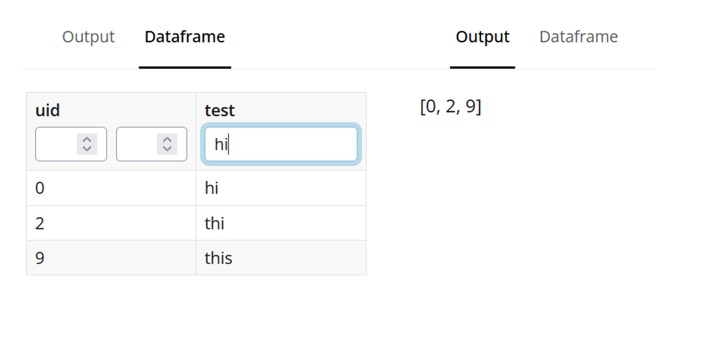

# Adding Interactivity and Data Flow to BIM Models

In this document, I wish to explore the basics of how to model data flow in a 3D scene. The goal will be to add interactivity to our [existing 3D model viewer](../../reports/a-game-dev-approach-to-bim.md). This way, users can apply predefined filters on the metadata that exists in the model, giving fine control over the view on the screen. As well, I'd like to create a front end dashboard that utilizes the existing JS scene we've built. This way, the entire effort can be setup as the tail end of a data pipeline.

## Tools

We've thoroughly explored the basics of [three.js](../hosting-3d-model/analysis_threejs.md). Our front end visualizer will be a standalone JS app. For the backend, I'd like to explore the option of [Shiny](https://shiny.posit.co/py/). This framework allows you to conduct traditional data science workflows with a front end visual element built on top. This front end can also tie into existing JS applications- which is crucial for our workflow here.

The overall goal here will be to build a Shiny app that connects to tabular data, and displays the output to a front end. This front end will be a custom standalone JS script which which serve as our 3D model viewer scene.

## Understanding the Basics of Shiny

Shiny allows you to build custom applications and introduces new ways to view your data. Let's start with the basics.

At the most fundamental level, we have an `app_ui` and a `server`. The ui handles the visuals, and the server handles the logic. Here is a simple app that introduces a slider, prompts the user for input, and prints that input to the screen

```py
app_ui = ui.page_fluid(
    ui.input_slider("num", "Choose a number:", min=1, max=100, value=50),
    ui.output_text("display_val")
)

# Explicit Server function logic
def server(input, output, session):
    @render.text
    def display_val():
        return f"You selected the value: {input.num()}"

# Binding them together into an App object
app = App(app_ui, server)
```

We have a few different components talking to each other here. Firstly, we have an `input_slider`, which takes on a default value of 50, max and min of 100 and 1 respectively, and saves the output to a variable within the input called `num`.

This variable is then accessed in the server through the `input` keyword. The server then works with this input, passes it into a predefined function which returns the string "you selected the value {num}. The function is called by name once again in the UI, and the output is rendered to a predefined ui component called output_text.

This is what the entirety of the app looks like.



This seems simple enough. We can enhance the complexity a tad, by splitting our input and output across 2 tabs. Here, we introduce a new ui component called the `navbar`. This allows you to create multiple tabs in the same dashboard and have the components speak to each other. We tweak the `app_ui` code a touch like so.

```py
app_ui = ui.page_navbar(
    ui.nav_panel(
        "Input",
        ui.input_slider("num", "Choose a number:", min=1, max=100, value=50)
    ),
    ui.nav_panel(
        "Output",
        ui.output_text("display_val")
    )
)
```

The `navbar` element creates multiple tabs in the same dashboard. The first parameter passed to it is the name of the tab (in this case "Input" and "Output"), and the second parameter is the copy of our original ui elements from the code above. Here is what the output now looks like.



Let's upgrade our input section. I'd like for this tab to be a table with user defined selection capabilities. Shiny has a ui component called a [Data Grid](https://shiny.posit.co/py/components/outputs/data-grid/). This UI component looks exactly like an excel spreadsheet and even includes options to add filters, data ranges, and edit styling options. Since this is an output element, we'll need to do some data tweaking to make it an input component.

Let's start by loading a test dataframe to our app and seeing if it will render to the screen.

We need to make the following tweaks to our code. Firstly, we need a dataframe. So we load our test dataframe to the session using pandas.

```py
test_df = pd.read_csv('data/test_input_data.csv')
```

Now, within our server function, we need to write some code to properly serve up the corresponding dataframe. We write a new function `render_df` with a new render target `@render.data_frame`. This function is currently very basic, and will only serve our existing dataframe to the frontend ui.

```py
@render.data_frame
def render_df():
    return render.DataGrid(test_df) 
```

Lastly, we're no longer rendering text to the page, we're rendering a dataframe. Hence, we swap out the `ui.output_text()` with `ui.output_data_frame`. This ui component calls our previously defined function `render_df` by name.

```py
ui.nav_panel(
    "Output",
    ui.output_data_frame("render_df")
)
```

On save, this is what we observe.



Looks good! However, this datagrid is not very interactive. Let's add some opportunities for filters. This is an easy addition, and only requires us to pass the flag `filters=True` in our custom server function -->

```py
@render.data_frame
def render_df():
    return render.DataGrid(test_df, filters=True)
```

And now, on save, this is what we get.



A nice side effect here is that the function includes "contains" search. i.e. if the element contains the serrach term, it is returned.

This is all well and done, but currently our datagrid is not really doing anything. To convert it into a input element, we need to write another piece of code.

I'd like for us to build the following workflow. The dataframe is rendered to the page. On filter, the resulting elements are compiled into a list and sent to our other tab where they are displayed.

Firstly, we shall change out tab names since they are no longer input and output. These have been renamed to `Output` and `Dataframe`.

Now, we add a new function is our server called `render_summary`. Our datagrid object has a method called `data_view`, which returns the currently active cells in our datagrid. We shall use this to our advantage, and build the following new function -->

```py
@render.text
def render_summary():
    current_df = render_df.data_view()
    return list(current_df["uid"])
```

The decorator for this function is `@render.text` since currently, we're only outputting our user's selection to the screen.

We also call this new function in our app_ui under output_text().

```py
ui.nav_panel(
    "Output",
    ui.output_text("render_summary")
)
```

Now, when we save and reload the dashboard this is what we observe.



This is perfect. We have a basic functioning app at this point, and are ready to move on to the next step.


## Custom JS Front End UI

I'd like to implement the following basic app workflow. Using our basic datagrid input from earlier, pass the filtered uid's to a different tab which contains a custom front end UI created from pure javascript. This will be our previously created [QSViewer](../../reports/a-game-dev-approach-to-bim.md) implementation. The fitered UIDs should trigger a function call to an eventlistener which will take the selected UIDs and change their color.

Let's start with the basics- rendering a custom JS front end to our app. This work is derived from this article [regarding one-off custom JS components](https://shiny.posit.co/py/docs/custom-component-one-off.html) in Shiny. Over time, we shall convert this to a full package implementation.

There are two things that need to be done- one on the JS side and one on the Python side. First, we create a copy of our viewer script and save it in a file called `qs_viewer_binding.js`. Things are mostly the same in this file, but we need to link this to our Shiny backend. To do so, we create a new `binding`. This involves adding the following code to the bottom of our script.

```js
class QSViewerBinding extends Shiny.OutputBinding {
    // Find element to render in
    find(scope) { 
        return scope.find(".shiny-qsviewer-output");
     }

    // Render output element in the found element
    renderValue(el, payload) {

    };
};

// Register the binding
Shiny.outputBindings.register(
  new QSViewerBinding(),
  "shiny-qsviewer-output"
);
```

Note, this is a direct derivation from the code listed in the docs, with a few tweaks. We use the predefined class `Shiny.OutputBinding()`, and add the following 2 methods onto it- `find(scope)`, and `renderValue`.

The find function will return the CSS DOM element that we want our output function to render to. Hence, we name this component `.shiny-qs-viewer-output`. The name here is important, as this is what we shall send our Python code output to in `app.py`.

The next method, renderValue is what allows us to send data between the applications. It includes a reference to the DOM element we want to target, and `payload` element to send data. For now, this function is blank but the `payload` feature will be very useful shortly.


## Links

[existing 3D model viewer](../../reports/a-game-dev-approach-to-bim.md)

[three.js](../hosting-3d-model/analysis_threejs.md)

[Shiny](https://shiny.posit.co/py/)

[Shiny Docs](https://shiny.posit.co/py/docs/custom-component-one-off.html)

