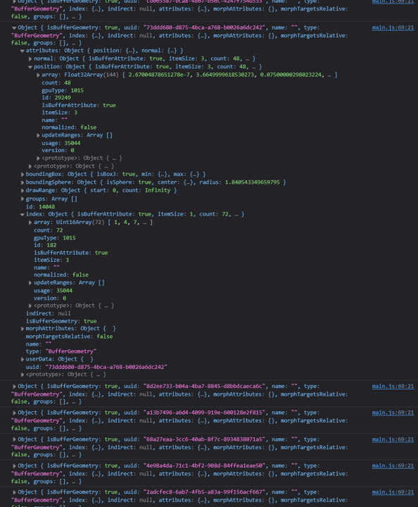
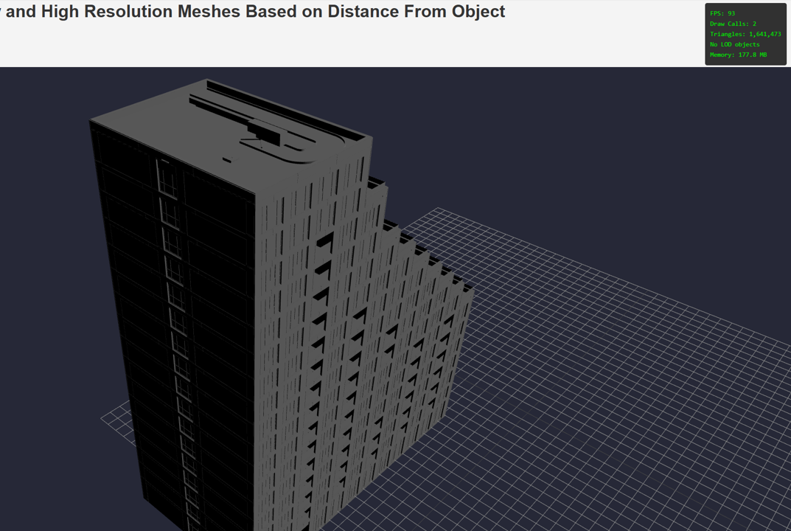
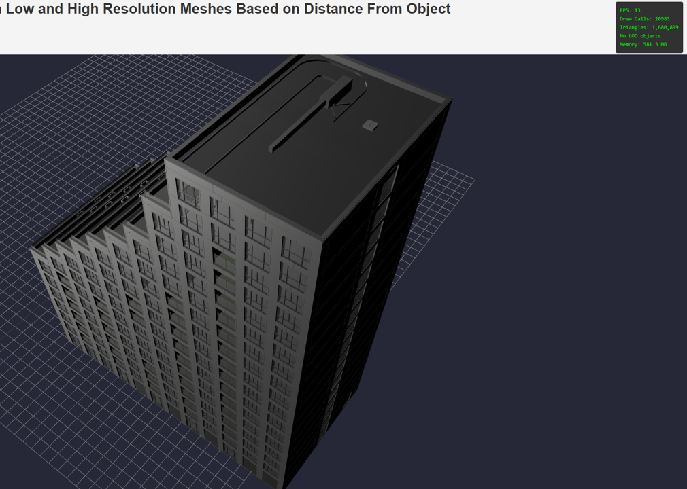
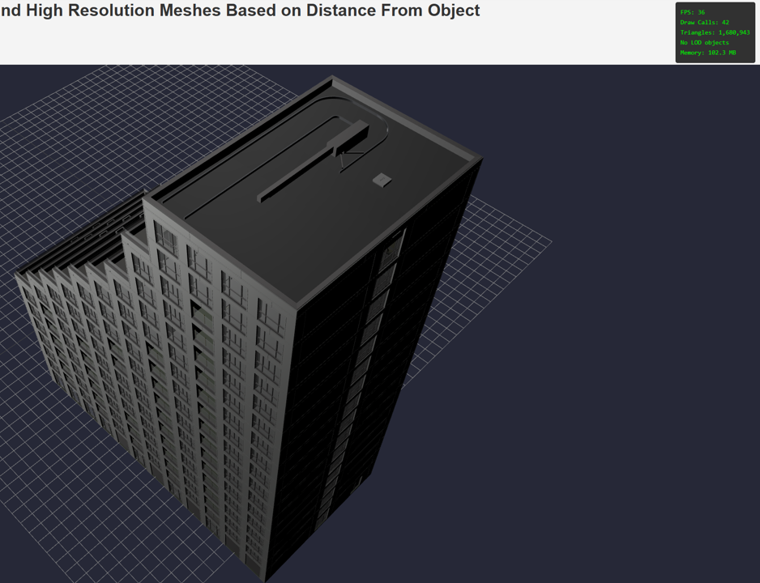

# Batched Mesh

The [batched mesh](https://threejs.org/docs/#BatchedMesh) class of objects in three.js allow for draw call strerammlining when you have multiple individual objects in the scene with common materials. For large scenes with lots of individual objects, this means we can condense all our meshes sharing material properties down into one draw call for the GPU to handle, significantly improving the [CPU bottleneck that we tend to observe in large scenes](draw-calls-in-scenes.md). We shall work with our `architectural` BIM model and see if we can optimize the total number of draw calls that the scene is currently making.

## Implementation

We observe the following baseline results in our model.


The results are not great. ~16,000 draw calls in the scene- one for each object. Extremely low FPS count at approximately 10 FPS. This shall serve as our baseline for all implementations going forward.

As a reminder, the scene above was loaded to three.js without any optimizations as follows.

```js
const loader = new GLTFLoader().setPath('models/bim-model/');
loader.load('sixty5-architectural.glb', (gltf) => {
    const mesh = gltf.scene;
    mesh.position.set(0,0,0);
    scene.add(mesh);
})
```

For more information on loading glb files to a three.js scene, [see this article here](../hosting-3d-model/analysis_threejs.md).

To implement the `BatchedMesh` method, we need to understand the parameters and considerations to keep in mind. From the [docs](https://threejs.org/docs/#BatchedMesh), we observe that this objects requires 4 parameters-
- `maxInstanceCount`: corresponding the the individual objects in the scene,
- `maxVertexCount`: corresponding to the max number of vertices that exist in the scene,
- `maxIndexCount`: corresponding to the total number of Indices (pointers to the vertex ID, used for creating faces),
- `material`: the material being used.

We shall be getting these properties by [traversing through the scene](../hosting-3d-model/bpy_with_lod.md). Here is the high level code which we use to acquire propoerties.

```js
const loader = new GLTFLoader().setPath('models/bim-model/');
loader.load('sixty5-architectural.glb', (gltf) => {
    const meshes = []

    gltf.scene.traverse((child) => {
        if (child.isMesh) {
            meshes.push(child);
        }
    });

    let totalVertexCount = 0;
    let totalIndexCount = 0;

    meshes.forEach((mesh) => {
        totalVertexCount += mesh.geometry.attributes.position.count;
        totalIndexCount += mesh.geometry.index.count;
    })

    const batchedMesh = new THREE.BatchedMesh(
        meshes.length,
        totalVertexCount,
        totalIndexCount,
        new THREE.MeshStandardMaterial()
    )

    meshes.forEach((mesh,_) => {
        const geometryId = batchedMesh.addGeometry(mesh.geometry);
        const instanceId = batchedMesh.addInstance(geometryId);

        mesh.updateMatrixWorld();
        batchedMesh.setMatrixAt(instanceId, mesh.matrixWorld);
    })

    scene.add(batchedMesh);
})
```

Let's break this down.

The first step is a simple [traversal loop](../hosting-3d-model/bpy_with_lod.md) which we use to acquire our meshes. The meshes are saved to an empty array called `meshes`. We then initialize two variables `totalVertexCount` and `totalIndexCount` which shall be used to store this data from the model.

For each of the meshes in the array, we need to get the number of vertices and indices. These properties exist in the `geometry` tab of the object. We can print the contents of the geometry attribute to the console as follows. This will sit within our traversal loop.

```js
gltf.scene.traverse((child) => {
    if (child.isMesh) {
        console.log(child.geometry);
    }
})
```

The output of this looks like so in the console.



We observe a section for the `position`. This will track the number of vertices that exist in each mesh. As well, we notice a section called `index`. This will track the number of indices that exist in each mesh. We notice that the number of indices and vertices are different within the same mesh. This is because the vertices point to exact points in space, but indices refer to shapes that are drawn using these vertices. A vertex may be reused across different faces in a mesh, in which case it will have multiple index counts that all refer to the same vertex.

We proceed with this information, and push the counts for each mesh to our created variables `totalVertexCount` and `totalIndexCount`.

```js
meshes.forEach((mesh) => {
    totalVertexCount += mesh.geometry.attributes.position.count;
    totalIndexCount += mesh.geometry.index.count;
})
```

Now that we have this information, we can create our `BatchedMesh` object.

```js
const batchedMesh = new THREE.BatchedMesh(
    meshes.length,
    totalVertexCount,
    totalIndexCount,
    new THREE.MeshStandardMaterial()
)
```

The reason why we pre allocate this memory in our `BatchedMesh` object is so that this entire block of memory (known as a buffer) gets passed from the CPU to the GPU as one `draw call`. In the vanilla implementation, our CPU was passing 16,000 individual draw calls the GPU causing the massive bottleneck.

We pass our required parameters to `BatchedMesh`. Note, for trial purposes we create a new `MeshstandardMaterial`, which will be applied to all objects in our scene. Under normal conditions, we would likely need to split the geometry in the model by their internal memory property, and save each group to a different `BatchedMesh` object. This would result in one draw call per material that exists in the model.

Finally, we add our individual geometry to the `BatchedMesh` object. This involves first adding the mesh object, then acquiring the transformation matrix properties and assigning them back to the specific instance in our object.

```js
meshes.forEach((mesh,_) => {
    const geometryId = batchedMesh.addGeometry(mesh.geometry);
    const instanceId = batchedMesh.addInstance(geometryId);

    mesh.updateMatrixWorld();
    batchedMesh.setMatrixAt(instanceId, mesh.matrixWorld);
})
```

First, for each object in our `meshes` array, we add the geometry to the `BatchedMesh` object. This function returns a `geometryId` which we can use to reference it in the buffer. We also need to assign an `instanceId` since we can have multiple instances of the same geometry. This function takes in the specific `geometryId` from earlier and assigns a new `instanceId`. From the [docs](https://threejs.org/docs/#BatchedMesh), it appears that the same `geometryId` is used to generate multiple instances of the object in the buffer. This means, if I add a cube object to my `BatchedMesh`, it gets assigned a signle `geometryId`. If I add multiple instances of this cube to my scene, they each get assigned a specific `instanceId`, but they all reference the same `geometryId`.

From the docs on `BatchedMesh`:

```js
const box = new THREE.BoxGeometry( 1, 1, 1 );
const sphere = new THREE.SphereGeometry( 1, 12, 12 );
const material = new THREE.MeshBasicMaterial( { color: 0x00ff00 } );
// initialize and add geometries into the batched mesh
const batchedMesh = new BatchedMesh( 10, 5000, 10000, material );
const boxGeometryId = batchedMesh.addGeometry( box );
const sphereGeometryId = batchedMesh.addGeometry( sphere );
// create instances of those geometries
const boxInstancedId1 = batchedMesh.addInstance( boxGeometryId );
const boxInstancedId2 = batchedMesh.addInstance( boxGeometryId );
const sphereInstancedId1 = batchedMesh.addInstance( sphereGeometryId );
const sphereInstancedId2 = batchedMesh.addInstance( sphereGeometryId );
```

We see that two instances of the `box` have been added to our object, both referencing the same `boxGeometryId`, but with different `instanceId`.

Back to the original code, the last line of our code updates the `matrixWorld()` transformation of the specific geometry. Essentially we are copying over the transformation matrix from the original object into our `BatchedMesh`.

The last step is to add our `BatchedMesh` obejct to scene.

```js
scene.add(batchedMesh);
```

We notice immediate improvements.



The first thing to note is that we are getting an FPS count of ~90. A stark improvement from the roughly 10FPS we were getting from the vanilla implementation of the model. Secondly, we see that the number of draw calls in the scene have significantly reduced- from 16,000 down to only 2. A side note, we see 2 as the number here instead of 1 because the scene is also drawing our reference grid. The entire 16,000 objects in the model have been condensed down into 1 draw call here and the results are showing.

## Multi-Material Batching

The results in the previous section were promising, but we're not out of the woods yet. We only created one `BatchedMesh` object with a default `MeshStandardMaterial`. Our original model had many more materials, and if we want to maintain the original look and feel, we will need to account for these materials. We should still see performance improvements from earlier since we will have much less draw calls than our original.

We need a new baseline since our original export did not include the materials from the model. We load our new model using the vanilla `gltfLoader`.



AS expected, we get poor results.

Let's implement our tweaked `BatchedMesh` code. Here is what the updated code looks like.

```js
const loader = new GLTFLoader().setPath('models/bim-model/');
loader.load('sixty5-architectural.glb', (gltf) => {
    const materials_map = new Map()

    gltf.scene.traverse((child) => {
        if (child.isMesh) {
            
            if (!materials_map.has(child.material.name)) {
                materials_map.set(child.material.name, []);
                materials_map.get(child.material.name).push(child);
            } else {
                materials_map.get(child.material.name).push(child);
            }
        }    
    });

    materials_map.forEach((meshes, mat) => {
        let totalVertexCount = 0;
        let totalIndexCount = 0;

        meshes.forEach((m) => {
            totalVertexCount += m.geometry.attributes.position.count;
            totalIndexCount += m.geometry.index.count;
        })

        const batchedMesh = new THREE.BatchedMesh(
            meshes.length,
            totalVertexCount,
            totalIndexCount,
            meshes[0].material
        )

        meshes.forEach((m,i) => {
            const geometryId = batchedMesh.addGeometry(m.geometry);
            const instanceId = batchedMesh.addInstance(geometryId);

            m.updateMatrixWorld();
            batchedMesh.setMatrixAt(instanceId, m.matrixWorld);
        })

        scene.add(batchedMesh);
    })
})
```

The code functions virtually exactly the same as before, except we swap our `meshes` array for a `Map` object. Each key in the map will correspond to a material in our model. Each value in the `Map` will correspond to our original `meshes` array. The `BatchedMesh` object creation step is now wrapped within a for loop that loops over each key in our `materials` object. This means, we will create a new `BatchedMesh` for every object in the scene.

With these tweaks in place, we load our model to scene and observe the following results.



The results are better than the baseline, but not great. Our `draw calls` figure has gone up from 2 to 42. Since each draw call corresponds to a material, we can infer that our scene our 41 unique materials in it. However, we observe a drop in FPS count- down to approximately 40. While this is better than our baseline, it is not comparable to the original 100FPS performance we saw with the single draw call model from earlier.

I suspect this might have to do with our material choice themselves. [Certain materials cause larger strain on the GPU than others](../auxiliary-scene-elements/optimizing-material-selection.md), especially transparent materials like glass. We swap our architectural model for a different one to observe the results.


## Conclusion

Through this endeavour, we were able to successfully reduce the total number of draw calls in a scene by batching our mesh objects based on material. For models with lots of individual mesh objects but relatively few total materials, this serves as a valid method of reducing the total bottleneck on our GPU. As we can see here, though our scene had a lot of tringles (~1.6M), the real slowdown in performance was the CPU-GPU interface and the number of draw calls. 

Batching our scene can help improve the overall performance.

## Links

[batched mesh](https://threejs.org/docs/#BatchedMesh)

[traversing through the scene](../hosting-3d-model/bpy_with_lod.md)

[CPU bottleneck that we tend to observe in large scenes](draw-calls-in-scenes.md)