# BatchedMesh with LOD

We have established that [instancing](instanced-mesh.md) and [batching](batched-mesh.md) are techniques which can be used to improve the performance of scenes with many objects. Both these methods tackle the issue of multiple [draw calls](draw-calls-in-scenes.md) dominating the resources of our scene. In those examples, we worked with a scene containing ~20k objects and proved that by batching and instancing, we were able to increase FPS count, as well as reduce memory usage. However, we established that this does not relate to GPU performance at all, and in intricately modelled scenes (as in the case with our MEP model), we will still be throttled by the performance of the GPU.

Now, we will add [LOD control](../hosting-3d-model/per-object-lod-control-with-threejs.md) to this scene, reducing the overall triangle count too and hopefully improving performance even further.

We draw inspiration for this project from [this example](https://threejs.org/examples/webgl_batch_lod_bvh.html) by gkjohnson.

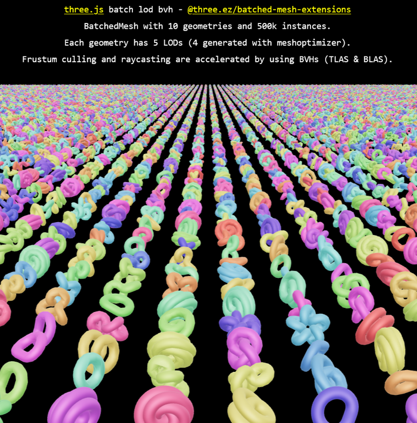

## Problem Statement

[In prior research](../hosting-3d-model/per-object-lod-control-with-threejs.md), we implemented LOD control to our scene using the [three.LOD()](https://threejs.org/docs/#LOD) class of objects. This tool worked best when we had individual objects being loaded to the scene in a standard fashion.


However, when working with `BatchedMesh` we start running into problems. Firstly, our objects are no longer saved as meshes- they are saved as [instances](instanced-mesh.md). We need to be deliberate with how we load our objects into memory. This adds an additional layer of complexity that will need to be addressed.

Secondly, since we're dealing with contiguous blocks of memory here, we will need to address how the LOD swapping mechanism works at the CPU - GPU interaction level. The last thing we'd want is to streamline our scene with batching and instancing, and then ruin it all by having the CPU send throusands of draw calls each frame when needing to swap the LOD of the objects.

And lastly, since we have so many objects in the scene, we do not want to be using traditional distance check algorithms when determining the objects that lie in our search radius. This will lead to many redundant calculations, and could even cause an entirely new bottleneck to our scene that will need fixing. Here, I would like to implement an [octree](notebooks/octree-querying.ipynb) search system that will narrow down our distance calculations to only a few carefully selected objects. I have an entire repo dedicated to studying [octree mechanics](https://github.com/suryashch/octree), so check that out.

This problem requires three logical parts that all need to come together and work in harmony- a three body problem, if you will.

## Understanding the Example

The example scene from gkjohnson provides us with a good starting point. [Here is the code behind it](https://github.com/mrdoob/three.js/blob/master/examples/webgl_batch_lod_bvh.html). The main code section we're interested in the </script> tag. There is a lot of code here, so I won't paste it unless it is important, but feel free to open and follow along if you so wish.

Before we peer into the code, I list out the main questions I'd like to have answered -->

1) How are the LOD's of the geometry being created?
2) How is the LOD added to the `BatchedMesh`?
3) How does the engine know which instances of the mesh are closest to the camera?
4) What sort of acceleration structure is being used to conduct our distance checks for determining active LODs?

We will keep these questions in mind as we move through the code.

Things kick off at the top with the imports. There are a few new ones that have not been seen before.

```js
import * as THREE from 'three';
import Stats from 'three/addons/libs/stats.module.js';
import { MapControls } from 'three/addons/controls/MapControls.js';
import { RoomEnvironment } from 'three/addons/environments/RoomEnvironment.js';
import { GUI } from 'three/addons/libs/lil-gui.module.min.js';

import { acceleratedRaycast, computeBatchedBoundsTree } from 'three-mesh-bvh';

import { createRadixSort, extendBatchedMeshPrototype, getBatchedMeshLODCount } from '@three.ez/batched-mesh-extensions';
import { performanceRangeLOD, simplifyGeometriesByErrorLOD } from '@three.ez/simplify-geometry';
```

The first import is just the base three.js library. The next 4 are cosmetic and not necessarily related to the mechanism. What is important are the last 3- `three-mesh-bvh`, `@three.ez/batched-mesh-extensions` and `three.ez/simplify-geometry`.

[`three-mesh-bvh`](https://github.com/gkjohnson/three-mesh-bvh) is a library used to create a Bounding Volume Hierarchy (BVH) of your scene. A BVH is similar to an octree, but rather than recursively divide by spatial coordinates, we divide by objects in the scene. More on this later.

[`batched-mesh-extensions`](https://github.com/agargaro/batched-mesh-extensions/) is a library that adds functionality to the `batchedmesh` object in threejs. More on this later.

And finally, [`simplify-geometry`](https://www.npmjs.com/package/@three.ez/simplify-geometry) appears to be a tool used to create multiple LOD's of a mesh. We shall also explore this later.

The code moves on to setting up metadata for the scene. We have discussed the basic [nuaces and requirements for this here](../hosting-3d-model/analysis_threejs.md). One additional initialization we observe here is for batchedMesh extensions.

```js
// add and override BatchedMesh methods ( @three.ez/batched-mesh-extensions )
    extendBatchedMeshPrototype();
```

This code block is defined in the docs for [`three.ez/batched-mesh-extensions`](https://github.com/agargaro/batched-mesh-extensions/), and must be called to enable the extended functions for `BatchedMesh`.

A variable of interest here is `batchedMesh` which shall be used to create our BatchedMesh object later.

```js
let batchedMesh;
```

There are a few additional terms in here, and one which is particularly of interest is the initialization of the raycaster.

```js
const raycaster = new THREE.Raycaster();
```

A raycaster allows for user interaction with the 3D model- it is how the model knows which object in the scene you have clicked on. This is the best analogy I have to understand how raycasting works- when you click on an object in the scene, think of the mouse emmitting a ray of light directly into the scene. This ray gets intersected by objects in the scene, and the first object to get hit is the object of interest. A raycaster "casts rays". Hopefully this helps.

The `init` function is where bulk of our main code is. Once again, I wont post the full code here, but feel free to follow along.

The code block I am interested in is the initialization of the BatchedMesh, which is here.

```js
const geometries = [
    new THREE.TorusKnotGeometry( 1, 0.4, 256, 32, 1, 1 ),
    new THREE.TorusKnotGeometry( 1, 0.4, 256, 32, 1, 2 ),
    new THREE.TorusKnotGeometry( 1, 0.4, 256, 32, 1, 3 ),
    new THREE.TorusKnotGeometry( 1, 0.4, 256, 32, 1, 4 ),
    new THREE.TorusKnotGeometry( 1, 0.4, 256, 32, 1, 5 ),
    new THREE.TorusKnotGeometry( 1, 0.4, 256, 32, 2, 1 ),
    new THREE.TorusKnotGeometry( 1, 0.4, 256, 32, 2, 3 ),
    new THREE.TorusKnotGeometry( 1, 0.4, 256, 32, 3, 1 ),
    new THREE.TorusKnotGeometry( 1, 0.4, 256, 32, 4, 1 ),
    new THREE.TorusKnotGeometry( 1, 0.4, 256, 32, 5, 3 )
];

// generate 4 LODs (levels of detail) for each geometry
const geometriesLODArray = await simplifyGeometriesByErrorLOD( geometries, 4, performanceRangeLOD );

// create BatchedMesh
const { vertexCount, indexCount, LODIndexCount } = getBatchedMeshLODCount( geometriesLODArray );
batchedMesh = new THREE.BatchedMesh( instancesCount, vertexCount, indexCount, new THREE.MeshStandardMaterial( { metalness: 1, roughness: 0.8 } ) );
```

`geometries` appears to be an array that contains the geometry of our individual instance objects. The parameters of `TorusKnotGeometry()` appear to control the shape of this object.

We then create a new variable `geometriesLODArray` using the function `simplifyGeometriesByErrorLOD`. This variable is then passed into another function `getBatchedMeshLODCount` which seems to return our `vertexCount`, `indexCount` and `instanceCount`- all of which are initialization parameters for [`BatchedMesh`](batched-mesh.md). For the time being, we will be creating our own LOD's so this step is not important.

The batchedmesh object is created using the properties acquired from the LOD generation step.

The next bit of code appears to index and instance our geometries. Here is what it looks like.

```js
// add geometries and their LODs to the batched mesh ( all LODs share the same position array )
for ( let i = 0; i < geometriesLODArray.length; i ++ ) {

    const geometryLOD = geometriesLODArray[ i ];
    const geometryId = batchedMesh.addGeometry( geometryLOD[ 0 ], - 1, LODIndexCount[ i ] );
    batchedMesh.addGeometryLOD( geometryId, geometryLOD[ 1 ], 50 );
    batchedMesh.addGeometryLOD( geometryId, geometryLOD[ 2 ], 100 );
    batchedMesh.addGeometryLOD( geometryId, geometryLOD[ 3 ], 125 );
    batchedMesh.addGeometryLOD( geometryId, geometryLOD[ 4 ], 200 );

}
```

Let's break this down. The array `geometriesLODArray` is an array of arrays. The first level of this array contains a reference to the specific geometry in the scene (specifically here it refers to our 10 different `TorusKnotGeometries` defined earlier). The second level of the list contains the geometry associated with our different LOD's. Researching a little more on [`SimplifyGeometry`](https://www.npmjs.com/package/@three.ez/simplify-geometry), we see that index 0 corresponds to the highest detailed mesh. We save the variable `geometrylOD` to be the ith index of this array, so effectively we are looping through our different object instances.

The `geometryID` is returned after adding the geometry of our object to the `batchedMesh`. `batchedMesh.addGeometry()` is in the base three.js library and is a default method in batchedMesh. This method returns the specific ID of our geometry, which we can use later for instancing. Within the `addGeometry()` method, we are passing the specific geometry itself (in this case, geometryLOD[ 0 ], corresponding to the highest detailed mesh here). The next two parameters correspond to `reservedVertexCount`, and `reservedIndexCount`. -1 signifies the default value, and we pass in the exact count of the number of instances we would like in the scene through the `LODIndexCount`, returned by the function `getBatchedMeshLODCount`.

We are then introduced to a new method, `.addGeometryLOD()`. This is a new method from the [`batched-mesh-extensions` library](https://github.com/agargaro/batched-mesh-extensions/) specifically under the [`LOD.ts`](https://github.com/agargaro/batched-mesh-extensions/blob/master/src/core/feature/LOD.ts) file. The parameters are the ID of the geometry (from the previous paragraph), the geometry of the LOD itself, from the `geometryLOD` array, and the distance at which the switch occurs. Each of the 4 LODs are added at the distances specified.

Woah.

That was an absolute mouthful. Essentially, we create a nested array `geometryLOD`, that contains at level 1, the basic geometries that exist in our model. Level 2 of the array contains the specific LODs for that object. Calling geometriesLODArray[0] will give us all the LOD's of the object in index 0. For each item in our for loop, we save the geometry of the object to our `BatchedMesh`, and then add the individual LOD's via the `addGeometryLOD()` method.

The next step in our code is to add the postitions of each of our instances. The code in our sample scene here adds these positions at random and places each instace on a 2x2 grid.

```js
const sqrtCount = Math.ceil( Math.sqrt( instancesCount ) );
const size = 5.5;
const start = ( sqrtCount / - 2 * size ) + ( size / 2 );

for ( let i = 0; i < instancesCount; i ++ ) {

    const r = Math.floor( i / sqrtCount );
    const c = i % sqrtCount;
    const id = batchedMesh.addInstance( Math.floor( Math.random() * geometriesLODArray.length ) );
    position.set( c * size + start, 0, r * size + start );
    quaternion.random();
    batchedMesh.setMatrixAt( id, matrix.compose( position, quaternion, scale ) );
    batchedMesh.setColorAt( id, color.setHSL( Math.random(), 0.6, 0.5 ) );

}
```

We won't go through this code in detail since our positions will be predefined in our scene. However, the key methods being called here are `.addInstance()`, `setMatrixAt` and `setColorAt`, all of which are [base `batchedMesh` methods](https://threejs.org/docs/#BatchedMesh).

Moving on, the next 2 code lines relate to our acceleration structures.

```js
// compute blas (bottom-level acceleration structure) bvh ( three-mesh-bvh )
batchedMesh.computeBoundsTree();

// compute tlas (top-level acceleration structure) bvh ( @three.ez/batched-mesh-extensions )
batchedMesh.computeBVH( THREE.WebGLCoordinateSystem );
```

Researching further into the mechanisms of TLAS (Top Level Acceleration Structure) and BLAS (Bottom Level Acceleration Structure), we see that both improve the performance of raycasting. Both methods relate to the BVH (Bounding Volume Hierarchy) that is a [similar concept to an octree](https://github.com/suryashch/octree).

The TLAS can be thought of as a broad phase algorithm. It starts at the top level of the scene and works its way down, checking constantly to see if our camera view intersects with a leaf node. The BLAS initiates after the TLAS is completed and iterates only through the results provided by the TLAS algorithm. The BLAS is more precise and goes down to the triangle level, to see if the raycast intersects with an object.

For the time being, we are more intersted in the TLAS, although the BLAS will be very useful too. We shall address this later.

Finally, the batchedMesh is loaded to the scene.

```js
scene.add( batchedMesh );
```

I think we're armed with sufficient information to recreate this concept with our own internal models.

## Basic Implementation

We shall try to recreate the above example using our Human Foot model. The first thing we need to do is split it out into its corresponding LOD's.

We proceed with this basic code structure.

```js
extendBatchedMeshPrototype();

THREE.Mesh.prototype.raycast = acceleratedRaycast;
THREE.BatchedMesh.prototype.computeBoundsTree = computeBatchedBoundsTree;

const instanceCount = 20;

let batchedMesh;

async function init() {
    const loader_batchLOD = new GLTFLoader().setPath('models/foot/');
    
    const [ hi, med, low ] = await Promise.all([
        loader_batchLOD.loadAsync('human-foot-hires.glb'),
        loader_batchLOD.loadAsync('human-foot-medres.glb'),
        loader_batchLOD.loadAsync('human-foot-lowres.glb')
    ]);
    
    const lod0 = hi.scene.children[0].geometry;
    const lod1 = med.scene.children[0].geometry;
    const lod2 = low.scene.children[0].geometry;

    const LODArray = [ 
        lod0,
        lod1,
        lod2
    ];
    
    const vCount = (lod0.attributes.position.count + 
                        lod1.attributes.position.count + 
                        lod2.attributes.position.count);
    
    const iCount = (lod0.index.count + 
                        lod1.index.count + 
                        lod2.index.count);

    const lod0_iCount = lod0.index.count;

    console.log( LODArray );

    const dummy = new THREE.Object3D();

    batchedMesh = new THREE.BatchedMesh( instanceCount, vCount, iCount, new THREE.MeshStandardMaterial());

    const geometryId = batchedMesh.addGeometry( LODArray[0], vCount, iCount );
    batchedMesh.addGeometryLOD( geometryId, LODArray[1], 5);
    batchedMesh.addGeometryLOD( geometryId, LODArray[2], 10);

    for (let i = 0; i < instanceCount; i++ ){
        const id = batchedMesh.addInstance( geometryId );
        
        dummy.position.set(
            Math.round( Math.random() * 10 ),
            Math.round( Math.random() * 10 ),
            Math.round( Math.random() * 10 )
        );

        dummy.updateMatrix();
        batchedMesh.setMatrixAt( id, dummy.matrix );
        batchedMesh.needsUpdate = true;
    };

    scene.add(batchedMesh);
}

init();
```

This code follows almost the same format as our previous `BatchedMesh` implementations, with a few key differences. Firstly, since we only have one mesh in our scene, we do not need a traversal loop. Instead, we load our three meshes as objects `hi`, `med` and `low`.

A key thing to keep in mind here is that we need to load these models within an async function. Async functions in js are a fundamental base JS concept that allow you to conduct operations out of sync. This means that functions can be loaded in the background while others are still running. A key concept here is that of a `Promise`, which essentially can be thought of as a placeholder return value from a function. The promise enables the asynchronous nature of these functions, as we no longer need to wait for the function to run entirely, just for the Promise to be created. Further information about promises [can be found here](https://developer.mozilla.org/en-US/docs/Learn_web_development/Extensions/Async_JS/Promises).

Anywway, back to the code. We nest our loader functions within an `Await` keyword, to pause the execution of the `init()` function until the loader object has successfully loaded our mesh. We had to implement this step since we were getting errors in the `batchedMesh` initialization due to the asynchronous nature of the JS functions.

Our loader object is loading the 3 versions of the mesh geometries to variables `hi`, `med` and `low`. We create the array `LODArray` with the individual LODs assigned to it.

We count the vertices and indices as normal.

The next code block initiates the `BatchedMesh` object with our precalculated data as follows -->

```js
batchedMesh = new THREE.BatchedMesh( instanceCount, vCount, iCount, new THREE.MeshStandardMaterial());

const geometryId = batchedMesh.addGeometry( LODArray[0], vCount, iCount );
batchedMesh.addGeometryLOD( geometryId, LODArray[1], 5);
batchedMesh.addGeometryLOD( geometryId, LODArray[2], 10);
```

The main geometry that is being used as the reference is that of LOD0. LOD's 1 and 2 are added to the batchedMesh object using the `addGeometryLOD()` method, as described in the example above.

Lastly, we set the position of our objects at random.

On load, this is what we are greeted with.

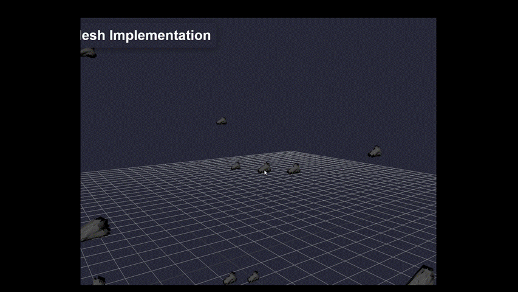

Our LOD function seems to be working well however, there seems to be some distortion at lower resolution LOD's. LOD0 (the full high resolution mesh) appears to be fine, but the other LOD's don't look the way they should. As a reminder, this is what we expect the lower LOD models to look like.


We see in the README of the [batched-mesh-extensions repo](https://github.com/agargaro/batched-mesh-extensions/), that for the LOD control mechanism to work, the geometries need to share the same vertex buffer. This is likely why we see distortions at our lower resolution LOD's. The way I understand it, when we [decimate](../reducing-mesh-density/analysis_decimate.md) our mesh in Blender, we create a new list of vertex ID's for our new mesh. Vertex ID number 10 in our original mesh may not correspond to the same vertex in our lower quality one.

As a result, our `batchedMesh` is creating the lower LOD while referencing the vertex indices of the LOD0 mesh. Hence, we see this distorted, exploded look.

This is why the example above was using the `SimplifyGeometry` method. This method applies the Decimation in place, while preserving the original vertex structure. In our case, this is not ideal, since this also increases the upfront runtime cost (for each unique geometry in the scene, we now need to apply a decimation step at runtime).

This is a problem, but one which I will tackle later. For now, I would like to measure some performance metrics.

## Performance of the Basic Scene

With only 20 instances of our foot in the scene, a high FPS count here is nothing to write home about. Let's increase our instance count and see how the performance varies.

To start off with, lets establish some base results. Our highest quality mesh contains 1,586 triangles, medium res contains 634, and low res contains 158. From high to low res, we see a 0.1x compression.

This means, on average we should expect to see a 10x improvement in GPU performance for batched LOD objects.

Here are the results of different number of instances in our objects.

### Table 1 - Performance Results BatchedMesh with LOD

| n_instances | triangles | expected_triangles | draw_calls | memory | fps |
| ----------- | --------- | ------------------ | ---------- | ------ | --- |
| 1 | 158 | 1,586 | 1 | 6 MB | 240 |
| 10 | 1,580 | 15,860 | 1 | 6 MB | 240 |
| 100 | 15,800 | 158,600 | 1 | 6 MB | 240 |
| 1,000 | 158,000 | 1,586,000 | 1 | 7 MB | 230 |
| 5,000 | 790,000 | 7,930,000 | 1 | 10 MB | 150 |
| 10,000 | 1,580,000 | 15,860,000 | 1 | 20 MB | 95 |
| 100,000 | 15,800,000 | 158,600,000 | 1 | 40 MB | 10 |

About the table:
- `n_instances`: The number of instances in the batchedMesh.
- `triangles`: The number of triangles in the scene.
- `expected_triangles`: The number of triangles that there would be, if we only had LOD0 (the highest quality mesh) active.
- `draw_calls`: The number of draw calls in the scene. Since we're working with batched mesh with one material, this will be 1 by default.
- `memory`: The memory being used by the webpage.
- `fps`: The overall frames being rendered per second. 60 FPS and above is generally gold standard.

There is a lot to unpack here. Firstly, the power of instancing is not lost on me. Even with 100,000 instances of the same object, our scene is only consuming 40 MB of memory!

Secondly, the LOD system is doing a lot of heavy lifting here. At 10,000 instances, we see that our GPU would have had to render 15M `expected_triangles` to the scene. Our MEP BIM model, used in the [InstancedMesh experiment](instanced-mesh.md) had ~8M triangles, so this is already double our MEP model. At 100,000 instances, the total number of theoretical triangles would be astronomical. The LOD system is only rendering the lowest quality mesh except for objects that are within the specified distance from the camera. As a result, our 10,000 instance model has only 790k trianlges, [roughly half of the Interior Kitchen model](draw-calls-in-scenes.md), but with 7,000 more individual objects.

At n=100,000 we see that our FPS count has reduced drastically. This is understandable since the GPU is rendering 15M triangles even after LOD compression. However, we load a new model layer from our original BIM model - `W-installatie` (yes, I'm aware the names are in Dutch, what can you do). This layer of the model is enormous, clocking in at 15M triangles. This level of triangle count can only mean one thing- we're dealing with a *really* large piping model. Sure enough, here is what the intricate details look like.


This model has internally got 15M triangles, which seems to align with our n=100,000 instance. However, loading this model to my scene and activating my NVIDIA GPU (extreme performance GPU), these are the results we get.

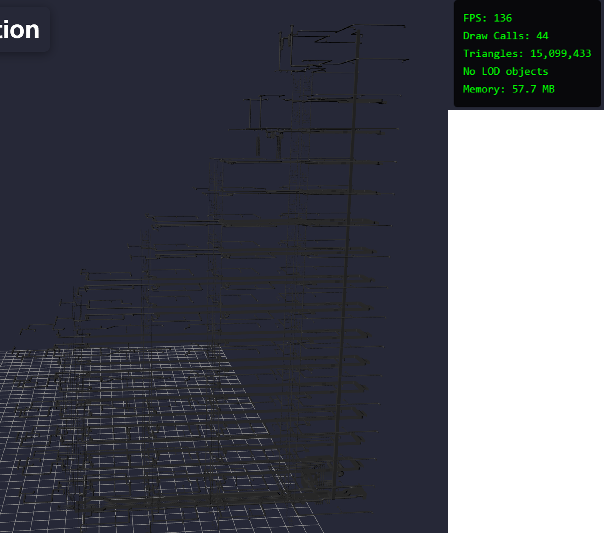

These results are far better. 136 FPS without even breaking a sweat. The BatchedMesh with LOD model however, fares worse.


Since our triangle count is the same in both cases, I suspect this may again have to do with CPU bottlenecks rather than GPU throughput. We can see that our NVIDIA GPU can handle 15M triangles easily, yet struggles with our BatchedMesh LOD scene. This may have to do with the distance calculations being conducted by our LOD engine. Luckily, we are provided with some techniques to address this, namely the BVH mentioned above. This is addressed in the Multiple Querying Problem below.

The performance results I'm most excited about are at n=10,000, where we see that the `expected_triangles` count is ~15M. This count was reduced down to 1.5M, and so the scene rendered at 95FPS. 15M triangles is a lot (double that of the MEP model), so I would expect that with our batching and LOD technique, we see some drastic performance improvements over our [current best of 121 FPS](instanced-mesh.md).

A happy side effect I noticed as well- as we zoom into an object and the LOD changes, we observe a fleeting increase in the total number of triangles being rendered to the screen, but that number very quickly drops back down as we continue zooming in. This is because of a method called `Frustum Culling`- objects that are outside of the immediate view of the camera are not rendered to the screen. `Frustum Culling` is enabled by default in three.js. What this means is, even if we have a high concentration of intricately modelled items in an area, our total triangle count will still be balanced because the objects off-screen will not be rendered.

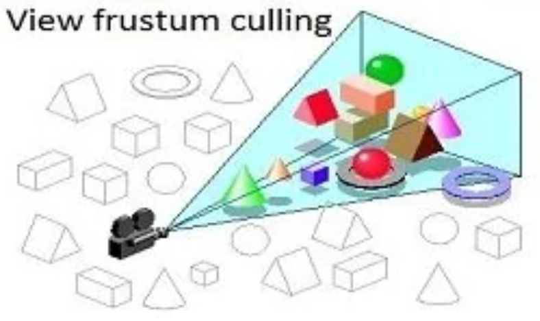

## Simplify Geometry Problem

We need to address the simplify geometry issue. Our batchedMesh system does not work unless our LOD's share the same vertex array. A fix provided in the example code above suggests that we create our LOD's at runtime using the function `simplifyGeometriesByErrorLOD()`. This is not ideal, but for testing purposes lets see how it performs. This function exists within the library [three.ez/simplify-geometry](three.ez/simplify-geometry). After some trial and error, this is how we were able to make it work.

```js
const instanceCount = 10000;

let batchedMesh;
let geometryId;
const dummy = new THREE.Object3D();

async function init() {
    const loader_batchLOD = new GLTFLoader().setPath('models/foot/');
    const mesh = await loader_batchLOD.loadAsync('human-foot-hires.glb');
    const geom = [ mesh.scene.children[0].geometry ];

    const geometriesLODArray = await simplifyGeometriesByErrorLOD( geom, 3, performanceRangeLOD )
    
    const { vertexCount, indexCount, LODIndexCount } = getBatchedMeshLODCount( geometriesLODArray );
	batchedMesh = new THREE.BatchedMesh( instanceCount, vertexCount, indexCount, new THREE.MeshStandardMaterial() );

    for ( let i=0; i < geometriesLODArray.length; i++ ){
        const geometryLOD = geometriesLODArray[ i ];
		geometryId = batchedMesh.addGeometry( geometryLOD[ 0 ], - 1, LODIndexCount[ i ] );
        batchedMesh.addGeometryLOD( geometryId, geometryLOD[ 1 ], 5 );
		batchedMesh.addGeometryLOD( geometryId, geometryLOD[ 2 ], 10 );
		batchedMesh.addGeometryLOD( geometryId, geometryLOD[ 3 ], 15 );
    };

    for ( let i = 0; i < instanceCount; i++ ){
        const id = batchedMesh.addInstance( geometryId );
        
        dummy.position.set(
            Math.round( Math.random() * 50 ),
            Math.round( Math.random() * 50 ),
            Math.round( Math.random() * 50 )
        );

        dummy.updateMatrix();
        batchedMesh.setMatrixAt( id, dummy.matrix );
        batchedMesh.needsUpdate = true;
    };

    scene.add(batchedMesh);
}

init();
```

A lot of the code has been adopted from the original example from gkjohnson above. At a high level, we load our foot model to our loader object and then call the function `simplifyGeometriesByErrorLOD()` to generate our LOD's- 3 to be exact. There is very little info in the documentation behind how it works, but my best guess is that it is using the [edge collapse](https://graphics.stanford.edu/courses/cs468-10-fall/LectureSlides/08_Simplification.pdf) method of mesh decimation.

On running this function, we get these results.


These results are even better than before. Referencing the table from our original batchedMesh with LOD implementation, we see that at 10,000 instances we had ~1.5M triangles in the scene. Using this method, we are halving that number even more - 770,000 triangles. As a result, the `FPS` metric has increased too. We repeat our experiment in [table 1](#table-1---performance-results-batchedmesh-with-lod) using the new `simplifyGeometry` method and observe these results -->

### Table 2 - Performance Results BatchedMesh with LOD - simplifyGeometry

| n_instances | triangles | expected_triangles | draw_calls | memory | fps |
| ----------- | --------- | ------------------ | ---------- | ------ | --- |
| 1 | 77 | 1,586 | 1 | 6 MB | 240 |
| 10 | 770 | 15,860 | 1 | 6 MB | 240 |
| 100 | 7,700 | 158,600 | 1 | 8 MB | 240 |
| 1,000 | 77,000 | 1,586,000 | 1 | 8 MB | 240 |
| 5,000 | 385,000 | 7,930,000 | 1 | 10 MB | 220 |
| 10,000 | 770,000 | 15,860,000 | 1 | 15 MB | 140 |
| 100,000 | 7,700,000 | 158,600,000 | 1 | 40 MB | 10 |

These are even more impressive results. Most importantly, we see a sharp increase in the FPS count for `n_instances` = 5,000 (150 -> 220 FPS) and 10,000 (95 -> 140 FPS), both extremely promising for our MEP model which falls into this range.

Although this method yields promising results, we note here that our `simplifyGeometry` algorithm is compiling at loadtime with only one object in our scene. Since our MEP model will have multiple unique geometries, it won't be feasible in the long term to compress our larger models.

## Shared Vertex Arrays

This section is a condensed version of a larger body of research on [mesh simplification](../reducing-mesh-density/mesh-simplification.md) and [GLTF file reindexing](gltf-preprocessing.md).

The docs for [BatchedMesh-extensions](https://github.com/agargaro/batched-mesh-extensions/) mention that LOD control requires all objects to share the same vertex array. This means, our LODs all need to use the same vertex data structure saved in memory. This proves to be a tougher problem to solve that at first glance.

To inspect our mesh's vertex and face arrays, we use a program called [MeshLab](https://www.meshlab.net/). This application includes a Python native API- [PyMeshLab](https://pymeshlab.readthedocs.io/en/latest/). This program is similar to [Blender](../hosting-3d-model/bpy_with_lod.md), but provides additional tools for mesh editing.

Let's understand the problem at hand. We require 2 LOD's of a mesh that both share the same vertex array. Traditionally, we have used Blender's [decimate method](../reducing-mesh-density/analysis_decimate.md) to create our LOD's however, this comes with 2 problems.

- The decimate edge-collapse algorithm creates new vertices in the LOD. This means the vertex positions in the decimated mesh will differ from the original one.
- The decimated mesh completely reorders the vertex numbers. This means, vertex number 10 in our original mesh may have a completely different index in the decimated mesh. Hence, the array will not be shared between the meshes.

To drive the point home, here is a diagram that helps explain the problem.

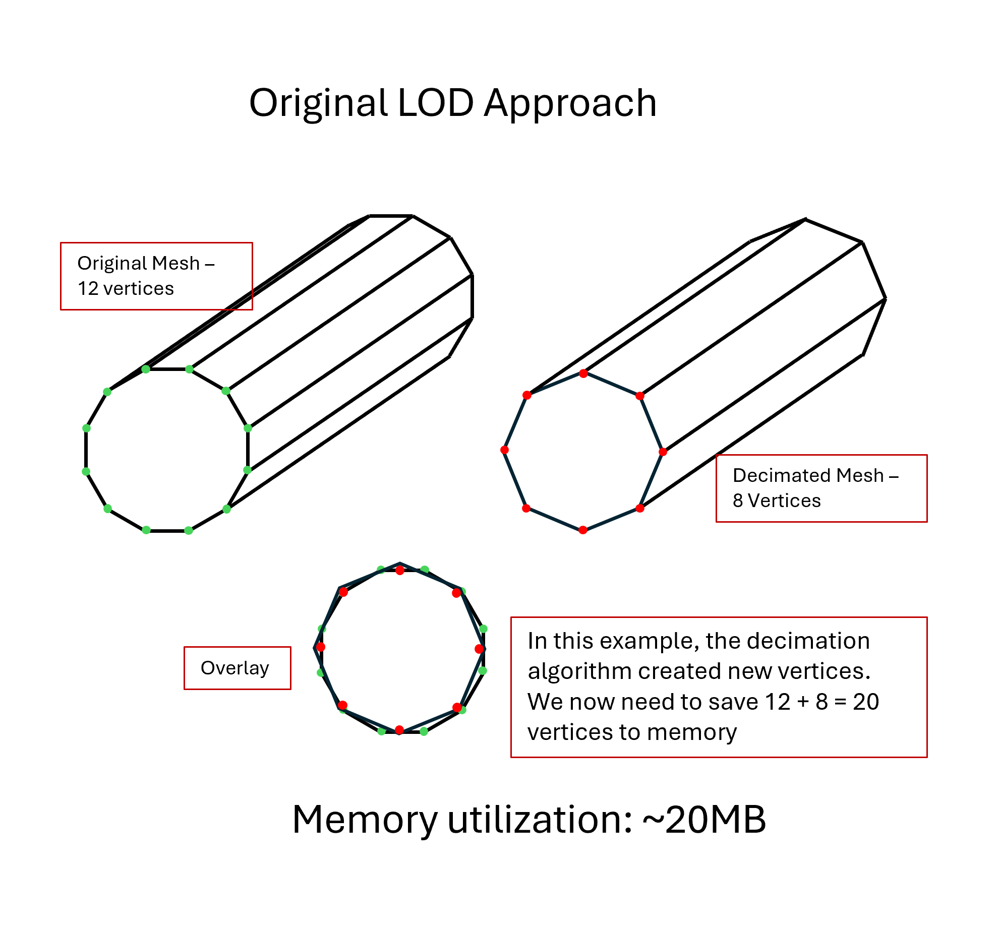

In the original Decimate LOD approach, we were creating new vertices on the fly. This did reduce the triangle count overall, but you can see when overlayed, that these 2 meshes do not share the same vertex array. The points are essentially duplicated, and we need to save both the original and decimated mesh's vertices to memory.

What we want, is for our LOD's to share the same vertex array.

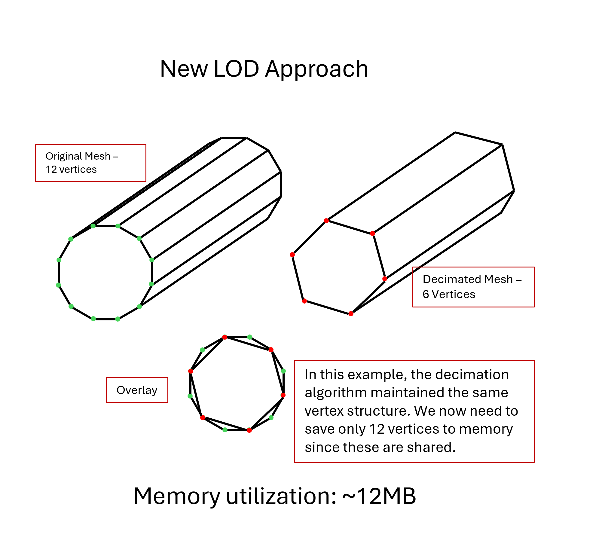

In the diagram above, the decimated mesh is an exact subset of the original- i.e. the vertices are shared. By doing this, we only need to save the original mesh's vertices to memory, and the decimated mesh can be simply sliced from the bank of the original.

Here is where `pymeshlab` comes in. MeshLab includes in its API, a host of different decimation methods, including the one we have been using this whole time- [edge collapse](https://pymeshlab.readthedocs.io/en/latest/filter_list.html#meshing_decimation_quadric_edge_collapse). However, where MeshLab differs from Blender is this argument which can be passed into the function: `optimalplacement = True`. This argument is set to `True` by default and tells the program to place the new vertices in the optimal place, such that the shape of the mesh is maintained. Ideally, we'd want our decimated mesh to resemble the original as much as possible hence why it deafults to True. However in our case, we actually want to set this to be `False`. By setting this argument as `False`, we collapse the edges into existing vertices in the original mesh.

All this to say, running this function on our human foot model, we observe the following vertex array structure.


The decimation strength is low, but when we overlay our high-res and low-res mesh over each other- we observe that the vertices of both align 1 to 1. Vertices in `red` are shared between our decimated mesh and original (these were untouched by the decimation algorithm). Vertices in `green` are specific to the original mesh and provide the finer details- especially in the toes.

You can follow along with the trial and error used to get to this point by analysing the code in [mesh-simplification.md](../reducing-mesh-density/mesh-simplification.md).

This solves our shared vertex array problem, but we still have an issue. The decimated mesh might have the same vertex positions as the original, but the index of each vertex is still different. Here we show the results of the edge collapse decimation step, with `optimalplacement= False`.

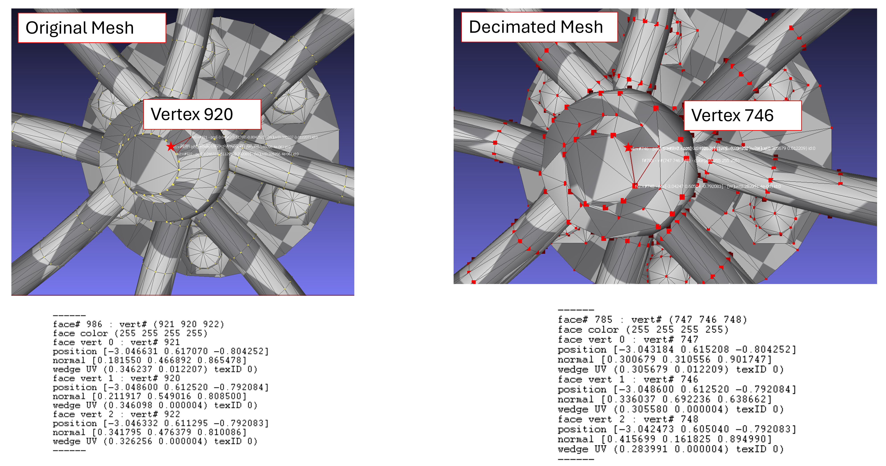

We see in the figure above, the vertex highlighted in `red` is positionally the same across our meshes, but has a different index number.

The only way we can assure the same index ordering structure across our meshes is to manually reorder the vertices.

[pymeshlab](https://pymeshlab.readthedocs.io/en/latest/) offers tools to view the vertex and face array for each mesh. Here, we load our human foot model and view the fundamental arrays.

```py
import pymeshlab

ms = pymeshlab.MeshSet()
ms.load_new_mesh('models/foot/human-foot.obj')

m = ms.current_mesh()
v_matrix = m.vertex_matrix()
f_matrix = m.face_matrix()
```

To view these matrices, let's convert to dataframe.

```py
vertex_df = pd.DataFrame(v_matrix, columns=["X", "Y", "Z"])
vertex_df.head()
```


We see the familiar shaped array implying 800 vertices each with x,y,z coordinates. Similarly, this is what the face array looks like when converted to dataframe.


These 2 arrays are the basic information we need to create our 3D object. Let's apply a decimation filter on this mesh.

```py
ms.meshing_decimation_quadric_edge_collapse(optimalplacement=False)
```

As mentioned above, we set the argument `optimalplacement=False` to ensure the decimated vertices are positionally the same as the original. Now, we get the decimated mesh's vertex and face array.

```py
v_matrix_decimate = m.vertex_matrix()
f_matrix_decimate = m.face_matrix()
```

The length of `v_matrix_decimate` confirms that we have indeed reduced the density of this mesh- 403 vertices versus the original 800. However, we can indeed see that the vertex indices are shuffled. To reorder these, we treat the position of each vertex as a unique key for both our meshes. This means, we can identify a vertex in the decimated mesh based on its position (X,Y,Z), look up that same value of coordinates in the original, and compare the indices across the tables. For example -->

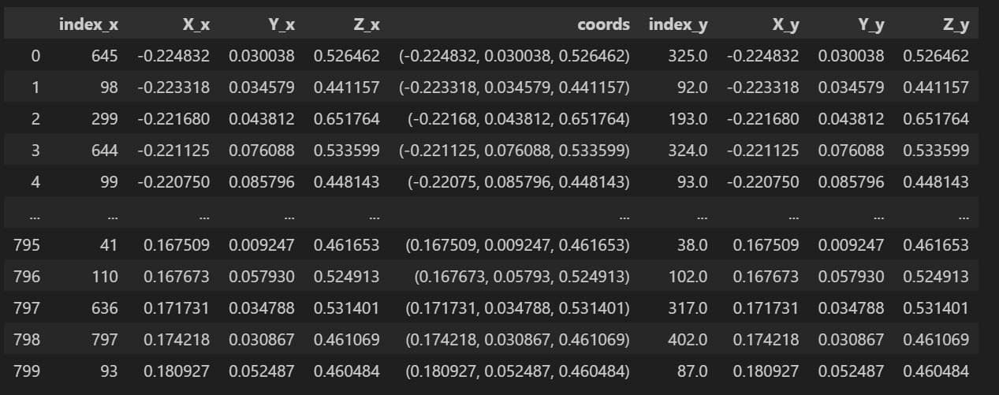

The vertex in row 1 has coordinates (-0.224832, 0.030038, 0.526462).

In the original mesh it had an index of 645. In the decimated mesh it has an index of 325. We have essentially created a map that tracks the index of a vertex before decimation and after.

We can now reorder our original mesh to match the order in our decimated one. Now, the decimated mesh can simply be saved to memory as a subset of the original (the first 403 rows, to be precise).

Here is a condensed version of the modularized code which we used to make this work.

```py
def decimate_mesh(v_mat, f_mat, perc_red=0.0):
    ms = pymeshlab.MeshSet()
    org_m = pymeshlab.Mesh(v_mat, f_mat)

    ms.add_mesh(org_m)

    ms.meshing_decimation_quadric_edge_collapse(optimalplacement=False, targetperc=perc_red)
    m = ms.current_mesh()

    v_dm = m.vertex_matrix()
    f_dm = m.face_matrix()

    v_dict = { tuple(row): i for i, row in enumerate(v_dm) }
    v_remapping = np.argsort(np.array([v_dict.get(tuple(row), np.inf) for row in v_mat ]))

    v_org_rmp = v_mat[v_remapping]

    v_inv_mapping = np.argsort(v_remapping)
    f_org_rmp = v_inv_mapping[f_mat]

    ms.clear()

    return v_org_rmp, f_org_rmp, v_dm, f_dm
```

For a better understanding of this process, feel free to take a deeper dive in the [mesh-simplification research document](../reducing-mesh-density/mesh-simplification.md).

Regardless of whether you were following along, the key question remains- does this method address our problem statement?

Well, we load our manually reindexed Human Foot model to our `BatchedMesh-with-LOD` scene created above (this time, only with a low and hi res version of the mesh), and observe this.


On first glance, we see that the distorted look from earlier is gone, and our foot model is definitely looking like a foot. More good news, we isolate these 2 frames in the gif above and focus on the toenails.

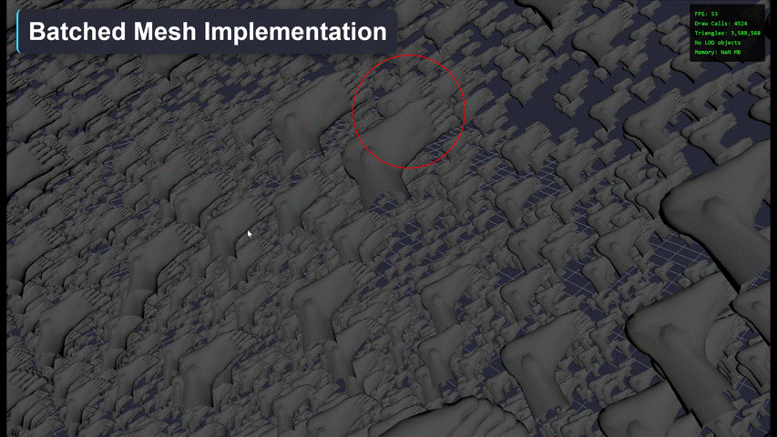

A striking success. We do see that the finer details of the model are only showing up past a certain zoom level. Let's extend this knowledge out to our MEP model.

### Applying to MEP Model

Let's apply the above concepts to the MEP model. Here, we have multiple meshes saved in one scene, so we will need to iterate through each and apply our decimation and reindexing script from above. We will also need to be extra careful when writing our data to memory since the [GLTF file type](https://www.khronos.org/gltf/) requires strict formatting.

As mentioned earlier, this section is condensed for clarity. A full deep dive of the analysis can be found in [gltf-preprocessing.md](gltf-preprocessing.md).

We have worked briefly with [GLTF](../hosting-3d-model/analysis_threejs.md) files before but we've never understood the schema which makes this work. GLTF uses a JSON style file format, with each object in the scene belonging to a hierarchy. We follow the hierarchy down to the lowest level, by following a set of indexes. The overall hierarchy of this file can be seen in the figure in this [GLTF Hirearchy Reference Manual](../../gltf20-reference-guide.pdf) from Khronos Group.

The main package we shall be using for editing the GLTF files is [pygltflib](https://pypi.org/project/pygltflib/), a python based library that provides all the tools necessary to work with GLTF files. The [docs](https://pypi.org/project/pygltflib/) actually provide us with most of the code we need to get the job done. Specifically-

- load .gltf or .glb files to session,

```py
import pygltflib

filename = "models/foot/human-foot-hires.glb"
gltf = pygltflib.GLTF2().load(filename)
```

- acquire the `points` (vertex) array,

```py
binary_blob = gltf.binary_blob()

points_accessor = gltf.accessors[gltf.meshes[0].primitives[0].attributes.POSITION]
points_buffer_view = gltf.bufferViews[points_accessor.bufferView]
points = np.frombuffer(
    binary_blob[
        points_buffer_view.byteOffset
        + points_accessor.byteOffset : points_buffer_view.byteOffset
        + points_buffer_view.byteLength
    ],
    dtype="float32",
    count=points_accessor.count * 3,
).reshape((-1, 3))
```

- acquire the `triangles` (faces) array from a mesh,

```py
binary_blob = gltf.binary_blob()

triangles_accessor = gltf.accessors[gltf.meshes[0].primitives[0].indices]
triangles_buffer_view = gltf.bufferViews[triangles_accessor.bufferView]
triangles = np.frombuffer(
    binary_blob[
        triangles_buffer_view.byteOffset
        + triangles_accessor.byteOffset : triangles_buffer_view.byteOffset
        + triangles_buffer_view.byteLength
    ],
    dtype="uint8",
    count=triangles_accessor.count,
).reshape((-1, 3))
```

- write custom [`bufferViews` and `accessors`](gltf-preprocessing.md),

```py
triangles_binary_blob = triangles.flatten().tobytes()
points_binary_blob = points.tobytes()
gltf = pygltflib.GLTF2(
    scene=0,
    scenes=[pygltflib.Scene(nodes=[0])],
    nodes=[pygltflib.Node(mesh=0)],
    meshes=[
        pygltflib.Mesh(
            primitives=[
                pygltflib.Primitive(
                    attributes=pygltflib.Attributes(POSITION=1), indices=0
                )
            ]
        )
    ],
    accessors=[
        pygltflib.Accessor(
            bufferView=0,
            componentType=pygltflib.UNSIGNED_BYTE,
            count=triangles.size,
            type=pygltflib.SCALAR,
            max=[int(triangles.max())],
            min=[int(triangles.min())],
        ),
        pygltflib.Accessor(
            bufferView=1,
            componentType=pygltflib.FLOAT,
            count=len(points),
            type=pygltflib.VEC3,
            max=points.max(axis=0).tolist(),
            min=points.min(axis=0).tolist(),
        ),
    ],
    bufferViews=[
        pygltflib.BufferView(
            buffer=0,
            byteLength=len(triangles_binary_blob),
            target=pygltflib.ELEMENT_ARRAY_BUFFER,
        ),
        pygltflib.BufferView(
            buffer=0,
            byteOffset=len(triangles_binary_blob),
            byteLength=len(points_binary_blob),
            target=pygltflib.ARRAY_BUFFER,
        ),
    ],
    buffers=[
        pygltflib.Buffer(
            byteLength=len(triangles_binary_blob) + len(points_binary_blob)
        )
    ],
)
gltf.set_binary_blob(triangles_binary_blob + points_binary_blob)
```

- save to a new file.

```py
filename = "test.glb"
gltf.save(filename)
```

I wont go through the details of our final script, but they can be found in the [accompanying research document](gltf-preprocessing.md). In essence we combined our decimate script from earlier with a new manual GLTF buffer writing script and placed it within a loop. Here is what our preprocessing pipeline looks like.

1) Start by creating a blank GLTF container to save our reindexed meshes.
2) We loop through every `node` in our GLTF scene.
3) We extract the mesh from each node.
4) We acquire the vertex and face arrays of the selected mesh.
5) We decimate this mesh using `pymeshlab` edge_collapse algorithm, remembering to set `optimalplacement=False`.
6) We save the resulting decimated mesh's vertex and face array.
7) The original mesh's vertices and faces are reindexed to match the decimated one.
8) We add the decimated mesh and the remapped original to our blank GLTF container.
9) Continue to the next `node` in the scene.
10) Lastly, the data is saved to a new GLB file.

And finally, after all of this preprocessing we can look to load our MEP model to the scene.

### Custom MEP Model Loaded to Scene

The results of our preprocessing script currently creates one large file that contains both the high and low resolution meshes. Hence, we will need to apply the same [`traverse()` method](../hosting-3d-model/basic-lod-control-with-threejs.md) used in earlier research.

The code used to load this data to the scene contains elements from the [BatchedMesh implementation](batched-mesh.md) and the afore-discussed [BatchedMesh with LOD](#basic-implementation) script. After some trial and error, here is what we came up with.

```js
extendBatchedMeshPrototype();

THREE.Mesh.prototype.raycast = acceleratedRaycast;
THREE.BatchedMesh.prototype.computeBoundsTree = computeBatchedBoundsTree;

let batchedMesh;

async function init() {

    let totalInstanceCount = 0;
    let totalVertexCount = 0;
    let totalIndexCount = 0;
    
    let uuid_map = new Map();
    
    const loader_instance = new GLTFLoader().setPath('models/bim-model/');
    const gltf = await loader_instance.loadAsync('test-mep.glb')
    
    const meshes = [];

    gltf.scene.traverse((child) => {
        if (child.isMesh) {
            meshes.push( child )
        };
    });

    for (const child of meshes) {
        const geom = child.geometry;
        const geom_uuid = geom.uuid;
        const index_count = geom.index.count;
        const vertex_count = geom.attributes.position.count;
        const inst_matrix = child.matrixWorld.clone();

        const [base_name, mesh_resolution] = child.name.split("-");

        if ( !uuid_map.has( base_name )){
            // If map does not have the mesh already, first create it
            
            uuid_map.set( base_name, new Map() );

            uuid_map.get( base_name ).set( "geometry", [] );
            uuid_map.get( base_name ).get( "geometry" ).push( geom )

            uuid_map.get( base_name ).set( "LODIndexCount", index_count * 2 );
            uuid_map.get( base_name ).set( "matrix", [] );

            uuid_map.get( base_name ).get( "matrix" ).push( inst_matrix );

            totalVertexCount += vertex_count;
            totalIndexCount += index_count * 2;
            totalInstanceCount += 1;
        
        } else {
            
            if ( mesh_resolution === "hires"){
                uuid_map.get( base_name ).get( "geometry" ).unshift( geom )
            } else {
                uuid_map.get( base_name ).get( "geometry" ).push( geom )
            };

            totalInstanceCount += 1;
        };
    };

    batchedMesh = new THREE.BatchedMesh( 100000, totalVertexCount, totalIndexCount, new THREE.MeshStandardMaterial() );

    uuid_map.forEach((value, key) => {

        const geometry = value.get("geometry");
        const LODIndexCount = value.get("LODIndexCount")
        const matrices = value.get("matrix");

        const geometry_hires = geometry[ 0 ];
        const geometry_lowres = geometry[ 1 ];
        
        const geometryId = batchedMesh.addGeometry( geometry_hires, -1, LODIndexCount );
        batchedMesh.addGeometryLOD( geometryId, geometry_lowres, 10 );

        const instanceId = batchedMesh.addInstance( geometryId )
        batchedMesh.setMatrixAt( instanceId, matrices[ 0 ] )

    });

    batchedMesh.needsUpdate = true;
    scene.add(batchedMesh);
};

init();
```

The code above first loops through the objects in the scene, saving each mesh to an array so as to [not edit the scene tree](../hosting-3d-model/bpy_with_lod.md).

For each mesh in our array, we now need to create a scene map. The logistics of this code is explained in more detail in the [BatchedMesh experiment](batched-mesh.md). Essentially, we keep track of the LODs in the scene by creating a `Map` object. The key of the map is the unique name of the mesh. Each entry in the map stores information relating to the `geometry` (low res or high res), the number of unique indices (`LODIncstanceCount`) and the matrix. Thus, when we push the objects to our BatchedMesh, we can effectively iterate over each mesh and add the low and high resolution versions of each.

Now, when we boot up our scene in a web browser, this is what we're greeted with.


This is a promising start. Our LOD system is definitely working- zooming into objects in the scene causes them to render in high resolution. As well, we observe a far lower triangle count at a 50ft view- 5M triangles compared to the original 8M. We established earlier than the decimation amount we applied was low, so theoretically, this figure could be optimized even further. The draw calls are limited to ~3k, which is a lot lower than the 30k unique objects which exist in the scene. FPS is sitting at ~30-40, not ideal but perhaps this could be improved further.

At this point, I am confident that the LOD swapping mechanism works within our `BatchedMesh` implementation however, we establish that CPU bottlenecks do still exist. These CPU bottlenecks should be controllable through using a `BVH` to query our near and far objects. This is explained ahead.

## Multiple Querying Problem

From the results in Table 1 and 2, we observe a sharp drop off in performance when we increase the number of instances in our `BatchedMesh` object to 100,000. While its obvious that 100,000 is a singificantly larger number of objects compared to 10,000, it is suspicious that the drop-off is so sharp. In this case, I believe the issue has to do with two main issues- the number of distance calculations being done by the CPU, and the sheer number of individual instances being saved to our `batchedMesh` object.

We can solve the instance number issue by converting to [`instancedMesh`](instanced-mesh.md). This object is known to hold higher numbers of instances. Sure enough, when we swap the `batchedMesh` to an `instancedMesh`, we get 90 FPS even with 100,000 instances.

```js
// Basic Instancing with instancedMesh
const geometry = new THREE.BoxGeometry(1,1,1);
const material = new THREE.MeshBasicMaterial();
const instanceCount = 50000;

const instancedMesh = new THREE.InstancedMesh( geometry, material, instanceCount )

const dummy = new THREE.Object3D()

for ( let i=0; i < instanceCount; i++ ){

    dummy.position.set(
        Math.round( (Math.random() - 0.5) * 50 ),
        Math.round( (Math.random() - 0.5) * 50 ),
        Math.round( (Math.random() - 0.5) * 50 )
    );

    dummy.updateMatrix();
    instancedMesh.setMatrixAt( i, dummy.matrix );
}

scene.add( instancedMesh )
```

To solve the CPU bottleneck problem, a tool we can use is an [octree](notebooks/octree-querying.ipynb). This limits the number of distance calculations which need to be conducted by the engine and reduces the time complexity of this problem from O(n) to O(log n). This is elaborated further, [in this report on Octree Basics](https://github.com/suryashch/octree/blob/main/reports/octree.md).

We shall be working with a special flavour of octree here called a `Bounding Volume Hierarchy` (BVH) tree system. This system is considered a Top Level Acceleration Structure (TLAS) since it creates the tree levels based bounding boxes of the objects in the scene, rather than generic cubes in space. The de facto library in three.js for this tree is maintained by gkjohnson, (the author of our test script above) [and can be found here](https://github.com/gkjohnson/three-mesh-bvh). Let's implement this method using our code for the foot model.

Let's revisit the LOD swapping code from earlier, using the human-foot model.

```js
const instanceCount = 10000;

let batchedMesh;
let geometryId;
const dummy = new THREE.Object3D();

async function init() {
    const loader_batchLOD = new GLTFLoader().setPath('models/foot/');
    const mesh = await loader_batchLOD.loadAsync('human-foot-hires.glb');
    const geom = [ mesh.scene.children[0].geometry ];

    const geometriesLODArray = await simplifyGeometriesByErrorLOD( geom, 3, performanceRangeLOD )
    
    const { vertexCount, indexCount, LODIndexCount } = getBatchedMeshLODCount( geometriesLODArray );
	batchedMesh = new THREE.BatchedMesh( instanceCount, vertexCount, indexCount, new THREE.MeshStandardMaterial() );

    for ( let i=0; i < geometriesLODArray.length; i++ ){
        const geometryLOD = geometriesLODArray[ i ];
		geometryId = batchedMesh.addGeometry( geometryLOD[ 0 ], - 1, LODIndexCount[ i ] );
        batchedMesh.addGeometryLOD( geometryId, geometryLOD[ 1 ], 5 );
		batchedMesh.addGeometryLOD( geometryId, geometryLOD[ 2 ], 10 );
		batchedMesh.addGeometryLOD( geometryId, geometryLOD[ 3 ], 15 );
    };

    for ( let i = 0; i < instanceCount; i++ ){
        const id = batchedMesh.addInstance( geometryId );
        
        dummy.position.set(
            Math.round( Math.random() * 50 ),
            Math.round( Math.random() * 50 ),
            Math.round( Math.random() * 50 )
        );

        dummy.updateMatrix();
        batchedMesh.setMatrixAt( id, dummy.matrix );
        batchedMesh.needsUpdate = true;
    };

    scene.add(batchedMesh);
}

init();
```

This code unfortunately is set up to individually calculate the distance between each instance in our model. To truly eliminate redundant calculations, we will need to manually create this `batchedmesh` object, with a manual trigger to swap the LOD's. To do so, we must load both versions of the model (hi and low res) to a single BatchedMesh object.

```js
const instanceCount = 10000;

let batchedMesh;
const dummy = new THREE.Object3D();
let meshes = [];

let totalVertexCount = 0;
let totalIndexCount = 0;

let hiresGeomIds = [];
let lowresGeomIds = [];

async function init() {
    const loader = new GLTFLoader().setPath('models/foot/');
    const [gltf_hi, gltf_low] = await Promise.all([
        loader.loadAsync('human-foot-hires.glb'),
        loader.loadAsync('human-foot-lowres.glb')
    ]);
    
    const geom_hires = gltf_hi.scene.children[0].geometry;
    const geom_lowres = gltf_low.scene.children[0].geometry;

    totalVertexCount += geom_hires.attributes.position.count;
    totalVertexCount += geom_lowres.attributes.position.count;

    totalIndexCount += geom_hires.index.count;
    totalIndexCount += geom_lowres.index.count;

    batchedMesh = new THREE.BatchedMesh(
        instanceCount,
        totalVertexCount,
        totalIndexCount,
        new THREE.MeshStandardMaterial()
    );

    const lowres_geometryId = batchedMesh.addGeometry( geom_lowres );
    const hires_geometryId = batchedMesh.addGeometry( geom_hires );

    for ( let i = 0; i < instanceCount; i++ ){
        const id = batchedMesh.addInstance( lowres_geometryId );
        
        lowresGeomIds[ id ] = geom_lowres;
        hiresGeomIds[ id ] = geom_hires;

        dummy.position.set(
            Math.round( Math.random() * 50 ),
            Math.round( Math.random() * 50 ),
            Math.round( Math.random() * 50 )
        );

        dummy.updateMatrix();
        batchedMesh.setMatrixAt( id, dummy.matrix );
    };
    
    batchedMesh.needsUpdate = true;
    scene.add(batchedMesh);

}

init();
```

We have essentially created a new batchedMesh object here that contains the geometry for both our hi and lowres meshes, but only activates the lowres mesh on load. We then keep track of which instances in the scene are in which location. In the code below specifically, we keep track of the instance id in 2 arrays - `lowresGeomIds` and `hiresGeomIDs`. For each instance saved in the `batchedMesh`, we keep track of this `id` within each array. On load, we see 10,000 instances of the lowres mesh.

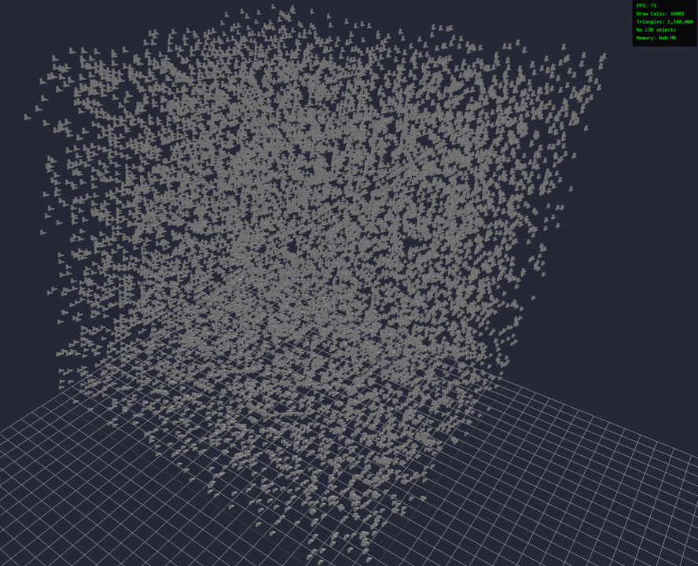

This aligns with the results seen in [Table 1](#table-1---performance-results-batchedmesh-with-lod). However, there is no LOD control at this point. To do so, we must create a new BVH object. We add these 2 lines of code after adding our `batchedMesh` object to the scene.

```js
bvh = new ObjectBVH( batchedMesh );
console.log(bvh);
```

Now, when we open the console, this is what we see.

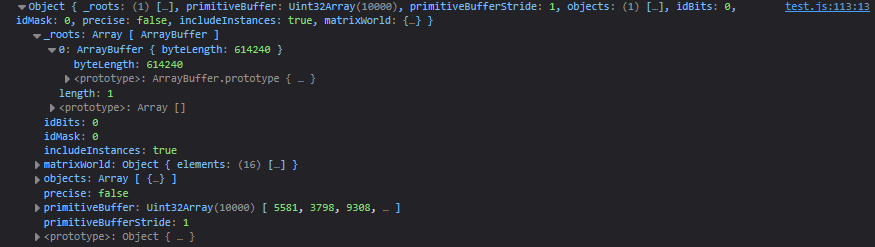

If we open out the primitive buffer, we see a group of mapped objects which look similar to the [GLTF mapping](gltf-preprocessing.md) exercise.


## Conclusion

Let's reiterate the problem statement here. The main issue with our MEP model is that is is large- both in terms of raw objects ([Draw Calls](draw-calls-in-scenes.md)) and in terms of triangles ([GPU Throughput](../hosting-3d-model/per-object-lod-control-with-threejs.md)). As a result, this model faces singificant performance limitations.

We address the draw calls issue through the use of [Batching](batched-mesh.md) and [Instancing](instanced-mesh.md).

To address the GPU throughput problem, we've established that [LOD control](../hosting-3d-model/per-object-lod-control-with-threejs.md) in an effective means to an end. However as seen in the work above, traditional methods fail because we need to ensure 

We were able to establish that batching a scene with LOD control is possible. Current limitations of this approach include inconsistencies with the type and quality of geometry, runtime computational costs, and limitations due to search querying algorithms slowing down CPU-GPU bandwidth (as seen in the 100,000 instance example).

## Links

[instancing](instanced-mesh.md)

[batching](batched-mesh.md)

[draw calls](draw-calls-in-scenes.md)

[this example](https://threejs.org/examples/webgl_batch_lod_bvh.html)

[three.LOD()](https://threejs.org/docs/#LOD)

[octree](notebooks/octree-querying.ipynb)

[octree mechanics](https://github.com/suryashch/octree)

[Here is the code behind it](https://github.com/mrdoob/three.js/blob/master/examples/webgl_batch_lod_bvh.html)

[nuaces and requirements for this here](../hosting-3d-model/analysis_threejs.md)

[`SimplifyGeometry`](https://www.npmjs.com/package/@three.ez/simplify-geometry)

[`three.ez/batched-mesh-extensions`](https://github.com/agargaro/batched-mesh-extensions/)

[`LOD.ts`](https://github.com/agargaro/batched-mesh-extensions/blob/master/src/core/feature/LOD.ts)

[base `batchedMesh` methods](https://threejs.org/docs/#BatchedMesh)

[Promises in JS](https://developer.mozilla.org/en-US/docs/Learn_web_development/Extensions/Async_JS/Promises)

[decimate](../reducing-mesh-density/analysis_decimate.md)

[In previous work](../hosting-3d-model/per-object-lod-control-with-threejs.md)

[three.ez/simplify-geometry](three.ez/simplify-geometry)

[edge collapse](https://graphics.stanford.edu/courses/cs468-10-fall/LectureSlides/08_Simplification.pdf)

[Octree Basics](https://github.com/suryashch/octree/blob/main/reports/octree.md)

[three-mesh-bvh](https://github.com/gkjohnson/three-mesh-bvh)

[mesh simplification](../reducing-mesh-density/mesh-simplification.md)

[MeshLab](https://www.meshlab.net/)

[edge collapse](https://pymeshlab.readthedocs.io/en/latest/filter_list.html#meshing_decimation_quadric_edge_collapse)

[GLTF file type](https://www.khronos.org/gltf/)

[GLTF](../hosting-3d-model/analysis_threejs.md)

[GLTF Hirearchy Reference Manual](../../gltf20-reference-guide.pdf)

[docs](https://pypi.org/project/pygltflib/)

[`traverse()` method](../hosting-3d-model/basic-lod-control-with-threejs.md)