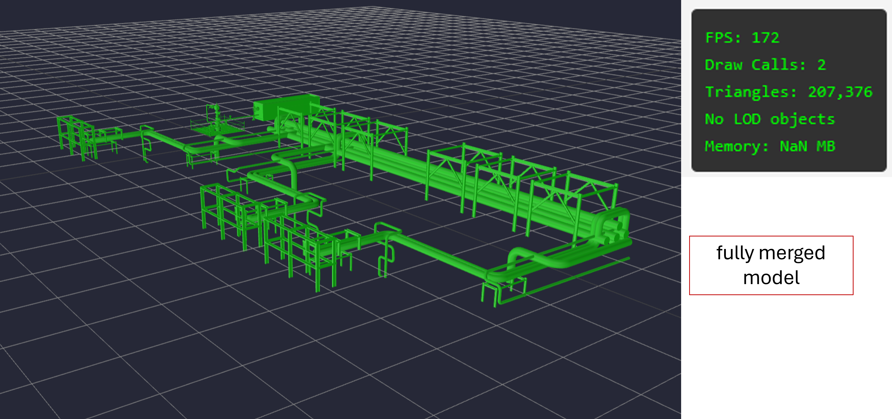
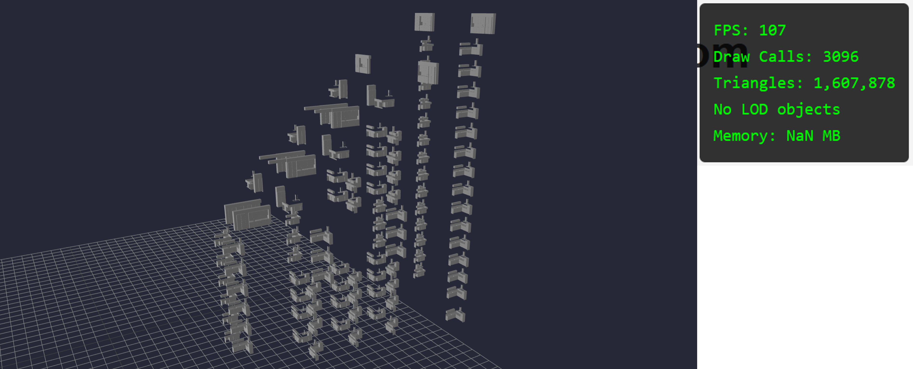
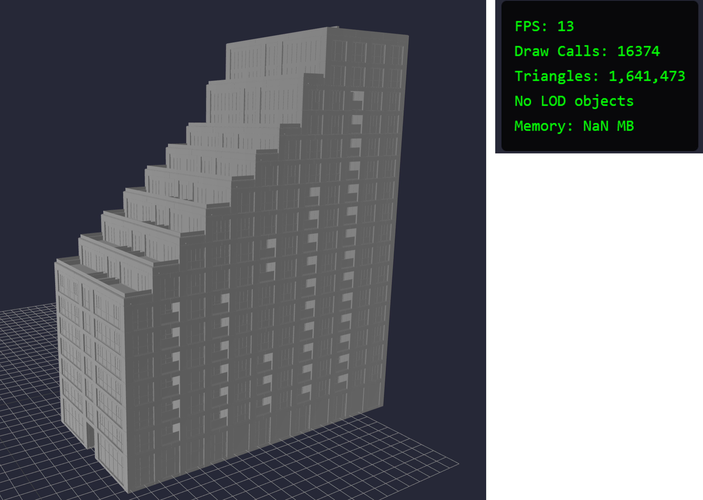
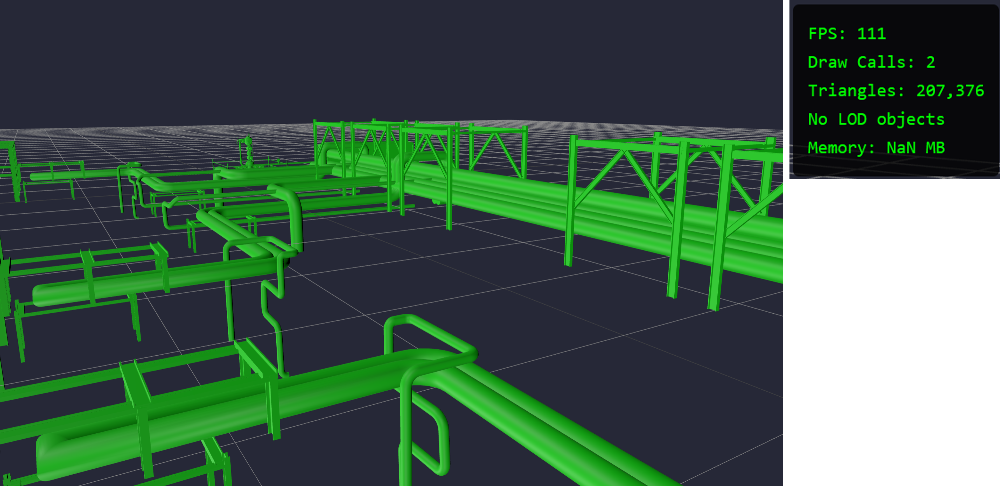

# Optimizing Draw Calls in a three.js Scene

In our [LOD Control Model](per-object-lod-control-with-threejs.md), we were able to establish that dynamic switching between low and high quality meshes reduces GPU strain. Our results proved that this optimization did not affect `draw calls`, but did not elaborate more on it. In this paper I explore the basics of draw calls, their impact on the performance of the scene, and explore optimization techniques to limit their net impact.

## What are Draw Calls?

A `draw call`, as the name suggests, is a call from the CPU to the GPU to `draw` an object to the screen. The more objects you have in your scene, the more draw calls you have. If you aren't careful, this number of `draw calls` can significantly limit the performance capabilities of the scene well before GPU bottlenecks start emerging. In BIM projects where we have lots of individual objects, this is especially an issue.

In this project I am working with an open source BIM model provided by [buildingsmart-community](https://github.com/buildingsmart-community). The model is of a real residential development in the Netherlands called [Sixty5](https://www.strijp-s.nl/en/building/sixty5). For ease of memory and github hosting limits, we limit our model to just the MEP (Mechanical, Electrical, Plumbing) layer for the time being.

If we load this model directly to our scene, we start to appreciate why `draw calls` need to be limited. We have ~22000 draw calls in our scene- one for each object. Here is what the raw model looks like in our [basic scene](analysis_threejs.md).

The performance is slow and buggy. I would not want to use this for more than a few minutes at a time. We notice extremely slow `FPS` (Frames Per Second) as well.

Using our original `piperacks` model as an example, we see the results from a 50ft view. Here we have 303 `draw calls` for each of the objects in our scene.

To test out how `draw calls` work, I merge all the objects in my scene into one mesh. This means I should only have one large `draw call` that I need to make to render my scene. Sure enough, on loading to the scene, we get these results.

2 `draw calls`- one for rendering the mesh, one for rendering the 2D grid.

To drive the understanding home, I load two models to our scene and measure the performance- the `architectural` model and `interiors-kitchens` model from our test BIM model. Here are the results we observe from the `Interior Kitchen` Model.

Here are the results we observe from the Architectural Model.

There are a few striking differences we observe.

1) The number of `draw calls` in the interior model (3,096) is much less than the architectural model (16,374). This implies there are a lot more individual objects in the architectural model than the interior one.

2) The total number of [triangles](../reducing-mesh-density/analysis_decimate.md) in the scene are roughly the same (~1.6M). This implies that the `interior-kitchen` model is more finely modelled than the `architectural` model, since the `architectural` model has vastly more individual objects.

3) The FPS count for the interior model is ~100 FPS compared to ~13 from the architectural model- significantly lower.

Since both models contain roughly the same number of `triangles`, we can infer that `draw calls` are the limiting factor here for our slow model performance. In this case, we have a CPU bottleneck rather than a GPU one.

## Merging Objects

Since `draw calls` need to be limited, an obvious question we might ask is, why not just merge all our geometries in the model into one giant mesh and load that to the scene? Logically speaking, we will have the same number of triangles in the scene but with a massive reduction in `draw calls`.

There are a few reasons why that won't work. Firstly, by merging all our objects into one giant mesh, we lose the ability for per object selection. We cannot select an individual pipe object and view it's details.

Secondly, and counter-intuitively, we actually observe reduced when we load our one-giant-mesh model to the scene.

We observe that the number of draw calls and triangles do not change as we move around the scene. This is becuase of a method called `Frustum Culling`, whereby objects that are out of the camera's viewing angle are not rendered to the screen. Frustum Culling is enabled by default in Three.js scenes.

Since our entire scene is one mesh, we lose this ability to `cull` objects that are off the screen. As a result, the total number of triangles and draw calls do not change when we move around the scene and our performance is capped (lower FPS than the dynamic model).

Let's consolidate our findings from above into a table.

| Model | Draw Calls | Triangles | FPS | Performance |
| :----- | :-----: | :-----: | :-----: | :-----: |
| BIM - MEP | 22,591 | 8,462,391 | ~11 | Poor |
| BIM - Interior | 3,096 | 1,607,878 | ~100 | Good |
| BIM - Architectural | 16,374 | 1,641,473 | ~20 | Poor |
| Piperacks - Dynamic | Varied | Varied | ~180 | Excellent |
| Piperacks - Merged | 2 | 207,376 | ~100 | Good |

The optimal solution contains a mix of LOD Control and Merging geometries. This process is called `batching`. Let's see if we can improve on these base results.

## Batching the Scene

### References

[buildingsmart-community](https://github.com/buildingsmart-community)

[Sixty5](https://www.strijp-s.nl/en/building/sixty5)

