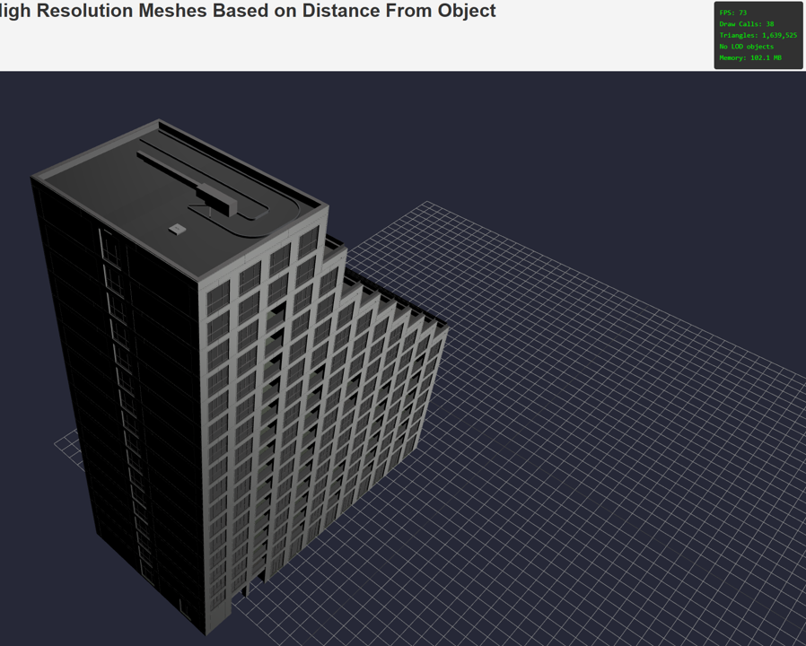

# Optimizing Draw Calls in a three.js Scene

In our [LOD Control Model](per-object-lod-control-with-threejs.md), we were able to establish that dynamic switching between low and high quality meshes reduces GPU strain. Our results proved that this optimization did not affect `draw calls`, but did not elaborate more on it. In this paper I explore the basics of draw calls, their impact on the performance of the scene, and explore optimization techniques to limit their net impact.

## What Are Draw Calls?

A `draw call`, as the name suggests, is a call from the CPU to the GPU to `draw` an object to the screen. The more objects you have in your scene, the more draw calls you have. If you aren't careful, this number of `draw calls` can significantly limit the performance capabilities of the scene well before GPU bottlenecks start emerging. In BIM projects where we have lots of individual objects, this is especially an issue.

In this project I am working with an open source BIM model provided by [buildingsmart-community](https://github.com/buildingsmart-community). The model is of a real residential development in the Netherlands called [Sixty5](https://www.strijp-s.nl/en/building/sixty5). For ease of memory and github hosting limits, we split our model into individual layers, and load just the MEP (Mechanical, Electrical, Plumbing) layer for the time being.

If we load this model directly to our scene, we start to appreciate why `draw calls` need to be limited. We have ~22000 draw calls in our scene- one for each object. Here is what the raw model looks like in our [basic scene](analysis_threejs.md).


The performance is slow and buggy. I would not want to use this for more than a few minutes at a time. We notice extremely slow `FPS` (Frames Per Second) as well.

Using our original `piperacks` model as an example, we see the results from a 50ft view. Here we have 303 `draw calls` for each of the objects in our scene.


To test out how `draw calls` work, I merge all the objects in my scene into one mesh. This means I should only have one large `draw call` that I need to make to render my scene. Sure enough, on loading to the scene, we get these results.


2 `draw calls`- one for rendering the mesh, one for rendering the 2D grid.

To drive the understanding home, I load two models to our scene and measure the performance- the `architectural` layer and `interiors-kitchens` layer from our test BIM model. Here are the results we observe from the `Interior Kitchen` Model.


Here are the results we observe from the Architectural Model.


There are a few striking differences we observe.

1) The number of `draw calls` in the interior model (3,096) is much less than the architectural model (16,374). This implies there are a lot more individual objects in the architectural model than the interior one.

2) The total number of [triangles](../reducing-mesh-density/analysis_decimate.md) in the scene are roughly the same (~1.6M). This implies that the `interior-kitchen` model is more finely modelled than the `architectural` model, since the `architectural` model has vastly more individual objects.

3) The FPS count for the interior model is ~100 FPS compared to ~13 from the architectural model- significantly lower.

Since both models contain roughly the same number of `triangles`, we can infer that `draw calls` are the limiting factor here for our slow model performance. In this case, we have a CPU bottleneck rather than a GPU one.

## Merging Objects

Since `draw calls` need to be limited, an obvious question we might ask is, why not just merge all our geometries in the model into one giant mesh and load that to the scene? Logically speaking, we will have the same number of triangles in the scene but with a massive reduction in `draw calls`.

There are a few reasons why that won't work. Firstly, by merging all our objects into one giant mesh, we lose the ability for per object selection. We cannot select an individual pipe object and [view it's details](../information-modelling/working-with-object-metadata-in-bim.md).

Secondly, and counter-intuitively, we actually observe reduced performance when we load our one-giant-mesh model to the scene.


We observe that the number of draw calls and triangles do not change as we move around the scene. This is becuase of a method called `Frustum Culling`, whereby objects that are out of the camera's viewing angle are not rendered to the screen. Frustum Culling is enabled by default in Three.js scenes.


Since our entire scene is one mesh, we lose this ability to `cull` objects that are off the screen. As a result, the total number of triangles and draw calls do not change when we move around the scene- the GPU stores every single vertex and edge in memory regardless of if it's visible or not. As a result, our performance is capped (lower FPS than the dynamic model).

And thirdly, we also observe that our new exported one-giant-mesh file has exploded out to 10x the size. This is becuase the [GLTF](../hosting-3d-model/analysis_threejs.md) file format is efficient at grouping unique geometries into one `InstancedMesh`. This means, if we have multiple geometries in the model that have the same mesh, materials, parameters (like steel beams, long pipes, bolts etc), they get saved as one `InstancedMesh` in memory. Since we're merging our objects together, we lose the ability to instance our individual meshes and so each vertex needs to be saved to memory, thus exploding the file size.

```yml
sixty5_piping.glb: 74.8 MB
sixty5_piping_merged.glb: 610.7 MB
```

Our file size has increased by roughly 10x, and we will run into memory limitations far before any CPU or BPU bottlenecks.

Let's consolidate our findings from above into a table.

| Model | Draw Calls | Triangles | FPS | Performance |
| :----- | :-----: | :-----: | :-----: | :-----: |
| BIM - MEP | 22,591 | 8,462,391 | ~11 | Poor |
| BIM - Interior | 3,096 | 1,607,878 | ~100 | Good |
| BIM - Architectural | 16,374 | 1,641,473 | ~20 | Poor |
| Piperacks - Dynamic | Varied | Varied | ~180 | Excellent |
| Piperacks - Merged | 2 | 207,376 | ~100 | Good |

The optimal solution contains a mix of LOD Control and Merging geometries. One process we could use is called `batching`. Let's see if we can improve on these base results.

## Batching the Scene

Let's create a simple batching example with the `BIM - Architectural` model. The standard three.js library includes an object called the [`BatchedMesh`](https://threejs.org/docs/#BatchedMesh). It essentially allows the grouping of objects that share the same materials, to be passed to the GPU as one `draw call`. Crucially, we are still able to maintain the per-object interactivity. [In this example](batched-mesh.md), we implement batching on our `BIM - Architectural` model and observe the performance results. The example walks through the specific code implementation used. For now, we shall just show the results.



For reference, here were the original performance metrics from the standard un-optimized version of the `Architectural` model.


The difference in results is stark. Our batched model has far fewer `draw calls`, as well as highly improved FPS results (~75 versus ~10). The optimized architectural model appears to have similar performance results as our `BIM interior` model, aligning with our theory that draw calls were the factor slowing down performance.

## How Does Batching Work?

How did this work? One key difference between the vanilla implementation of our `gltfLoader` and `BatchedMesh` is that we pre-allocated memory in the scene for the total number of vertices, triangles and indices. This allowed for a more structured draw call instruction being sent from the CPU to GPU. By pre-allocating the memory, we pass this array as a whole to the GPU for rendering.

Compared to the vanilla implementation which sent individual calls for each object, the `BatchedMesh` creates one draw call containing all the geometry and transforms required to render to the screen.

We split by material since this is the most computationally expensive step in a GPU. The lowest computational layer in a GPU is called a `shader`. Shaders can only process one material at a time, but can perform multiple parallel calculations on this one material. The `BatchedMesh` object is grouped by material for this reason, and as a result, all the geometries which share that same material can be grouped and passed to one `shader` in the GPU.

## Conclusion

Scenes with a large number of individual objects are performance bound by the CPU- regardless of how compressed each individual mesh is. By batching our mesh objects in the scene, we were able to drastically reduce the total number of CPU - GPU calls (known as `draw calls`), and improve the overall performance of the scene. Batching our objects allowed us to pre-allocate memory, and pass all our individual objects as one giant `draw call`.

While the performance of the scene was significantly improved, we note that the new method only removed the bottleneck between the CPU and GPU, and shifted our performance ceiling back to the GPU. This means our scenes are once again upper-bound by the total number of vertices and edges.

In future research I explore having the best of both worlds- both batching and [LOD control](../hosting-3d-model/per-object-lod-control-with-threejs.md), to reduce our triangle count while also keeping draw calls low.

### Links

[buildingsmart-community](https://github.com/buildingsmart-community)

[BIM Model - Sixty5](https://www.strijp-s.nl/en/building/sixty5)

[Hosting a 3D model on a Webpage](analysis_threejs.md)

[BIM Metadata Explained](../information-modelling/working-with-object-metadata-in-bim.md)

[Batched Mesh](batched-mesh.md)

[three.js BatchedMesh docs](https://threejs.org/docs/#BatchedMesh)

[Per Object LOD control with three.js](../hosting-3d-model/per-object-lod-control-with-threejs.md).