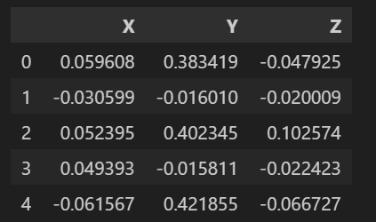
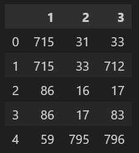
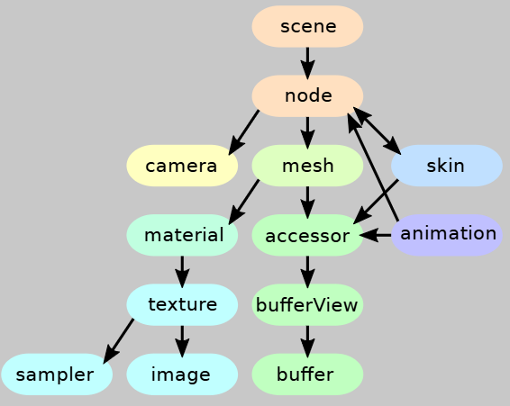
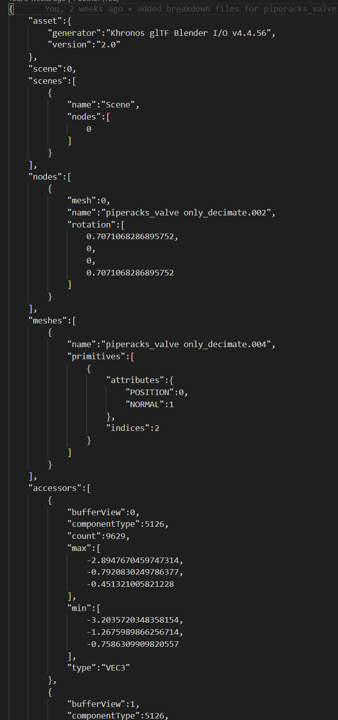
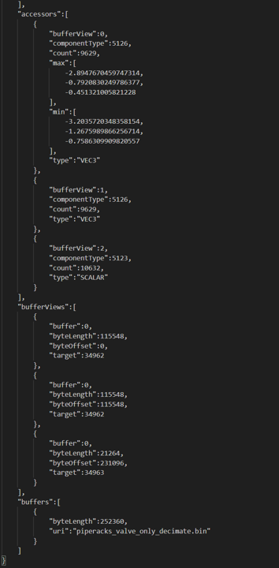
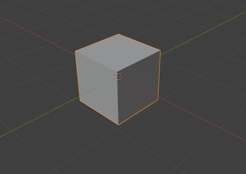
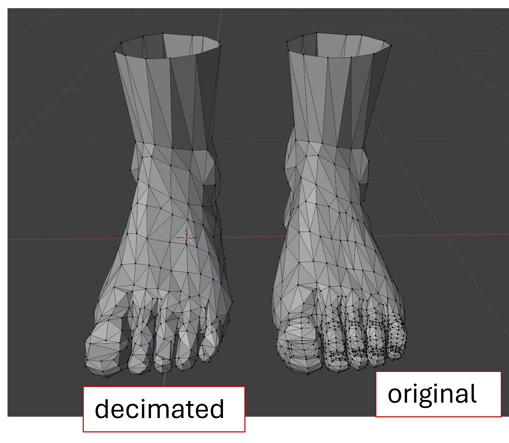
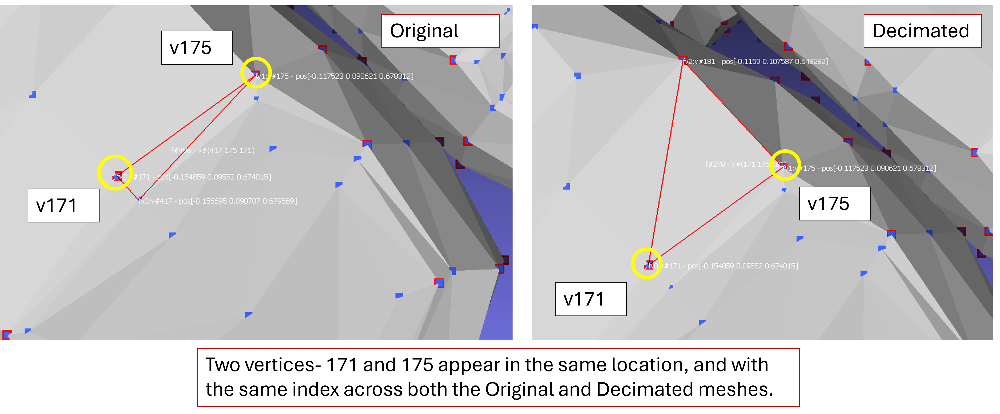

# Preprocessing GLTF Files for Efficient LOD Control in Scenes

We have proven that [LOD control](../hosting-3d-model/per-object-lod-control-with-threejs.md) improves GPU computational efficieny in densely populated scenes. We also saw that [Batching](batched-mesh.md) our scene improves CPU efficiency. However, combining the 2 requires a little bit of out-of-the box thinking. While LOD functionality does exist within our `BatchedMesh` object, implementing this accurately requires careful consideration of the underlying vertex and index array.

In this work, I explain the basics of array structuring in GLTF files, optimizations which can be made for memory, as well as walking through the structure and rationale behind any scripts that we include. The [accompanying notebook](notebooks/gltf-eda.ipynb) provides additional insight and in depth analysis of code.

## Background

3D objects consist of [`vertices` and `faces`](../hosting-3d-model/analysis_threejs.md). The `vertices` are stored in a data structure called the `vertex_array`. This is essentially a 2D matrix, where the rows consist of individual vertices, and the columns correspond to coordinates (specifically X,Y,Z). Here is an example of what this may look like.



`Faces` in the model refer to how the different certices are connected with each other to form surfaces. This data is stored in another data structure called the `index_array`. Alternatively, this could be called the face_matrix.



Here, the numbers refer to the specific row in the vertex array. For example, row 1 of our face matrix has the numbers (715, 31, 33). These numbers refer to our vertex array, and show what vertices are used to make a surface. In this example, Face 1 in the 3D model is created by joining the vertices is rows 715, 31 and 33.

Normally, the ordering of the vertices and indices should not matter, and are often created on the fly. However, LOD control in a `BatchedMesh` object requires a shared vertex structure between the different LOD objects. This means, lower level LOD's need to use the exact same vertices as the original mesh, just reconstructed with different faces.

We explored how to manage this manual indexing in the section on [mesh-simplification algorithms](../reducing-mesh-density/mesh-simplification.md). However, the conversion to GLTF file requires another bit of manual intervention.

Traditional GLTF file exporers will treat every individual object in the scene as unique. This means any scene with LOD objects will effectively "double" the file size- since each LOD is being considered its own object. We need to tweak the GLTF file creation process such that objects which share the same vertex array are treated the same.


Now, we explore how to achieve this manual GLTF file indexing and generation.

## Main Structure of GLTF File

GLTF uses a JSON style file format, with each object in the scene belonging to a hierarchy. The overall hierarchy of this file can be seen in the figure in this [reference manual](../../gltf20-reference-guide.pdf) from Khronos Group. Here we show a high level overview of the same.



A lot of the items in this list are containers for data which we wont need. For example, our scene won't have any animation, so there's no need to understand how this works. For now, we will be looking at the following.

- `scene`
- `node`
- `mesh`
- `accessor`
- `bufferView`
- `buffer`

At the highest level contains the `scene` container. This tree-like structure holds all the necessary data for rendering and serves the main entry point for all the objects within it. We have been using this `scene` object all through our past endeavors by referencing the function `scene.traverse()`.

Next up, we have `nodes`. Nodes refer to groups of objects in the scene. For example, if we split our [BIM model](../optimizing-the-scene/draw-calls-in-scenes.md) by discipline (ex: piping, structure, electrical etc), each one of these layers will represent our nodes in the scene tree. Within the `nodes` data structure, we observe references to specific `meshes`, along with a specific index. This index number refers to the specific index of the `mesh` that is contained within it.

The `mesh` object in the GLTF file saves metadata related to the actual objects in the scene. This includes the "name" of the mesh, as well as primitives for attributes and indices. The attributes save information about the POSITION and NORMAL of the object, while the index refers to the specific `accessor` that was used to create this information.

`Accessors` store information about the object tranforms- position, rotation and scale, and also use integer indexing to reference a `bufferview`.

`BufferViews` save information on how to slice the array saved in memory to get the correct data you need, and finally-

`Buffers` reference the raw memory saved in the file.

If we follow this hierarchy, we can trace a line all the way from the `scene` to the buffer. Take for example, this GLTF file of the model `piperacks_valve_only_decimate.gltf`. This was one of the files we used for testing the [decimation](../reducing-mesh-density/mesh-simplification.md) algorithm, and we know it contains only one object in the scene. Here is what the file format looks like when opened with a text editor, although note this is just the top half.



We start at the root of the scene, which references index 0. As a reminder, the GLTF file format is linear- so we need to look in the container below, for the object in index 0.

The container below is the "scenes" container, which wasn't mentioned above, but can be used if you have multiple scenes. We don't, so we see that the container in Index 0 here referes to the main scene in our tree.

This scene object then further references the `nodes` container, with Index 0. If we had multiple containers like this one, they would show up here too.

Within our "nodes" container, we see an index reference to the `mesh` (also 0 in this case).

The `meshes` container would ideally contain more than one mesh in the scene, but in this case we only have 1. As also observe that a few datapoints in this container have index references- namely, the POSITION, NORMAL, and indices. These are all references to the container below it, which is the `accessors` container.

The `accessors` container holds metadata associated with each mesh. Here we finally see more than one datapoint. We take a look at the `meshes` and `accessors` containers for a quick example.

Mesh0 in our `meshes` container references accessor 0 for its POSITION data, accessor 1 for its NORMAL data and accessor 2 for its indices data. In the figure above, the accessor data is slightly cut off, so we fill it in along with the rest of the containers here.



Now, we can see there are indeed 3 different children within our `accessors` container. The first (Index 0) corresponds to the POSITION data for our `mesh`, and it further references `bufferview` 0. Similarly, the second child in our `accessor` container (Index 1) corresponds to our NORMAL data for our mesh, which further references `BufferView` 1. Lastly, the third child (Index 2) corresponds to our "indices" data (the actual XYZ data for our mesh), and further references `BufferView` 2.

As we make our way down to the `bufferviews`, things tend to get a little confusing. However, its important to just remember the rule that the index referencing is linear, and will always call reference to the container below it. `BufferViews` store data relating to the bytelength and byteoffset. This relates to how data is stored in memory and provides the program with discrete indices on how to slice the main array to get the info needed.

For example, `bufferview 0` has a buffer of index 0, a bytelength of 115,548 and a byteoffset of 0. To a computer, this means "Look in Buffer 0, start at index 0, and continue for the next 115,548 bytes."

Similarly, `bufferview 2` has a buffer of index 0, a bytelength of 21,264, and a byteoffset of 231,096. This can be interpretted as "Look in Buffer 0, start at index 231,096 and continue for the next 21,264 bytes."

We also observe a variable called "target". This is a predefined number that determines what time of data is being saved. 34962 is a static reference to the ARRAY_BUFFER, which saves raw vertices, while 34963 references the ELEMENT_ARRAY_BUFFER which saves triangles.

Finally, we make our way down to the buffer (of which we have only 1). The buffer references a `uri`, which is usually a file path to where the data is stored (usially in binary format).

Now that we have a basic understanding about this structure, let's explore basics of how to edit it.


## Working with GLTF Files

The main package we shall be using for editing the GLTF files is [pygltflib](https://pypi.org/project/pygltflib/). This library gives us a comprehensive suite of tools necessary to edit the GLTF file structure.

The "Hello World" of this file package involves creating and saving a cube to gltf file format, from a raw input of vertices and faces. From the [docs](https://pypi.org/project/pygltflib/), we implement the following code.

First, we define our vertex array and triangles array as follows -->

```py
points = np.array(
    [
        [-0.5, -0.5, 0.5],
        [0.5, -0.5, 0.5],
        [-0.5, 0.5, 0.5],
        [0.5, 0.5, 0.5],
        [0.5, -0.5, -0.5],
        [-0.5, -0.5, -0.5],
        [0.5, 0.5, -0.5],
        [-0.5, 0.5, -0.5],
    ],
    dtype="float32",
)
triangles = np.array(
    [
        [0, 1, 2],
        [3, 2, 1],
        [1, 0, 4],
        [5, 4, 0],
        [3, 1, 6],
        [4, 6, 1],
        [2, 3, 7],
        [6, 7, 3],
        [0, 2, 5],
        [7, 5, 2],
        [5, 7, 4],
        [6, 4, 7],
    ],
    dtype="uint8",
)
```

We explored how to create and work with these arrays in the [mesh decimation](../reducing-mesh-density/mesh-simplification.md) document.

The next step is to manually create the format of our GLTF file using this information.

```py
triangles_binary_blob = triangles.flatten().tobytes()
points_binary_blob = points.tobytes()

gltf = pygltflib.GLTF2(
    scene=0,
    scenes=[pygltflib.Scene(nodes=[0])],
    nodes=[pygltflib.Node(mesh=0)],
    meshes=[
        pygltflib.Mesh(
            primitives=[
                pygltflib.Primitive(
                    attributes=pygltflib.Attributes(POSITION=1), indices=0
                )
            ]
        )
    ],
    accessors=[
        pygltflib.Accessor(
            bufferView=0,
            componentType=pygltflib.UNSIGNED_BYTE,
            count=triangles.size,
            type=pygltflib.SCALAR,
            max=[int(triangles.max())],
            min=[int(triangles.min())],
        ),
        pygltflib.Accessor(
            bufferView=1,
            componentType=pygltflib.FLOAT,
            count=len(points),
            type=pygltflib.VEC3,
            max=points.max(axis=0).tolist(),
            min=points.min(axis=0).tolist(),
        ),
    ],
    bufferViews=[
        pygltflib.BufferView(
            buffer=0,
            byteLength=len(triangles_binary_blob),
            target=pygltflib.ELEMENT_ARRAY_BUFFER,
        ),
        pygltflib.BufferView(
            buffer=0,
            byteOffset=len(triangles_binary_blob),
            byteLength=len(points_binary_blob),
            target=pygltflib.ARRAY_BUFFER,
        ),
    ],
    buffers=[
        pygltflib.Buffer(
            byteLength=len(triangles_binary_blob) + len(points_binary_blob)
        )
    ],
)
gltf.set_binary_blob(triangles_binary_blob + points_binary_blob)
```

While it seems like there is a lot of code above, all we're essentially doing is creating the structure of our GLTF file manually. We the the familiar scene, nodes, meshes data blocks. Since they all refer to one object, ther are all given the index 0.

An important consideration is that both the `triangles` and `points` array need to be converted to binary format. This is done in the first step, `triangles.flatten().tobytes()`.

The main part of the code we'll explore here is in the creation of the `bufferviews`. We note that the bytelength here corresponds to the overall length of our individual `blobs`, and the byteoffset is just the cumulative length of the previous child. 

For example, bufferView index 1 (the second child) has a byteoffset of `len(triangles_binary_blob)`, which is the length of the previous child in memory. The bytelength of bufferview Index 1 corresponds to the length of `points_binary_blob`. If we had a bufferview at index 2, it would have a byteoffset of all the previous children (in this case, index 0 and 1) which would be `len(triangles_binary_blob)` + `len(points_binary_blob)`.

Hopefully that makes sense.

There is one last function call we need to make, and that is to save our GLTF file.

```py
filename2 = "test.glb"
gltf.save(filename2)
```

If we open this file in Blender, this is what we observe.



It is ultimately just a cube, but serves as a crucial workflow method for manual control over the structure of the gltf file.

## Working With More Discrete Models

Here we apply the same logic above to our human-foot model. We have previously been able to create low resolution LODs of this model through our EDA [defined here](../reducing-mesh-density/mesh-simplification.md). Here, we load this data to our environment.

```py
ms = pymeshlab.MeshSet()

# Loading the full mesh
ms.load_new_mesh('../../../models/foot/modelsoriginal_mesh.obj')

m = ms.current_mesh()
v_matrix_org = m.vertex_matrix()
f_matrix_org = m.face_matrix()

ms.load_new_mesh('../../../models/foot/modelsdecimated_mesh.obj')

m = ms.current_mesh()
v_matrix_dec = m.vertex_matrix()
f_matrix_dec = m.face_matrix()
```

Essentially, we are loading our precalculated LOD's that have been saved as wavefront file format (.OBJ), and extract the vertex and face data from it. This array is in exactly the same format as is required to be passed to our GLTF file.

```py
v_matrix_org
```
```
array([[ 0.059608,  0.383419, -0.047925],
       [-0.030599, -0.01601 , -0.020009],
       [ 0.052395,  0.402345,  0.102574],
       ...,
       [ 0.157481,  0.015595,  0.408668],
       [ 0.163158,  0.035477,  0.397872],
       [ 0.163247,  0.081139,  0.437404]], shape=(800, 3))
```

```py
f_matrix_org
```
```
array([[366,  28,  30],
       [366,  30, 363],
       [ 81,  15,  16],
       ...,
       [395,  89, 489],
       [505, 490,  89],
       [490, 463,  89]], shape=(1586, 3), dtype=int32)
```

As a reminder, the vertex array of our decimated mesh will be exactly the same as that of our original mesh, plus the original vertices from the main mesh. If that doesn't make sense, [take a read through this](../reducing-mesh-density/mesh-simplification.md).

Now, our goal is to create a GLTF file that contains both these meshes (original and decimated), but only saves one vertex array for both. The decimated and original meshes will use the same vertex structure, but will have different bytelengths.

After some trial and error, here is the edited code we used to create this file. 

```py
triangles_org_binary_blob = f_matrix_org.flatten().tobytes()
triangles_dec_binary_blob = f_matrix_dec.flatten().tobytes()

points_org_binary_blob = v_matrix_org.tobytes()
points_dec_binary_blob = v_matrix_dec.tobytes()

# print(points_org_binary_blob, "\n", points_dec_binary_blob)

points_dec_byte_offset = v_matrix_dec.shape[0] # Here, instead of a binary blob for our decimated mesh, we subset from the original with a byte offset

gltf_lod = pygltflib.GLTF2(
    scene=0,
    scenes=[pygltflib.Scene(nodes=[0, 1])],
    nodes=[
        pygltflib.Node(mesh=0),
        pygltflib.Node(mesh=1)
    ],
    meshes=[
        pygltflib.Mesh(
            primitives=[
                pygltflib.Primitive(
                    attributes=pygltflib.Attributes(POSITION=2), indices=0
                )
            ]
        ),
        pygltflib.Mesh(
            primitives=[
                pygltflib.Primitive(
                    attributes=pygltflib.Attributes(POSITION=3), indices=1
                )
            ]
        )
    ],
    accessors=[
        pygltflib.Accessor(  # accessor0: original mesh indices
            bufferView=0,
            componentType=5125,
            count=f_matrix_org.size,
            type=pygltflib.SCALAR
            # max=[int(f_matrix_org.max())],
            # min=[int(f_matrix_org.min())],
        ),
        pygltflib.Accessor(  # accessor1: decimated mesh indices
            bufferView=1,
            componentType=5125,
            count=f_matrix_dec.size,
            type=pygltflib.SCALAR
            # max=[int(f_matrix_dec.max())],
            # min=[int(f_matrix_dec.min())],
        ),
        pygltflib.Accessor(  # accessor2: original mesh vertex positions
            bufferView=2,
            componentType=pygltflib.FLOAT,
            count=len(v_matrix_org),
            type=pygltflib.VEC3,
            max=v_matrix_org.max(axis=0).tolist(),
            min=v_matrix_org.min(axis=0).tolist(),
        ),
        pygltflib.Accessor(  # accessor3: decimated mesh vertex positions
            bufferView=3,
            componentType=pygltflib.FLOAT,
            count=len(v_matrix_dec),
            type=pygltflib.VEC3,
            max=v_matrix_dec.max(axis=0).tolist(),
            min=v_matrix_dec.min(axis=0).tolist(),
        )
    ],
    bufferViews=[
        pygltflib.BufferView(  # bufferview0: original mesh indices
            buffer=0,
            byteLength=len(triangles_org_binary_blob),
            target=pygltflib.ELEMENT_ARRAY_BUFFER,
        ),
        pygltflib.BufferView(  # bufferView1: decimated mesh indices
            buffer=0,
            byteOffset=len(triangles_org_binary_blob),
            byteLength=len(triangles_dec_binary_blob),
            target=pygltflib.ELEMENT_ARRAY_BUFFER,
        ),
        pygltflib.BufferView(  # bufferView2: original mesh vertices
            buffer=0,
            byteOffset=len(triangles_org_binary_blob)+len(triangles_dec_binary_blob),
            byteLength=len(points_org_binary_blob),
            target=pygltflib.ARRAY_BUFFER,
        ),
        pygltflib.BufferView(  # bufferView3: decimated mesh vertices
            buffer=0,
            byteOffset=len(triangles_org_binary_blob)+len(triangles_dec_binary_blob), # Notice here how we are using the same starting index as the previous bufferview
            byteLength=len(points_dec_binary_blob),
            target=pygltflib.ARRAY_BUFFER,
        )
    ],
    buffers=[
        pygltflib.Buffer(
            byteLength=len(triangles_org_binary_blob) + len(triangles_dec_binary_blob) + len(points_org_binary_blob)
        )
    ],
)
gltf_lod.set_binary_blob(triangles_org_binary_blob + triangles_dec_binary_blob + points_org_binary_blob)
```

If you'd like a more detailed understanding of how this code block works, please follow along with the [accompanying notebook](notebooks/gltf-eda.ipynb).

In general, the only edits we made here is to add a new `mesh` for our original and decimated mesh, added 2 new accessors (corresponding to the new mesh), and edited the bufferviews.

Most of the changes occur in the `bufferView` section. The logic from earlier applies, essentially we're marking spacific sequences of memory which give us the data we need.

```py
bufferViews=[
    pygltflib.BufferView(  # bufferview0: original mesh indices
        buffer=0,
        byteLength=len(triangles_org_binary_blob),
        target=pygltflib.ELEMENT_ARRAY_BUFFER,
    ),
    pygltflib.BufferView(  # bufferView1: decimated mesh indices
        buffer=0,
        byteOffset=len(triangles_org_binary_blob),
        byteLength=len(triangles_dec_binary_blob),
        target=pygltflib.ELEMENT_ARRAY_BUFFER,
    ),
    pygltflib.BufferView(  # bufferView2: original mesh vertices
        buffer=0,
        byteOffset=len(triangles_org_binary_blob)+len(triangles_dec_binary_blob),
        byteLength=len(points_org_binary_blob),
        target=pygltflib.ARRAY_BUFFER,
    ),
    pygltflib.BufferView(  # bufferView3: decimated mesh vertices
        buffer=0,
        byteOffset=len(triangles_org_binary_blob)+len(triangles_dec_binary_blob), # Notice here how we are using the same starting index as the previous bufferview
        byteLength=len(points_dec_binary_blob),
        target=pygltflib.ARRAY_BUFFER,
    )
]
```

`BufferView 0` functions virtually the same as earlier, and stores the original mesh indices.

`BufferView 1` has a byteoffset equal to the length of the previous bufferView, and stores data relating to the indices of the decimated mesh.

`BufferView 2` saves the vertices related to the original mesh, and has a byteoffset of the length of `BufferView 0` + `BufferView1`.

`BufferView 3` is where things get interesting. Instead of saving a completely new vertex array, we observe that we use the same byteoffset and as BufferView 2. This is because the decimated mesh vertices are an exact subset of the original mesh vertices. Hence, we reuse the same data, only with a different bytelength. Observe how the byteoffset for both BufferViews 2 and 3 are the same, but the bytelengths are different.

Finally, when assigning to a contiguous blob of memory, we only pass the arguments `triangles_org_binary_blob`, `triangles_dec_binary_blob` and `points_org_binary_blob`. We have effectively compressed down our data, since we don't need to store `points_dec_binary_blob` to memory.

Now, if we save this file and open it in Blender, here is what we observe.

```py
filename3 = "test_LOD.glb"
gltf_lod.save(filename3)
```



Perfect results. The original mesh has been moved to the side to show the effect of the decimation, but in reality they are overlayed on top of one another.

As well, if we open this file in MeshLab, we can verify that the vertex indices are aligned across our 2 meshes. In the figure below, blue vertices correspond to ones from the original mesh, which red vertices correspond to ones that are shared across the decimated and original meshes.





## Links

[LOD control](../hosting-3d-model/per-object-lod-control-with-threejs.md)

[Batching](batched-mesh.md)

[`vertices` and `faces`](../hosting-3d-model/analysis_threejs.md)

[pygltflib](https://pypi.org/project/pygltflib/)

[decimation](../reducing-mesh-density/mesh-simplification.md)