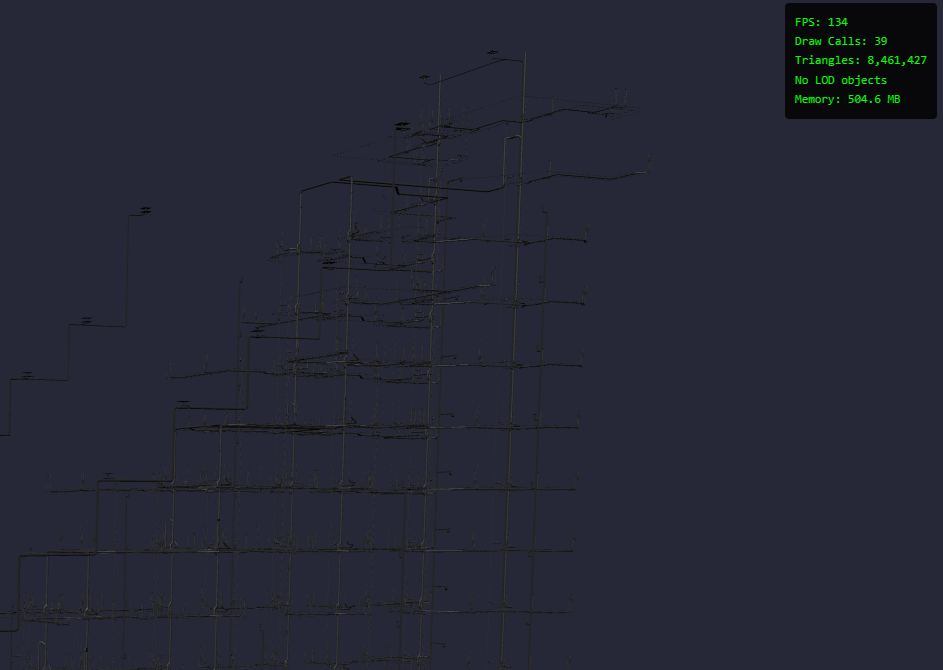
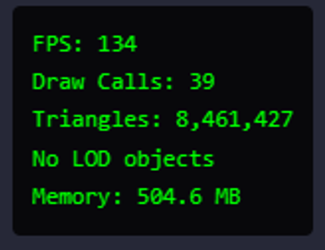
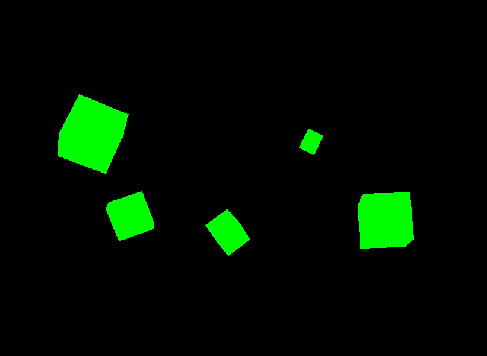
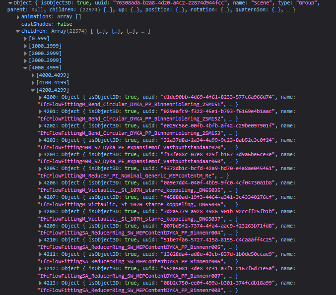
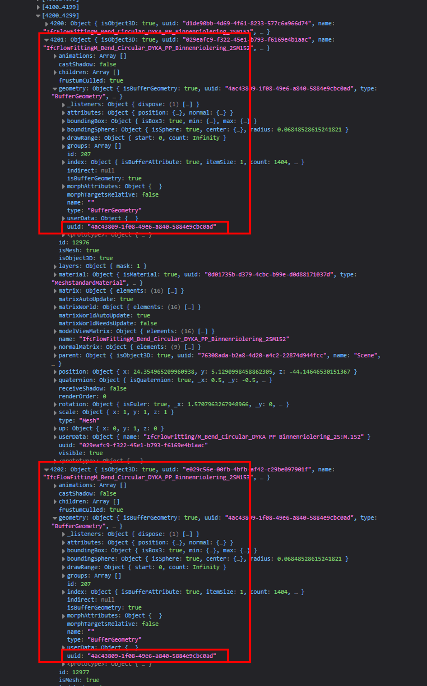
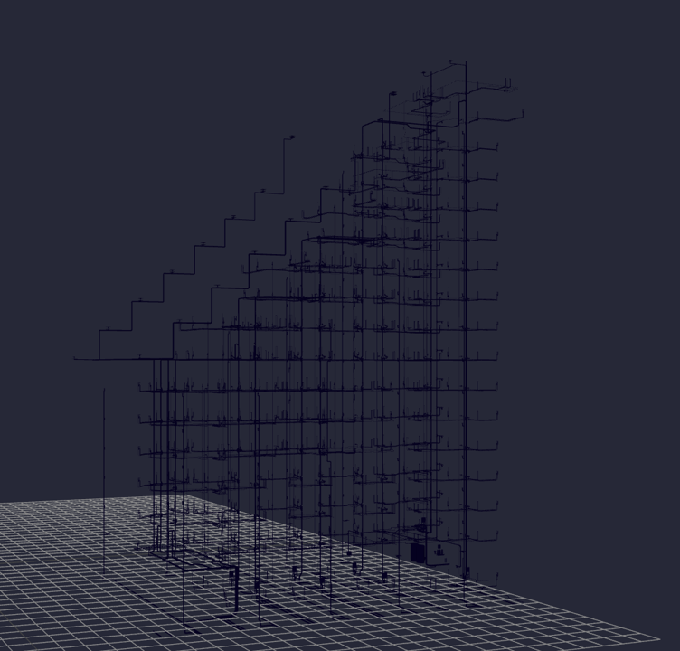
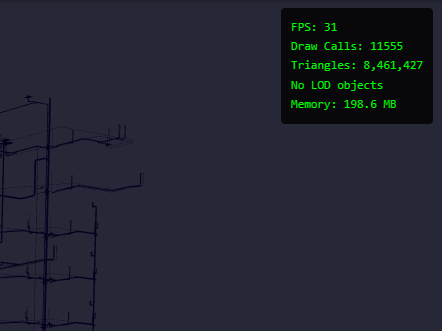
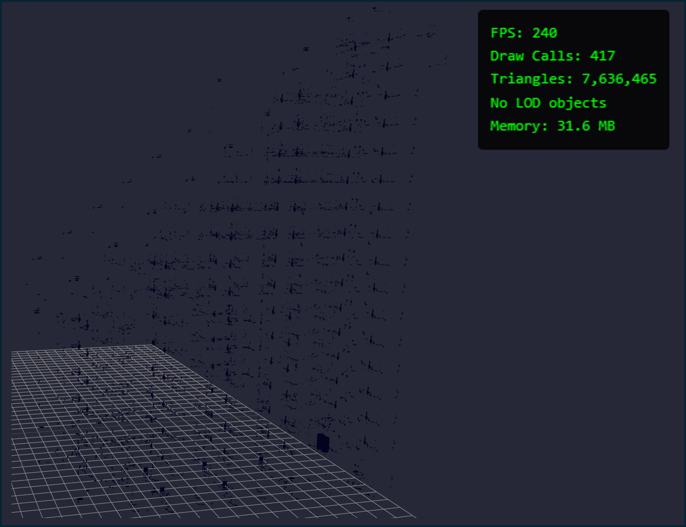
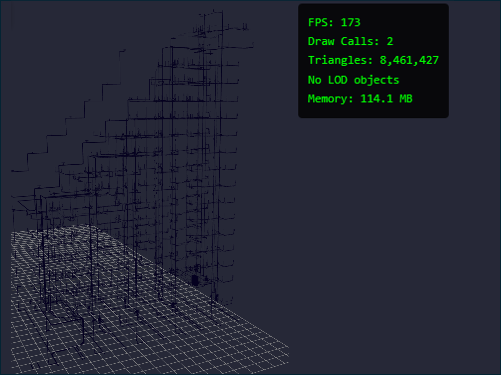
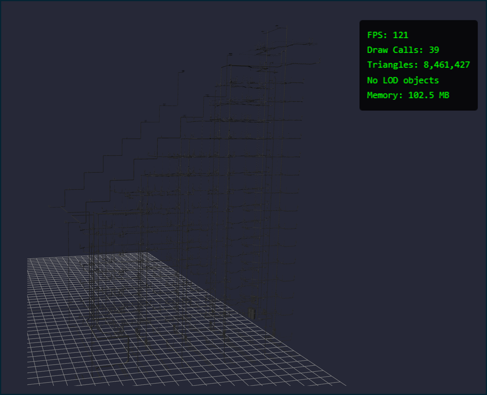

# Improving Model Memory Usage and Performance with Instancing

The [Instanced Mesh](https://threejs.org/docs/#InstancedMesh) class of objects in ThreeJS allows for efficient renderings of the same geometry in different locations. Essentially this means that a scene which contains multiple different objects each with the same geometry can render using one 1 [draw call](draw-calls-in-scenes.md). An example of where this may be useful is in rendering of scenes that contain 

Think blades of grass in a field, bolts in a steel beam, 90 degree elbows in a pipe- all have the same geometry, just loaded to different positions in the scene. From a memory perspective this grants us huge savings- we now only need to store the `edge` and `vertex` data of our object once. Everything else can be controlled by adjusting the position, rotation, and scale of the object. This is how video games can have scenes with millions of blades of grass, all which run at a comfortable 60 FPS.


Let's see if we can incorporate the same in our BIM model.

## High Level Logic

The model we will be working with is the MEP (Mechanical, Electrical, Plumbing) model from our Sixty5 BIM model, provided by the [buildingsmart-community](https://github.com/buildingsmart-community). Because we have already [batched our scene](batched-mesh.md), we observe a toasty 130 FPS when rendering this large model. As a reminder, batching allows us to upload geometry data to the buffer directly as one contiguous block of memory, reducing the bottleneck associated with CPU to GPU interactions. Even though our scene contains ~20k individual objects, we only have 39 draw calls (one for each unique material in the scene).



Batching was a great quick fix to our draw call issue, but to truly optimize the scene, we need to reduce redundancy. The key figure we are looking for in this scene is the memory, which currently stands at ~500 MB.



Here is what our plan of attack looks like. The first thing we need to do is indentify which objects in our scene contain the same geometry. We save these objects and their transformation matrices to an array which we shall use to create our `InstancedMesh`. For all other objects that don't have duplicated geometries, we load as normal using `BatchedMesh`.

Utlimately at the end, we should see a higher number of draw calls than earlier but with significant savings in memory. Let's see what we get.

## InstancedMesh Properties

[InstancedMesh](https://threejs.org/docs/#InstancedMesh) requires the following attributes-

- `geometry`: The mesh geometry
- `material`: The mesh material
- `count`: The number of instances

The `InstancedMesh` object needs these properties to be defined on instantiation. Once defined, we load this object to the screen. In the code example below, we load a cube to an `InstancedMesh` object and call it to the screen 5 times.

```js
const geometry = new THREE.BoxGeometry( 1, 1, 1 );
const material = new THREE.MeshBasicMaterial({ color: 0x00ff00 });

const mesh = new THREE.InstancedMesh( geometry, material, 5 );
scene.add( mesh );

const dummy = new THREE.Object3D();

for ( let i = 0; i < 5; i++ ) {
  
  dummy.position.set(
      Math.round( Math.random() * 10 ),
      Math.round( Math.random() * 10 ),
      Math.round( Math.random() * 10 )
  );

  dummy.rotation.set(
      Math.round( Math.random() * 2 * Math.PI ),
      Math.round( Math.random() * 2 * Math.PI ),
      Math.round( Math.random() * 2 * Math.PI )
  );

  dummy.scale.setScalar( Math.random() + 0.5);

  dummy.updateMatrix();

  mesh.setMatrixAt( i, dummy.matrix );
  mesh.needsUpdate = true;
}
```



In the code above, we first define the basic geometry and material of our cube object. We then create our `InstancedMesh` object with a max count of 5.

The next step involves assigning the transformation matrices of each individual instance, and this required a bit of a non standard route. We first create a `dummy` object that will be used to store the random position, rotatation and scale transfromations which we apply. We loop over our max_instance_count, which is 5 in this case, and start randonly assigning position, rotatation and scale values. Once done, we copy the dummy objects transformation matrix over to our new instance using the `setMatrixAt()` method.

An important note that is mentioned both in the docs, and online is that the `needsUpdate()` flag needs to be manually set to `true`. This flag signals to the GPU that a recalculation of the object's matrix is needed. More information about this flag can be sought in the [ThreeJS manual](https://threejs.org/manual/#en/how-to-update-things).

Once loaded to the screen, we see our 5 instances of the cube in random positions, rotatations and scales as intended.

Let's move on to our large BIM model.

## Code Implementation

The first problem we need to tackle is finding out which objects in our scene share the same geometry. We take a look at our 3D model in the browser console prior to conducting any batching. Using tha basic loader, we call this code to our [Pre established Three JS scene](../hosting-3d-model/analysis_threejs.md).

```js
const loader = new GLTFLoader().setPath('models/bim-model/');
loader.load('sixty5-mep.glb', (gltf) => {
    const mesh = gltf.scene;
    
    console.log(gltf.scene);
    
    mesh.position.set(0,0,0);
    scene.add(mesh);
})
```

Now we open the console in our browser to see what we get.



Note the first two objects in the scene. They are both "IfcFlowFittingM_Bend_Circular_DYKA". This appears to be a fitting of some sort. In theory, these 2 objects should share the same geometry, however, we note that their `uuid` ia different. But, when we expand both objects in the scene-



We can observe that both objects refer to the same geometry `uuid`. This is an avenue we can use to check for instancing- test to see if the geometry points to the same `uuid`. An important note here is that both these objects have different tranformation matrices, as proved by their different `position` attributes. This means, we will need to extract the exact transformation matrix for each instance when we make our traversal loop.

Let's try combining this into a code block and running it on our `mep` model.

```js
const loader_instance = new GLTFLoader().setPath('models/bim-model/');
loader_instance.load('sixty5-mep.glb', (gltf) => {
    let uuid_map = new Map();
    
    gltf.scene.traverse((child) => {
        if (child.isMesh) {
            
            const geom = child.geometry
            const geom_uuid = geom.uuid;
            const inst_matrix = child.matrixWorld;

            if ( !uuid_map.has( geom_uuid )){
                // If map does not have the uuid already, first create it
                
                uuid_map.set( geom_uuid, new Map() );

                uuid_map.get( geom_uuid ).set( "geometry", geom );
                uuid_map.get( geom_uuid ).set( "matrix", [] );

                uuid_map.get( geom_uuid ).get( "matrix").push( inst_matrix );
            
            } else {
                // Map contains the uuid hence only need to push transformation matrix

                uuid_map.get( geom_uuid ).get( "matrix").push( inst_matrix );
            
            };
        };
    });
    
    uuid_map.forEach((value, key) => {
        
        const geometry = value.get("geometry");
        const num_instances = value.get("matrix").length;
        const matrices = value.get("matrix");
        
        const material = new THREE.MeshToonMaterial({
            color:"#270a77",
        });

        const mesh = new THREE.InstancedMesh( geometry, material, num_instances );
        scene.add( mesh );

        for ( let i=0; i < matrices.length; i++){
            mesh.setMatrixAt( i, matrices[i] )
        };

        mesh.needsUpdate = true;
    });
})
```

Now that is a mouthful. Let's break it down.

To start, we first create our `loader` object to read in the gltf file, along with tha main dictionary that we will use to store the results called `uuid_map`.

```js
const loader_instance = new GLTFLoader().setPath('models/bim-model/');
loader_instance.load('sixty5-mep.glb', (gltf) => {
    let uuid_map = new Map();
    
    // ...
});
```

We have a main traversal loop that loops through all the objects in our scene, along with a basic if statement that executes only if the child is a mesh.

```js
gltf.scene.traverse((child) => {
        if (child.isMesh) {
            
            // ...
        };
})
```

Within the traversal loop, we create our map object. The key will correspond to the geometry `uuid` and the values will be an array of the transformation matrices of the individual objects. The logic tests to see if the uuid does not already exist and if so, create it. We save the value to be a new `Map()`.

This subsetted map creates two new key value pairs- the first `geometry`, saves the geometry object from the scene tree. The second, `matrix` is a list that will contain all the transformation matrices of the individual objects.

```js
const geom = child.geometry
const geom_uuid = geom.uuid;
const inst_matrix = child.matrixWorld;

if ( !uuid_map.has( geom_uuid )){
    // If map does not have the uuid already, first create it
    
    uuid_map.set( geom_uuid, new Map() );

    uuid_map.get( geom_uuid ).set( "geometry", geom );
    uuid_map.get( geom_uuid ).set( "matrix", [] );

    uuid_map.get( geom_uuid ).get( "matrix").push( inst_matrix );

} else {
    // Map contains the uuid hence only need to push transformation matrix

    uuid_map.get( geom_uuid ).get( "matrix").push( inst_matrix );

};
```

Now, we loop through our dictionary and create a new `InstacedMesh` for each unique object geometry. We then set the individual instance transformations by iterating through the array `matrix` and setting the specific object instance to be that transformation.

```js
uuid_map.forEach((value, key) => {
    
    const geometry = value.get("geometry");
    const num_instances = value.get("matrix").length;
    const matrices = value.get("matrix");
    
    const material = new THREE.MeshToonMaterial({
        color:"#270a77",
    });

    const mesh = new THREE.InstancedMesh( geometry, material, num_instances );
    scene.add( mesh );

    for ( let i=0; i < matrices.length; i++){
        mesh.setMatrixAt( i, matrices[i] )
    };

    mesh.needsUpdate = true;
});
```

The entire collection of steps above essentially creates a dictionary of each unique geometry in the scene, and save the specific transformation matrices of all the instances. Once created, it assigns these transformation matrices to an instance of the object. THe final result looks like this.



Looks good. We expect this to be the same look. What are the new stats?



Some promising statistics here. Firstly, we note that the number of draw calls have increased. Still not as much as the raw model (~20k), but still worse than our `batchedMesh` implementation. This is because we have a lot of unique geometry in the model that is still being loaded as one individual draw call. We could likely optimize this with Batching.

Due to these higher draw calls, we can understandably see a lower FPS count (~30) signalling that we are once again bottlenecked by the CPU.

But the key highlight here is the memory usage. We observe that the memory being used by the webpage is more than half what we saw in the baseline (200MB versus ~500MB). This is good news and we shall work to optimize this figure even more.

## Optimizations

To start off with, let's see exactly which geometries are duplicated in our model. To do so, I add this quick `if` condition to our `loader` function.

```js
uuid_map.forEach((value, key) => {

    const geometry = value.get("geometry");
    const num_instances = value.get("matrix").length;
    const matrices = value.get("matrix");

    const material = new THREE.MeshToonMaterial({
        color:"#270a77",
    });
++++++++++++++++++++++++++++++++++++++++++++++
    if ( num_instances > 1 ){
        const mesh = new THREE.InstancedMesh( geometry, material, num_instances );
        scene.add( mesh );

        for ( let i=0; i < matrices.length; i++){
            mesh.setMatrixAt( i, matrices[i] )
        };

        mesh.needsUpdate = true;
    }
});
+++++++++++++++++++++++++++++++++++++++++++++++
```

Essentially, narrowing down our geometry to those that have more than one instance. Here is what we observe.



Some striking observations.

- `FPS` is back up to 240.
- `draw calls` are down to 417. We can theorize that we have 416 duplicate pieces of geometry in the model (one draw call is reserved for the grid).
- `triangles` count is high- 90% of the original 8M. This implies that most of the intricate geometry is in the fittings.
- `memory` is down to a whopping 6% of the original 500. **We can account for 90% of the triangles using only 6% of the original memory.**

These are fanstastic results, but we're not out of the woods. Let's Batch the remaining non unique geometry to keep our draw calls low. While perusing through the `BatchedMesh` [documentation](https://threejs.org/docs/#BatchedMesh), it appears that this object supports instancing natively. In this case, we can simply incorporate our individual geometries into a single `BatchedMesh` object instead of `InstancedMesh`.

We tweak our loader loop as follows.

```js
const loader_instance = new GLTFLoader().setPath('models/bim-model/');
loader_instance.load('sixty5-mep.glb', (gltf) => {
    
    let uuid_map = new Map();
    let totalVertexCount = 0;
    let totalIndexCount = 0;
    let totalInstanceCount = 0;

    const material = new THREE.MeshToonMaterial({
        color:"#270a77",
    });
    
    gltf.scene.traverse((child) => {
        if (child.isMesh) {
            
            const geom = child.geometry
            const geom_uuid = geom.uuid;
            const inst_matrix = child.matrixWorld;
            
            if ( !uuid_map.has( geom_uuid )){
                // If map does not have the uuid already, first create it
                
                uuid_map.set( geom_uuid, new Map() );

                uuid_map.get( geom_uuid ).set( "geometry", geom );
                uuid_map.get( geom_uuid ).set( "matrix", [] );

                uuid_map.get( geom_uuid ).get( "matrix").push( inst_matrix );

                totalVertexCount += geom.attributes.position.count;
                totalIndexCount += geom.index.count;
                totalInstanceCount += 1;
            
            } else {
                // Map contains the uuid hence only need to push transformation matrix

                uuid_map.get( geom_uuid ).get( "matrix").push( inst_matrix );

                totalInstanceCount += 1;

            };
        };
    });

    const batchedMesh = new THREE.BatchedMesh(
        totalInstanceCount,
        totalVertexCount,
        totalIndexCount,
        material
    );

    uuid_map.forEach((value, key) => {
        
        const geometry = value.get("geometry");
        const matrices = value.get("matrix");
        
        if (matrices.length > 0){
            const geom_id = batchedMesh.addGeometry( geometry );

            for ( let i=0; i < matrices.length; i++){
                const instanceId = batchedMesh.addInstance(geom_id)
                batchedMesh.setMatrixAt( instanceId, matrices[i] )
            };
        };
    });
    
    batchedMesh.needsUpdate = true;
    scene.add(batchedMesh);

})
```

The code is mostly same, with a few differences. BatchedMesh requires that we [track the total number of vertices, indices and instaces](batched-mesh.md), so we have created variables for them. In our traversal loop, we assign the geometry and matrix to our `uuid_map` as before, but we now also add the number of vertices and indices in the mesh, per unique geometry. This step is only added if the geometry is unique (i.e. it does not already exist in the Map). In both cases, we need to keep track of the total number of objects that will be in our scene (`totalInstanceCount`).

We create our `batchedMesh` object based on these variables. Note, we are defining a default material here for ease. In later iterations, this will need to be split be the default material within the model.

The last for loop is almost the same as before, the only difference is, we add our instances based on the geometry id. First we create a `geometry` ID for each unique geometry, them assign the transformation matrix of the instance using the same method as before. This code may seem confusing, but reference my [earlier research](batched-mesh.md) or the [docs](https://threejs.org/docs/#BatchedMesh) for a bit more understanding.

Once loaded, these are the results we observe.



Not bad. Our draw calls are down to 2 (one for the BatchedMesh, one for the grid). The FPS figure is a lot higher than our baseline (173 versus ~130). The memory usage is down to 114 MB (from ~500). This appears to be a our happy optimum. Researching further shows that splitting the `InstancedMesh` and `BatchedMesh` may further improve memory usage but we will save that for another day.

As a last step, we split the materials out, to truly compare apples to apples.

```js
const loader_instance = new GLTFLoader().setPath('models/bim-model/');
loader_instance.load('sixty5-mep.glb', (gltf) => {
    
    let material_map = new Map();
    
    gltf.scene.traverse((child) => {
        if (child.isMesh) {
            
            const material = child.material
            const geom = child.geometry
            const geom_uuid = geom.uuid;
            const inst_matrix = child.matrixWorld;
            
            if ( !material_map.has( material )){
                material_map.set( material, {
                    unique_geoms: new Map(),
                    vCount: 0,
                    iCount: 0,
                    instCount: 1
                });
            };
            
            const data = material_map.get( material )
            data.instCount++;

            if ( !data.unique_geoms.has( geom_uuid ) ) {
                data.unique_geoms.set(geom_uuid, {
                    geometry: geom,
                    matrix: []
                });

                data.vCount += geom.attributes.position.count;
                data.iCount += geom.index.count;
            };
            
            data.unique_geoms.get(geom_uuid).matrix.push( inst_matrix );
        };
    });

    material_map.forEach(( value,key ) => {
        const batchedMesh = new THREE.BatchedMesh(
            value.instCount,
            value.vCount,
            value.iCount,
            key
        );

        value.unique_geoms.forEach((subvalue) => {
        
            const geometry = subvalue.geometry;
            const matrices = subvalue.matrix;
            
            if (matrices.length > 0){
                const geom_id = batchedMesh.addGeometry( geometry );

                for ( let i=0; i < matrices.length; i++){
                    const instanceId = batchedMesh.addInstance(geom_id);
                    batchedMesh.setMatrixAt( instanceId, matrices[i] );
                };
            };
        });
        
        batchedMesh.needsUpdate = true;
        scene.add(batchedMesh);
    });
});
```

This code looks slightly different, and it was generated in part using Gemini since I ended up running into performance issues within my browser. However, functionally it should work the same. Essentially, all we're doing is nesting our original `uuid_map` within another `material` map. This way, each material in the scene will get its own BatchedMesh generation. We keep track of the vertex counts and index counts same as before.

Here are the results



The results appear to be a happy medium. Our FPS figure is on par with the original `BatchedMesh` implementation, implying that certain materials tend to be more resource heavy. However, our memory figure is still in line with our optimizations made earlier. A good note is that we observe the same number of draw calls from our `batchedMesh` implementation, meaning that we have 38 unique geometries in the model.

## Results

I throttled my machine to simulate what how a low-power GPU performs with this scene. That resulted in ~34 FPS, which leads me to believe that we are once again GPU constrained here (there are simply too many individual triangles in the scene for the GPU to perform well). In this case, we would need to combine instancing, batching and [LOD control](../hosting-3d-model/per-object-lod-control-with-threejs.md) into one hyper optimized scene.

A crucial consideration that needs to be kept in mind, which I noticed while trying to instance the `sixty5-mep-lowres` model- The geometries need to be exactly the same. It appears that applying the [decimate modfier](../hosting-3d-model/bpy_with_lod.md) on the model has not been conducted consistently. This means that objects that used to be duplicates, now have been decimated to a different degree and no longer share the same geometry.

I tried the same instancing script on my `mep-lowres` model and was surprised to see nothing show up on the screen. This is because there was nothing to instance- all the geometries in the scene were unique. Something to keep in mind for later.

## Conclusion

Through this endeavour, we explored the basics of instancing in 3D modelling. We were able to reduce the amount of memory usage in our scene by 80%, while keeping draw calls constant and improving the overall FPS count by 33%. These might seem like minor changes, but at scale this could be a large difference. For now, we have only tested results on the piping model. Other layers of the BIM model will likely yield similar results (a lot of the geometry tends to be duplicated in buildings).

In further research, I explore separating our instanced and batched meshes in the scene. We also scale up, increasing the model file size. Additionally, we explore LOD control, to finally reduce the GPU limit that we currently have.

## Links

[Instancing Example](https://threejs.org/examples/?q=lod#webgl_lod)

[Instanced Mesh](https://threejs.org/docs/#InstancedMesh)

[draw call](draw-calls-in-scenes.md)

[batched our scene](batched-mesh.md)

[ThreeJS manual](https://threejs.org/manual/#en/how-to-update-things)

[documentation](https://threejs.org/docs/#BatchedMesh)

[LOD control](../hosting-3d-model/per-object-lod-control-with-threejs.md)

[decimate modfier](../hosting-3d-model/bpy_with_lod.md)