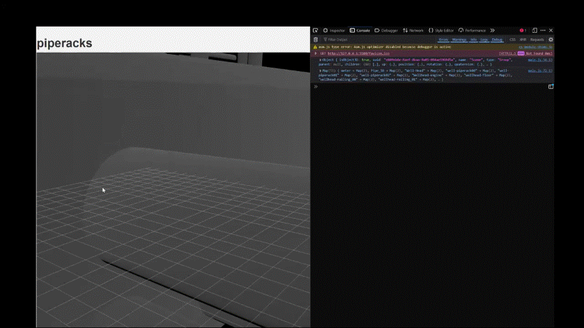

# Octree Basics

We have been able to establish that [dynamically swapping a mesh's resolution](../hosting-3d-model/per-object-lod-control-with-threejs.md) in a scene can improve the overall performance. As a refresher on it's workings, we loaded low and high resolution versions of the same mesh to one `LOD` container, and swapped which mesh was active at any time depending on how far away it was from the camera. This way, low res meshes could be rendered to the screen when the user was far away, and high res versions of the mesh could be rendered when our user zoomed in.

As we navigated around the page, the webpage was performing distance calculations between the camera and every LOD container in the scene thousands of times per second. Since our model only contained 303 objects, we were able to get away with this computationally intensive step without too much of a performance drop. However, when the number of objects in the scene explode (as is the case with BIM models), our computational debt increases and the webpage starts experiencing lag.

Why are we measuring the distance to every single object in our scene? It would be more efficient to group objects together in space. Now, if our camera is far enough away from this group of objects, we can immediately confirm that all the objects in the group should be rendered in low-res. When we get close to a group, we can apply our same distance based LOD swapping, but now only on objects within that group- a much smaller scale. This is the basic mechanism behind the workings of an `Octree`.

## What is an Octree?

An `Octree` is a basic tree data structure that contains 8 children for every node. It provides a method for scaling up [traversal loops](../hosting-3d-model/bpy_with_lod.md) from O(n) to O(log n) runtime. Fundamentally, this means that for a 4x increase in the number of objects in the scene, your performance decreases only by a factor of log(4) ~= 1.39. For large scenes, the `Octree` is an almost fundamental tool used to speed up performance.

An `Octree` is created by recursively dividing 3D space into smaller and smaller cubes. The graphic below shows the how an octree is constructed.

It is important to note here, that the cube in the picture is not a 3D model in itself- it refers to the space in your scene. Your 3D model would exist wholly within the root node (largest cube) of the octree. Individual objects in the scene would fit within different levels of the octree.

For example, a steel beam in your scene is likely very large and takes up a lot of space. This would be queried at one of the higher levels of the Octree.

While a valve on a pipe is likely very small in the scene. We would need to recursively divide our Octree a number of times before we reach the scale of this valve. It will be queried in the lower levels of the Octree.

## How Does an Octree Work?

A fundamental understanding- **Octrees do not store any data.** They are used for spatial querying. An Octree is used to answer the question- "Which objects in my scene are physically close to my area of interest"? In Video Games, the Octree may be used for player - object interactions.

Say our player has walked up to a treasure chest on the map and clicked the `A` button to open it. Now instead of searching through every treasure chest in the game to determine which one the player actually clicked on, we use an `Octree` to discard entire segments of the map and narrow our search down to only the specific segment which the player is closest to; vastly improving the performance of the game.

We can apply this logic to our LOD scene too, instead of measuring the distance between our camera and every single object in the scene, we measure the distance between our camera and the levels of our Octree. If the node fails the distance calculation, we can be certain that all the children objects of that node will fail too, and so that entire branch of our tree is discarded, or `pruned`.

If the node passes the distance check, we go down one level in the tree and perform those distance calculations again- just on a subset of the original data.

We repeat the process until we've made it down to the last level of the tree, at which point we see the true benefits that an Octree provides.

Our scene contains XXXX objects. As we make our way down the nodes, the final LOD control performs only XXX distance calculations. This results in a XXX% performance improvement.

## Conclusion

An Octree can be used effectively for spatial querying in large 3D scenes. For objects that don't meet LOD distance criteria, entire groups can be discarded without needing to loop through every item in the group. This effectively reduces our computational time from O(n) to O(log n), and allows for truly vast scene generation and hosting.

In BIM models detail is key, but that detail often comes at the expense of increased computational requirements. By utilizing some clever game dev techniques we can greatly reduce this debt, and truly make 3D models accessible to all.

## Links

[traversal loops](../hosting-3d-model/bpy_with_lod.md)

[LOD control](../hosting-3d-model/per-object-lod-control-with-threejs.md)