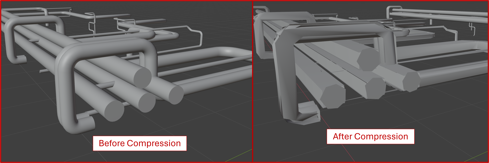
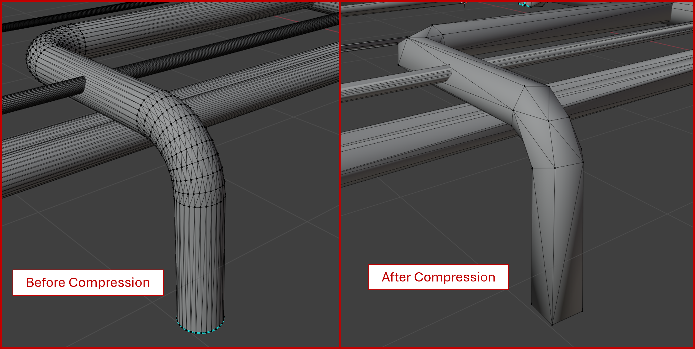

# Reducing Mesh Density of 3D Objects in Blender

Blender provides a suite of open source modifiers to edit meshes. One such modifier is the `decimate` modifier. The `decimate` modifier allows you to deform complex geometries into smaller bits, thereby improving model performance. However, this comes at the expense of detail, and as such, reducing the number of vertices and edges in an object will also result in it losing it's finer details. What if we could find a balance between the level of detail and the performance? Lets explore and find out.

## Why though?

When working with small models, the fine detail modelling is not likely to affect your performance too much. However, when the file size increases and the total number of meshes and surfaces needed to be loaded to memory skyrockets, small improvements to performance are likely to make a noticeable difference. I have found this to be most applicable in large-scale BIM models, where hundreds, if not thousands of individual objects need to be kept track of. Tapping into the BIM vein, one piece of geometry is most culpable to the model performance, and that is the humble pipe.

## Piping

Cylinders are notoriously hard to model. The fundamental buiding blocks of computer graphics are vertices and edges. vertices can be thought of as 'corners' while edges are what connect the corners to each other. In a cube, we have 8 vertices and 12 edges, as you can see in the image below (in no praticular order).

However, circles don't have any corners. A circle can be thought of as infinitely many corners that all connect to each other. It is impossible to model a perfect circle, so we approximate it using a large number of vertices. The more vertices, the more the object starts looking like a circle.

Hence, when we extrude all these individual edges and vertices into the page, we get a cylinder (pipe), which is hilariously inefficient for how simple of a shape it is.

Each of these edges and vertices need to be kept track of by your computer's GPU. In large models, this is usually what causes the lag- especially when your GPU is not powerful enough. Let's see if we can compress the total number of edges and vertices in an object.

## The Decimate Modifier

The `Decimate Modifier` in Blender will progressively merge egdes and vertices in an object together, reducing the overall count and also reducing the overall detailing. The decimate modifier has certain parameters which can be tuned to affect the final output of the shape. Most notably, the `Ratio` parameter will increase the amount of decimation which gets done on the object. Depending on how complex the geometry is, different ratios are preferable.

Let's apply a decimate modifier onto our cyclinder with `Ratio` set to be 0.25.

Before

After

We can see that the overall general shape of the object has been maintained, but finer details like the smoothness of the circle have been lost. For such basic shapes, a higher decimation ratio will not necessarily affect the overall shape. However, this is object dependent and may not work as well for complex objects.

In this example, we compress a basic mesh of a human foot using the `decimate` modifier with `Ratio` = 0.1

In this case, we lose a lot of the visual cues which help us identify the object. Clearly, we can see that the compressed version of the foot looks like something out of a early 2000's video game.While this compression technique is good on your computer's memory, you sacrifice on the various advancements that have been made in computer graphics over the past few decades.  

But, if we zoom out far enough...

Both our objects start looking awfully alike.

This implies that the Level of Detail required to successfully identify an object depends on its distance from the camera.

What if we could dynamically change which model is loaded to our 3D scene based on how far away the camera is from it? In further research, I will delve into building this model. For now, lets see if we can standardize our findings, specifically to BIM objects.

## Compression Ratios for Piping

Can we define a perfect standardized ratio? Well, `Piping` in our model includes more than just cylinders, it could including things like valves, flanges, mechanical equipment, all of which tend to have non standard geometries. Let's see what kind of performance gains we can get by simply compressing the piping.

Here I am working with a small 3D model of a piperack (this is considered small, as piperacks tend to be several hundred meters long!)

Let's focus on piping here. I will remove all the extra objects in the scene like the steel, valves, or any tanks.

To these pipes, I shall now apply a `decimate` modifier to compress our meshes. I experimented with different ratios and found that even a ratio as low as 0.04 seemed to preserve the general shape of our object. Here I show the results both before and after applying the `decimate` modifier.

Here is the result of our decimation. We can see that the cross sectional shape of our pipes have changed- they are no longer circular. This is to be expected, as I mentioned above, and implies that our compression worked well.

Here is the result of a more complex piece of geometry- a 90 Degree bend. We see that the compression algorithm has greately reduced the number of edges and vertices, while still mostly preserving the general shape.

This picture truly highlights the compression of our vertices. If you imagine a computer GPU trying to keep track of the postition and rotation of every single one of these points, we quickly start to see why large models are so performance ineffficient. But how do these models look from afar?

Adding back all the auxillary objects to the scene, we see minimal differences between the two versions of our model at a 50 ft view. We can clearly tell what the general shape is of these pipes, and adding our auxillary objects helps provide spatial context to the user. I would go so far to say that at this zoom level, its hard to differentiate between our compressed and uncompressed object.

What about file size results? The pre-compressed size of the model is 2.75 MB and post compression drops down to 1.41 MB, implying about a 1.9x compression ratio.

Performance is harder to measure, but I was able to simulate some results.

I copied both the original and decimated piperack model 64 times, to simulate what a large model might look like. I then throttled my computer's performance, limiting the temperature and battery settings, thereby reducing the performance. I then recorded the results of some simple panning and zooming within each model. Here is the original.

And here is the compressed version.

It can be clearly seen that navigating around the decimated model is a lot smoother than the original, especially at far enough zoom levels. I zoomed in to each model to prove that they are indeed, compressed and uncompressed respectively. I did my best to hold all other factors constant from my computer (ex: GPU usage, power draw), so the results we are seeing have to be from the reduction in edge and vertex count between each model.

## Conclusion

3D modelling is complex and highly evolved from the basic edge and vertex model I have described above. However, simple compression techniques like decimation can still help improve the performance of the model, especially in cases when absolute fine detailing is not necessarily the priority. By reducing the edge and vertex counts for each object, we can reduce the overall load on the GPU, and improve the responsiveness of our model.

This is my first publication on this topic. In further resarch, I will delve into Zoom-based Level of Detail modelling, and how to further improve our compression ratio using Machine Learning techniques.

### License

1. human-foot-base-mesh credit to ferrumiron6, Creative Commons License https://creativecommons.org/licenses/by/4.0/