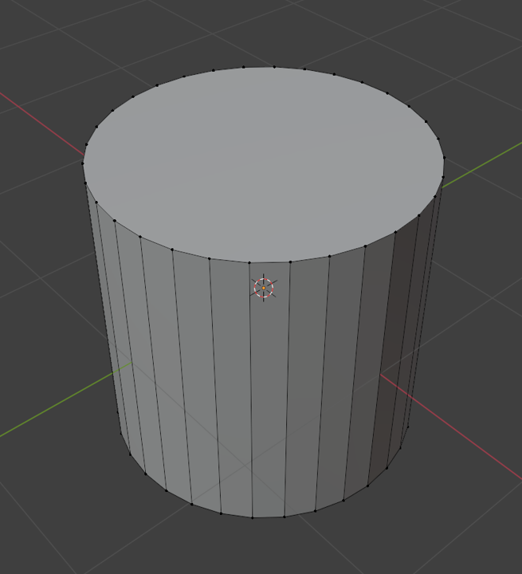
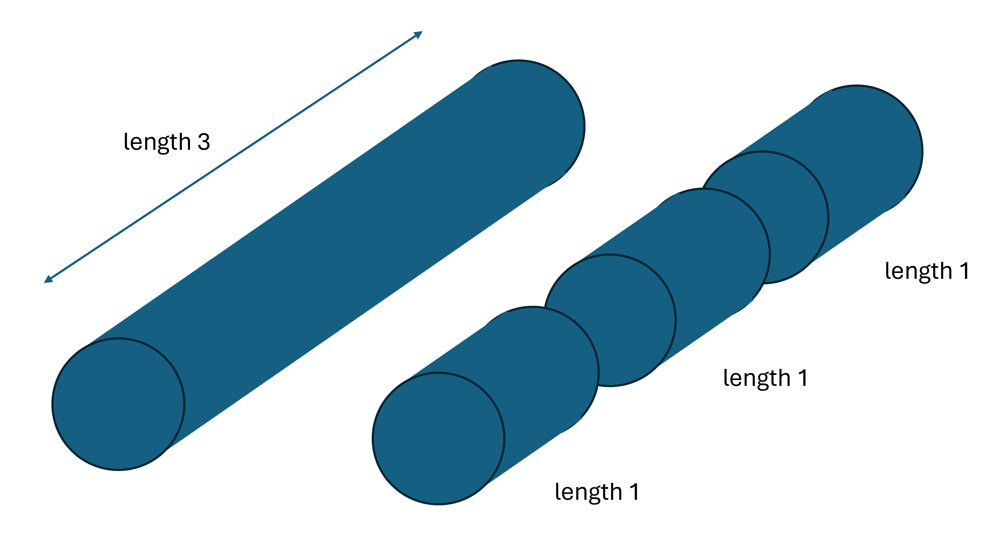
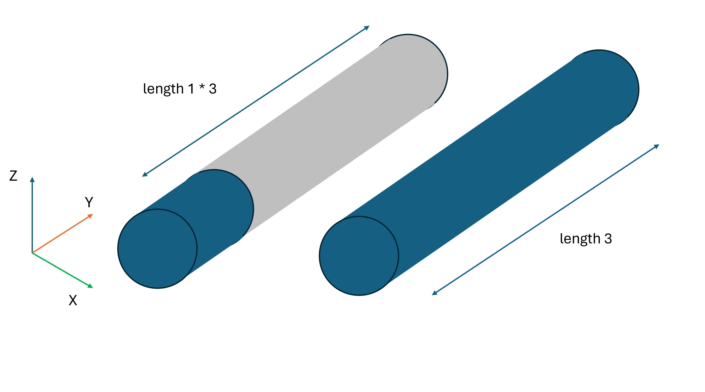
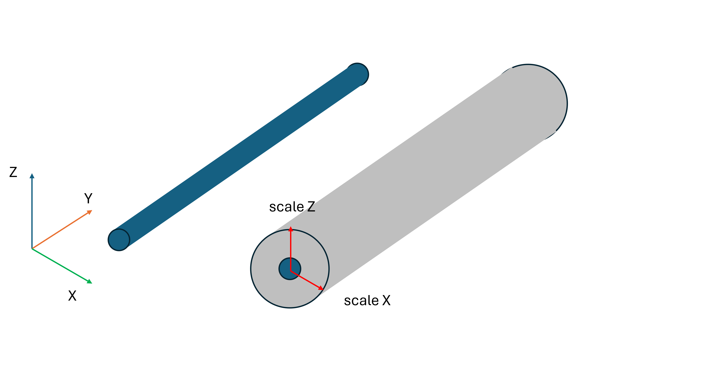

# Hyper Instanced Meshes to Reduce Memory Usage in Large BIM Scenes

The [QS Viewer](../../reports/a-game-dev-approach-to-bim.md) project helped us optimize a heavy BIM (BUilding Information Modeling) scene in three.js through a combination of techniques including LOD control, Instancing, Batching, and more. In that project, we were able to reduce the number of total draw calls in the scene, as well as dynamically change the active mesh at any time, enabling a smooth LOD control system. However, a parting observation in that project was that the memory usage of the scene was incredibly high. This is partly due to our LOD system introducing essentially 2 pieces of geometry for each item in the scene. This is not ideal, and will be the aim of the explorations in this paper.

Our high level goal with this research will be to create a deterministic method to hyper-instance our meshes in the scene, such that each unique object can be classified down to a handful of distinct geometries, with tunable parameters like scale, rotation and translation accounting for the rest of the finer control.

## Instancing

We established in prior research that [instancing](../optimizing-the-scene/instanced-mesh.md) helps reduce both draw calls and memory consumption of a 3D scene. This process works best for a scene that has lots of objects with the same geometry; for example, blades of grass in a field, bolts in a steel beam, 90 degree elbows in a pipe. All these objects have exactly the same geometry structure, and are just loaded to different positions in the scene. In this case, we do not need to save the geometry for each individual blade of grass- rather, we save this geometry once and refer to it multiple times. These `instances` of the geometry can also be loaded dynamically to different positions in the scene (i.e. each instance can have its own unique transformation matrix).

In this example, I'd like to tackle what I believe to be an extremely low hanging fruit- straight pipe.

## Methodology

The Mechanical Electrical Plumbing (MEP) layer of any BIM model is ubiquitously large. This is partly due to there being so many pipes in any building, but also because pipes are notoriously difficult to model in 3D. Due to the fundamental property of circles having no corners, 3D cylinders use a large number of vertices to approximate the "roundness". Hence, this simple shape often results in a drastic increase in the total number of `vertices` and `edges` in the scene.

That said, since pipes are such a simple shape, it becomes that much easier for us to approximate their geometry into something more memory friendly. The most basic shape that a pipe can take is that of a cylinder.

More so, any pipe in our model is simply a scalar multiple of this basic shape. For example, this run of straight pipe of length 3m, can be broken down into 3 straight pipes of length 1m.

Alternatively, this can be represented as one unit cylinder, scaled in the Y direction by a factor of 3.

The only other dimension that controls the shape of our pipe is the diameter, and this can be tweaked by scaling in our other 2 directions.

Using this logic, almost every single straight run of pipe should be able to be represented as a single unit cylinder that is scaled in specific directions. The benefits of this procedure become increasingly apparent when combined with the instancing technique mentioned above, as this would enable us to swap out every unique pipe geometry in the model with *one* geometry, theoretically resulting in massive memory gains.

## Data Process

## Links

