# Hyper Instanced Meshes to Reduce Memory Usage in Large MEP Models

The [QS Viewer](../../reports/a-game-dev-approach-to-bim.md) project helped us optimize a heavy BIM (Building Information Modeling) scene in three.js through a combination of techniques including LOD control, Instancing, Batching, and more. In that project, we were able to reduce the number of total draw calls in the scene, as well as dynamically change the active mesh at any time, enabling a smooth LOD control system. However, a parting observation in that project was that the memory usage of the scene was incredibly high. This was due to our LOD system introducing essentially 2 pieces of geometry for each item in the scene. This is not ideal, since now more than ever memory cost is at a premium.

Our high level goal with this research will be to create a deterministic method to hyper-instance our meshes in the scene, such that each unique object can be classified down to a handful of distinct geometries, with tunable parameters like scale, rotation and translation accounting for the rest of the finer control.

This work is influenced by the research paper ["The Unit Pipe: A Memory-Efficient Representation for Real-Time Visualization of Massive MEP Models"](https://research.chalmers.se/en/publication/549408), by Mikael Johansson and Mattias Roupé.

## Introduction

The Mechanical Electrical and Plumbing (MEP) layer of any BIM model is ubiquitously large. This is partly due to there being so many pipes in a building, but also because pipes are notoriously difficult to model in 3D. Due to the fundamental property of circles having no corners, 3D cylinders use a large number of vertices to approximate the "roundness". Hence, this simple shape often results in a drastic increase in the total number of `vertices` and `edges` in the scene.

That said, since pipes are such a simple shape, it becomes that much easier for us to approximate their geometry into something more memory friendly. At its most fundamental, a pipe's geometry can be represented by a cylinder.


More so, any pipe in our model is simply a scalar multiple of this basic shape. For example, this run of straight pipe of length 3m, can be broken down into 3 straight pipes each of length 1m.


Alternatively, this can be represented as one unit cylinder, scaled in the Y direction by a factor of 3.


The only other dimension that controls the shape of our pipe is the diameter, and this can be tweaked by scaling in our other 2 directions.


Using this logic, almost every single straight run of pipe can be represented as a single unit cylinder scaled in specific directions. The benefits of this procedure become increasingly apparent when combined with `instancing`, as this enables us to swap out every unique pipe geometry in the model with *one* geometry, resulting in massive memory gains.

## Instancing

We established in prior research that [instancing](../optimizing-the-scene/instanced-mesh.md) helps reduce both draw calls and memory consumption of a 3D scene. This process works best for a scene that has lots of objects with the same geometry; for example, blades of grass in a field, bolts in a steel beam, 90 degree elbows in a pipe. All these objects have exactly the same geometry structure, and are just loaded to different positions in the scene.


In this case, we do not need to save the geometry for each individual blade of grass- rather, we save this geometry once and reference it multiple times. These `instances` of the geometry can also be loaded dynamically to different positions in the scene (i.e. each instance can have its own unique transformation matrix).

To start, I'd like to tackle what I believe to be an extremely low hanging fruit- straight pipe.

## EDA

In this project we're working with an IFC file of a real development in the Netherlands called [Sixty5](https://www.strijp-s.nl/en/building/sixty5), courtesy of the [buildingSMART community](https://github.com/buildingsmart-community). We shall isolate our data to just the MEP layer of the building for this project. This model contains ~23k objects.


Since we're working with an IFC file, we can view the metadata of each object clearly. Here are the straight pipes, filtered by their IFC definiton `IfcFlowSegment`. There are ~11k straight pipe geometries in the model (~49% of the total objects).

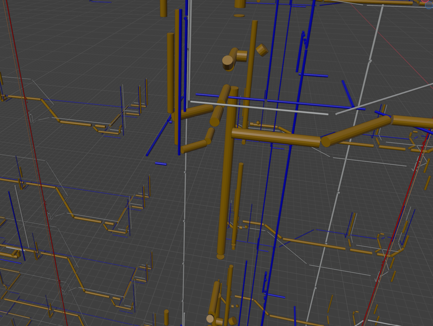

We see that the straight pipes take up most of the visual space in the model. Let's export this filtered model out and establish a baseline. We export to [gltf](https://www.khronos.org/gltf/) format, for optimized viewing in a browser environment. An important note here is that we must exclude any extra data associated with the object like materials, textures or metadata. To truly compare apples to apples, we need to work with strictly vertices and faces. Here is what the file looks like in our test three.js scene.

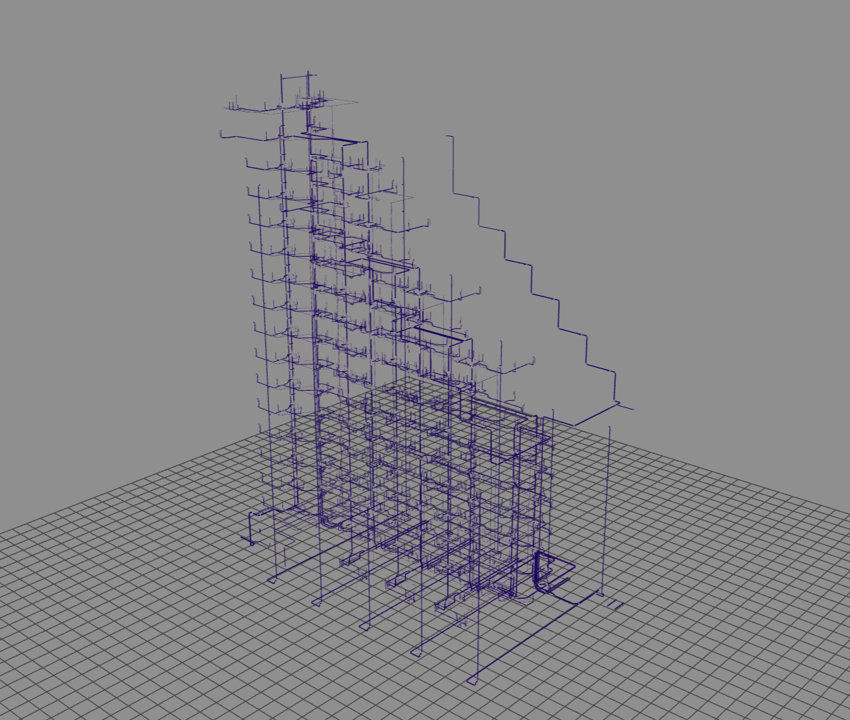

We see our scene as expected. However, if we add a simple condition to only include duplicated geometry, we see that all our objects disappear.

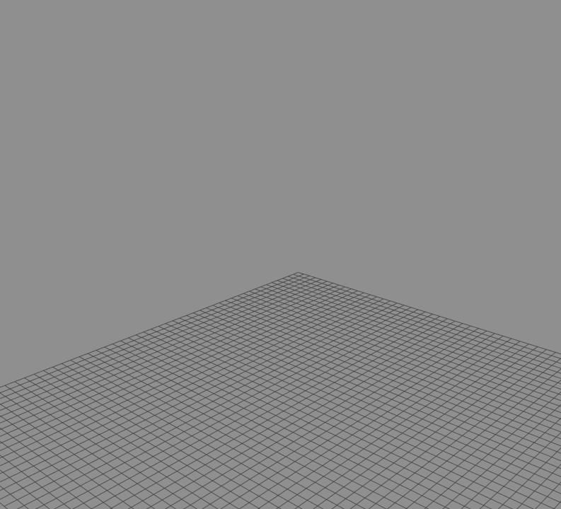

This means that every piece of straight pipe geometry is unique in the scene. Not good.

Here are the baseline results.

| Model | Size on Disk | Peak RAM | Stable RAM | FPS |
| ----- | ------------ | -------- | ---------- | --- |
| Naive | 42 MB | 300 MB | ~60 MB | ~90 |

Let's see if we can improve this.

## Methodology

Our high level data process shall involve iterating through every straight pipe in the scene, finding its position, rotation, and scale, and applying those same transforms to our pre-defined unit pipe. The result should be a shape that's virtually identical to the original, but that references one central piece of geometry.

We create our unit pipe in Blender as follows.

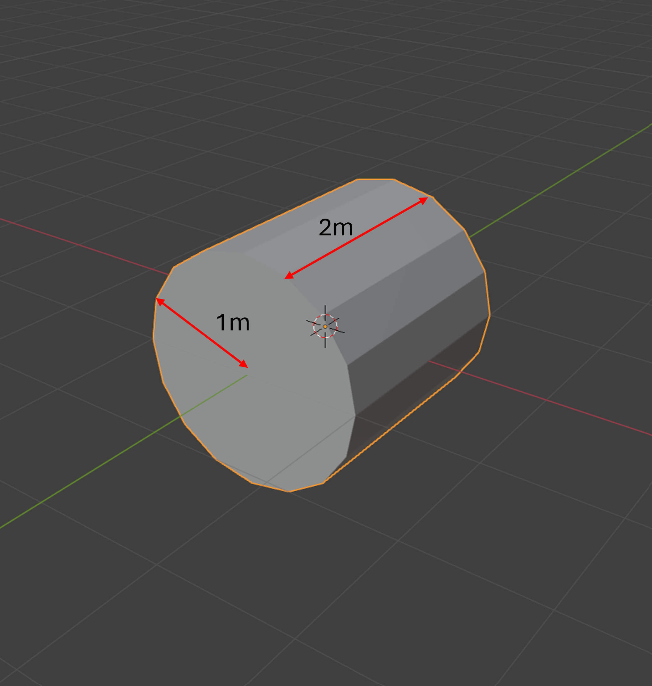

Note the dimensions of this unit cylinder- length 2m, radius 1m. Choosing 2m as the "unit" length may seem wrong, but since we're centering this pipe on the origin, its extents will be 1m in each direction. The same logic applies to the radius- centered at the origin, the pipe should extend out 1m.

Here is what the vertices of this pipe look like in 3D space.

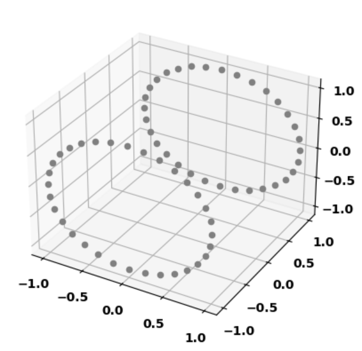

If we sample a pipe at random from the model and plot it similar to above, this is what we see.


Looking at this pipe, we see that its centered about the point X,Y,Z; and extends out x meters from that point along the longest axis. As well, we see that its rotated 90 degrees to the positive X axis. These are the transformations which we need to apply to our unit pipe.

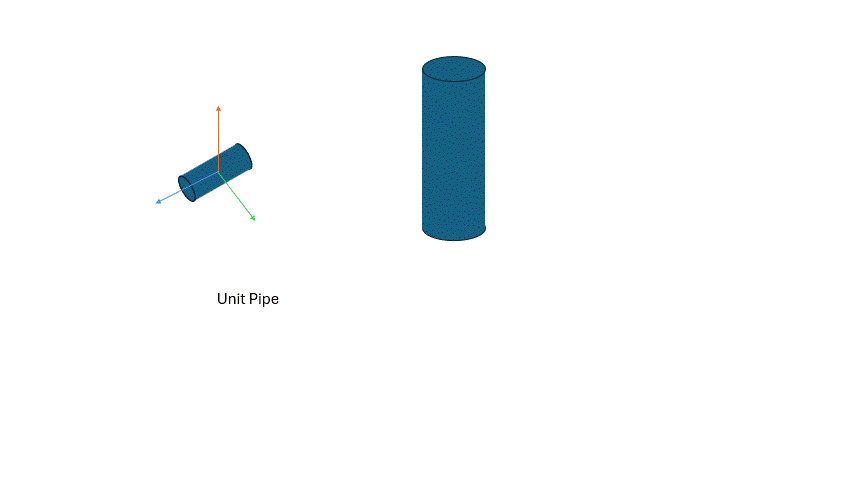

We combine these 3 transformations into one 4x4 transformation matrix that applies these 3 steps in one go. [This video](https://www.youtube.com/watch?v=Do_vEjd6gF0) explains really nicely why our transformation matrix has dimensions of 4x4, and not 3x3. In general, since we're working with homogenous coordinates, we need to account for one additional dimension.

## Data Process

Lets break this process down into Translation, Rotation and Scale.

### Translation

To find the translation of our pipe, we need to find how far from the origin it has been pushed. We can solve this by calculating the centroid of our pipe. This point represents the geometric mean of all our vertices, and is equivalent to the origin in our unit pipe. Hence, the translation is simply the difference between the centroid of our sample pipe and our unit pipe (the origin).

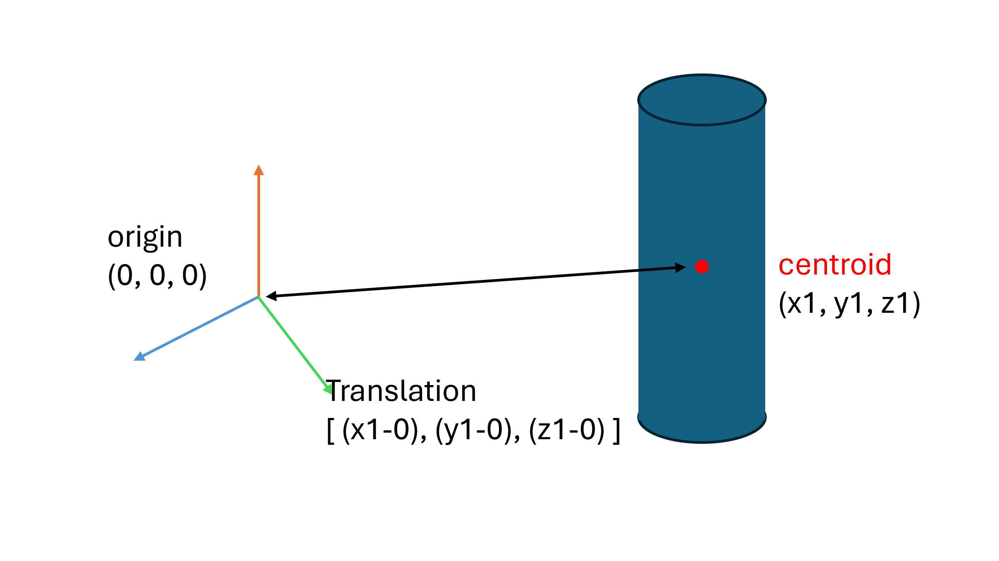

Since the origin is 0,0,0- the translation of our pipe boils down to its centroid.

### Rotation

To find the rotation matrix of our system, we shall use a data science technique called Principal Component Analysis (PCA). This method is traditionally used to compress high dimensional datasets into "Principal Components", or vectors which explain a majority of the data variance.

In english, it helps identify the axes along which our data is most spread out.

Consider this example. We have a 3D dataset as shown in the gif below. If we plot these points on a chart, we observe discrete X, Y, and Z coordinates for each of our points. However, while the data definitely has 3 dimensions, it is mainly concentrated in 2 directions here. If we instead rotate our axes like so, the data essentially reduces to 2 dimensions.

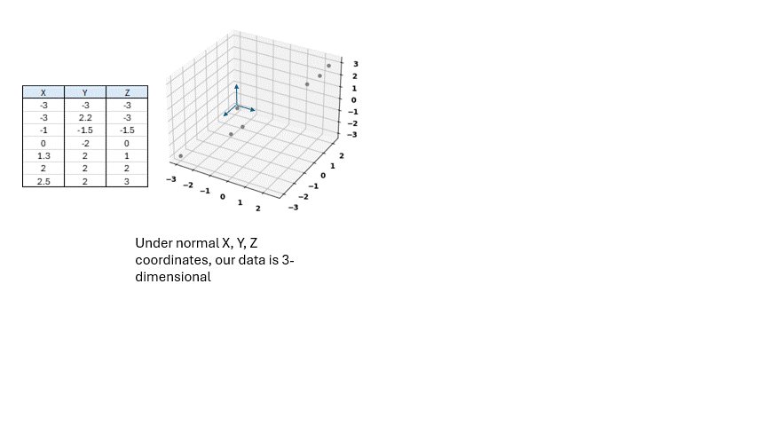

These new axes are called the "Principal Components" of our dataset, and are found by calculating the eigenvectors of the covariance matrix. The principal components describe the directions along which most of the variance in our dataset can be explained.

If we treat the vertices of our pipe as data points, we can apply a similar technique to find the rotation vectors of our pipe. Once we find the eigenvectors, those serve as the basis for our rotation matrix.

I wont go into details here, but further information can be found in this [python notebook](notebooks/hyper-instance.ipynb)

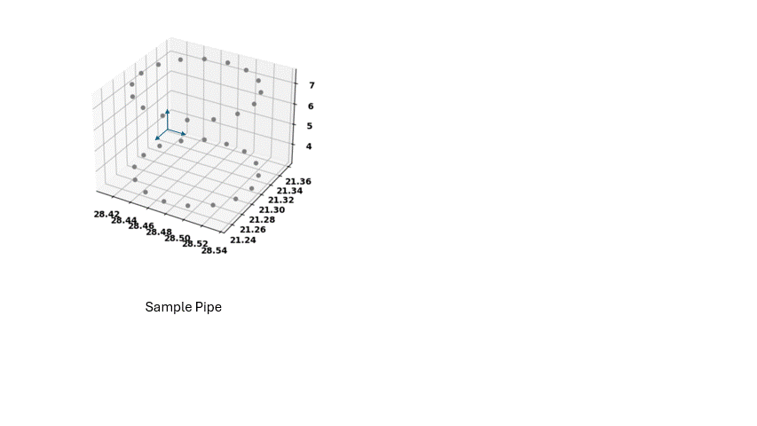

Hence, when we extract our principal axes, we can derive the transformation matrix of our pipe.

An important finding here relates to finding the longest axis. The largest eigenvalue identifies the direction with the highest variance in our data. For our pipe, this is usually the length axis, since pipes are usually longer than they are wide.

However, some pipes may be short and stubby. In this case, the largest eigenvalue will *not* be our length axis. If we mistakingly use the largest eigenvalue as our length axis, we run into the risk of improper orientation. To counter this, we instead use the assumption that since the pipe has a circular cross section, 2 of its 3 eigenvalues will be the same (since the variance of a circle is the same in all directions). Hence, we essentially find the "odd-one-out", of our 3 eigenvalues, and use that as our length axis.

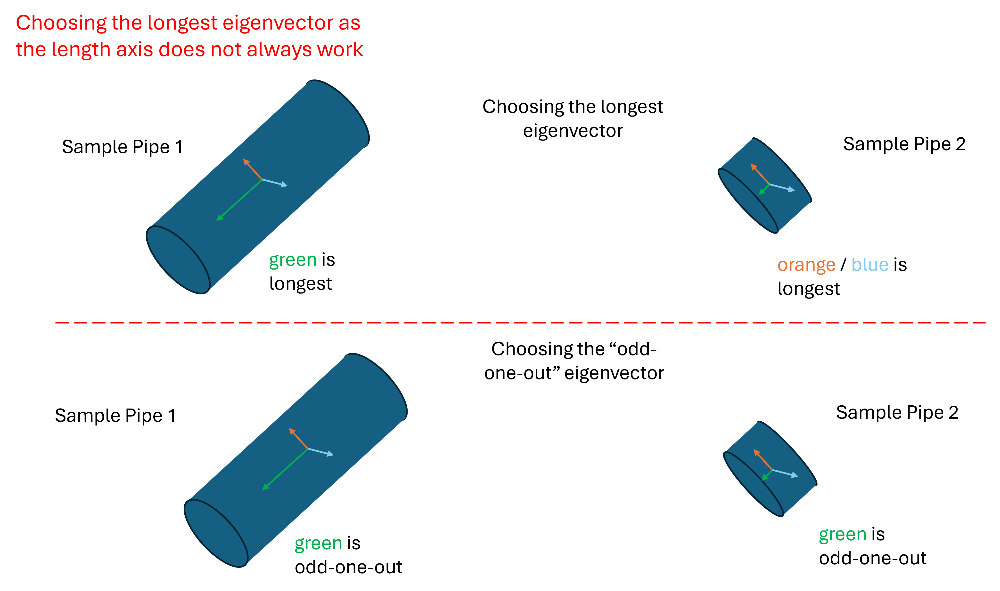

This could potentially lead to issues in the case where the length of our pipe is also the same as the radius. Here, all 3 eigenvalues will be the same and we will not be able to identify our length axis. In practice, this case is rare and so we proceed with this assumption.

### Scale

Finding the scale matrix is a little easier. Since we have our principal axes, we can simply find the projection of our original points along these new axes. The largest dimension will give us the scale vector. This is also the reason why we chose 2m as the size of our unit cylinder, as this pipe extends out 1m in the length axis. We can just multiply the dimensions by the derived max value.


We need to convert the vector values into a 3x3 matrix to be able to multiply it with our rotation vector. Hence, we embed them along the diagonal of a 3x3 matrix.

### Final Matrix

The final matrix combines the rotation, scale, and translation matrices into one 4x4 matrix. The rotation and scale is first combined into one matrix and embedded into the top left 3x3 partition of the final matrix.

Then the translation vector is encoded into our final matrix in the 4th column.

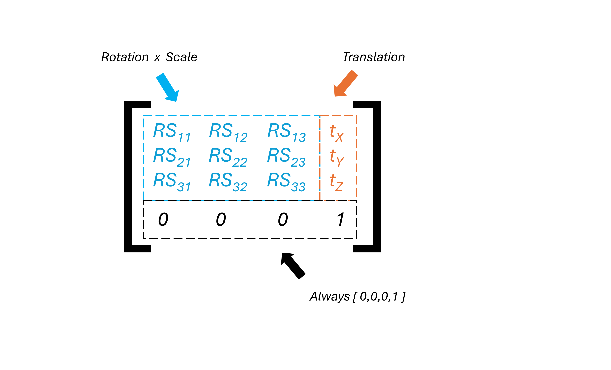

The last row of our matrix will always be [0,0,0,1]. The inclusion of this additional row enables the entire transformation to remain "linear", and is explained more in [this video](https://www.youtube.com/watch?v=Do_vEjd6gF0).

Hence, we have our final derived transformation matrix. As a reminder, this matrix represents a series of transformations that will be applied onto our unit pipe in order for it to have the correct position, orientation, and scale as our sample object. Since the matrix is 4x4, we also need our vertices to have 4 dimensions, so we add an additional dimension to make the math work.

```text
vertex_1 = [ x_1, y_1, z_1, 1 ]
vertex_2 = [ x_2, y_2, z_2, 1 ]
...
vertex_n = [ x_n, y_n, z_n, 1 ]
```

## Results

We test our process by multiplying the calculated transformation matrix with the vertices of our unit pipe and seeing what we get. We get some samples from the model as follows.

### Tests

Test 1: Basic Pipe.

Looking at the vertex plot of this pipe, we know that its essentially rotated 90 degrees about the Y axis and scaled slightly. If we transform our unit pipe with the derived transformation matrix, this is what we observe.


The transformation matrix captured these operations perfectly. We see that the unit pipe has indeed been scaled, rotated and translated such that it overlaps well with our sample shape.

Test 2: Diagonal Pipe.

A diagonal pipe is particularly tough, since the rotation is no longer 90 degrees or restricted to one axis. However, using the same PCA approach as above to calculate the transformation matrix gives us these results for our unit pipe.


Looks good.

Test 3: Exceptionally short Pipe.

An exceptionally short pipe has potential to cause some problems, since it is not immediately apparent which axis corresponds to the length. However, our process above captures the dimensions corresponding to the circular cross section, and the result appears as intended.


### Final Model

Applying these optimizations to each straight pipe in our model involves iterating through each `IfcFlowSegment` in our file, and deriving the transformation matrix. We manually parse this data and save it to a gltf file. More info on this process can be found in [this notebook](notebooks/hyper-instance-3.ipynb).

The final data in the file includes one mesh (representing our unit pipe), and ~11k transformation matrices that each reference this one mesh. Here is what the model looks like in our three.js basic scene.


Virtually no difference over our naive implementation. The final results compared to the baseline are as follows.

| Model | Size on Disk | Peak RAM | Stable RAM | FPS |
| ----- | ------------ | -------- | ---------- | --- |
| Naive | 42 MB | 300 MB | ~60 MB | ~90 |
| **Hyperinstanced** | **2.5 MB** | **100 MB** | **10.5 MB** | **~96** |

- The naive model utilizes 42MB on disk, excluding any materials.
- This model peaks at 300MB when loading the data to the scene.
- Once the garbage collector is run, the scene uses approximately 60MB of stable RAM, at ~90FPS.

- Our hyperinstanced model utilizes only 2.5MB of space on the disk- **a 94% reduction in file size.**
- When loading to the scene, our RAM peaks at ~100MB- **a 66% reduction**.
- Once garbage collection is run, the stable RAM usage of the scene is ~10.5MB- **a ~82% improvement**

While performance figures are comparable between models, we note drastic improvements to the memory consumption of the scene. Initializing a scene utilizes higher memory due to raw files being loaded. Peak RAM usage improved by 66%. Once the garbage collection is run, the scene settles into a stable amount of memory usage. Stable RAM usage improved ~82%. And total file size on disk improved by 94%.

## Limitations

This process works well for pipes that are pure cylinders. However, for hollow modelled pipes (i.e. ones that have an inner and outer diameter), the process breaks down. The key metric in these types of pipes is the 'wall thickness', or the difference between the outer and inner diameter. Usually, this number needs to be constant (something like 200mm thick). In this case, scaling the pipe will break this metric's integrity, since the "thickness" value will scale according to the factor applied to it. This limitation is also noted in the research paper by Johansson et al.


Another limitation occurs in the rare case that a pipe has equal dimensions for both radius and length. Here, the eigenvalues of the decomposition will all be exactly equal, and so the model will not be able to deterministically find the length axis. The transformation will choose an axis at random, and so the final representation of the unit pipe may be skewed.


Lastly, this method works strictly for circular, straight pipes, and will not work for other geometries. Adaptations can be made to account for ducts of other cross section (for example, rectangular), but the model currently does not account for it.


## Conclusion

In an increasingly digital world, seeing is believing- and on a construction site there is quite a lot that needs to be seen. Through this endeavour, we were able to significantly compress a 3D model's memory footprint without compromising on visual integrity. The resulting scene can be viewed on machines with lower available RAM, without crashing. While this process on its own does not necessarily improve the performance of the scene, when used in conjunction with other viewing techniques like Instancing and LOD Control, it results in a smooth hardware-agnostic user experience that can be enjoyed by most.

In further research, we expand this technique out to other mesh types- oval ducts, rectangular beams, 90 degree elbows; geometries which are omnipresent on a construction site.

## References

["The Unit Pipe: A Memory-Efficient Representation for Real-Time Visualization of Massive MEP Models"](https://research.chalmers.se/en/publication/549408)

## Links

[Sixty5](https://www.strijp-s.nl/en/building/sixty5)

[buildingSMART community](https://github.com/buildingsmart-community)

[This video](https://www.youtube.com/watch?v=Do_vEjd6gF0)
