# Mesh Simplification Techniques

In this research we explore the basics of Mesh Simplification. In prior work we have explored the usage of the [edge collapse](analysis_decimate.md) algorithm in `Blender`. While powerful, the algorithm has certain drawbacks, namely that the orginal vertex structure is decimeted in the process and our compressed mesh is essentially treated as a completely new object, and not a subset representation of the original, as intended. As seen in the [batched-mesh-with-LOD](../optimizing-the-scene/batchedmesh-with-LOD.md) example, we require this object to be a subset of the original and so shall explore various techniques to achieve the same.

Here is our objective statement.

*"We would like to implement a mesh simplification algorithm that maintains the original coordinates and positions of our vertices, such that when they are loaded to a scene, they can share the same vertex buffer"*

## Introduction to MeshLab

For the purpose of this work, we shall be working with an open source program known as [MeshLab](https://www.meshlab.net/). This software provides in depth tools for working with meshes and includes a Python based API, [PyMeshLab](https://pymeshlab.readthedocs.io/en/latest/).

## Problem Statement

Here, we load a simple model of a valve handle derived from the original [piperacks.glb](../hosting-3d-model/analysis_threejs.md) model file. Opening this with MeshLab shows the following statistics and image.


From the statistics, we see that the mesh has 3,606 vertices and 7,088 faces. The main handle of the valve hsas some extremely intricate geometry, which will be likely where we see the most decimation and edge compression. An important consideration here is that this model file is a closed-form manifold mesh. This means there are no gaps or open edges. This is likely a best case scenario, since our piping files will likely have open ends or "holes", where they connect to other pipes. We shall also address this form of geometry later.

For the time being, let's apply a simple decimation filter on our mesh. Here, we are using the simple Edge-Collapse with decimate filter, with a ratio of 0.4. These are the results -->


We observe familiar results, and note that our number of vertices in the mesh are down to 1,479 (approximately 40% of the original), as well as the faces down to 2,834 (approximately 40% of the original). However, we notice that the algorithm has created new meshes in this process of simplification.

Here, we track the face right in the center of our mesh before and after compression.


Before compression, our mesh in the center was composed of vertices indexed at (895, 926, 910). After compression, this face is now deformed and composed of the vertices (633, 643, 638). Our algorithm has essentially created a new mesh with different vertex indices.

This is in essence, the problem statement, and we shall explore various methods of compression which preserve the original vertex indices.

## Mesh Decimation Algorithms

We saw in the example above that the default Edge Collapse algorithm fails to achieve our intended purpose since it created new vertices. That said, there is an option in the original algorithm choices that may help improve our results- "Optimal Position of Simplified Vertices".

[Option to Keep the Optimal Position of Simplified Vertices](img/edge-collapse-optimal-position.png)

By default, this option is checked since this controls the final error between the original mesh and compressed mesh. However, when unchecked we see that the algorithm will collapse the edges into the original vertices, thereby effectively acting as a sampler for the mesh.

Here are the results of this algorithm with the option unchecked.

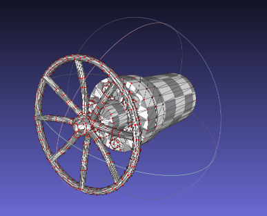

If we overlay this mesh on top of the original, we see that it is indeed a subset of the original. In the figure below, the large RED points are from our decimated mesh.

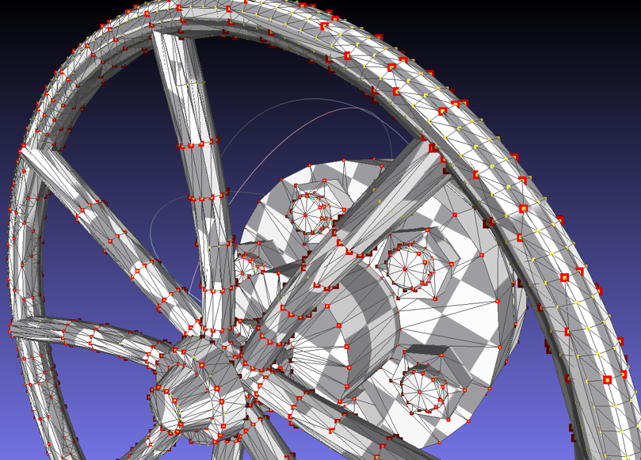

While this is promising, we note that our algorithm still has not maintained the indices of our original mesh. In the figure below, both vertices highlighted with the star are the same geometrically. However in the original mesh it maintains index 920 while in the decimated mesh, it is labelled as 746.

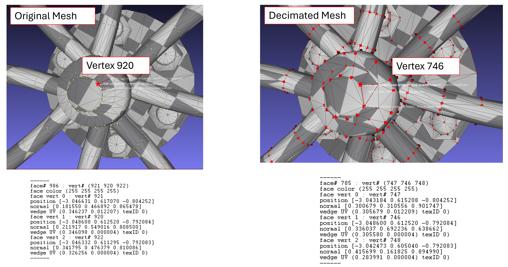

Its easy to see why this is occuring, since indices are assigned chronologically. It is yet to be seen if this can be fixed, or if it even requires to be. More on this later.

## Sampling and Reconstruction

A theory I would like to test out is that of sampling and reconstruction from the mesh. We treat our mesh as a point cloud, where each vertex corresponds to a point. We run a sampling algorithm (here, we use Poisson Disk Sampling) to choose a predefined number of vertices from our original mesh as a sub-sample. Then, we reconstruct our triangles from the subsample, to ideally, create a low-resolution representation of our mesh.

Here is our original mesh.


We resample our vertices from this mesh using the Poisson Disk Resample filter that is available to us in MeshLab -->

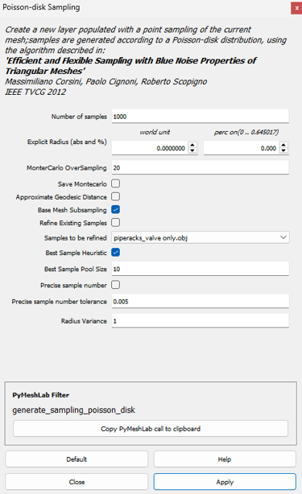

We maintain the default options here, except for checking the box "Base Mesh Subsampling", which implies that our base set of points to sample from will be our original mesh's vertices. We would like our compressed mesh representation to include data from the original, so this makes sense for why we would need it. Here are the results of this sampling.

The points chosen by our sampling algorithm:

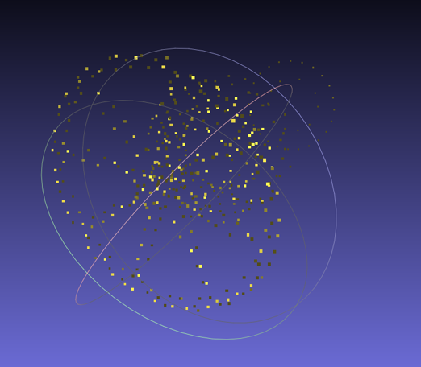

Overlayed with the original mesh, we see that the sampling algorithm has indeed chosen the vertices from our original mesh.

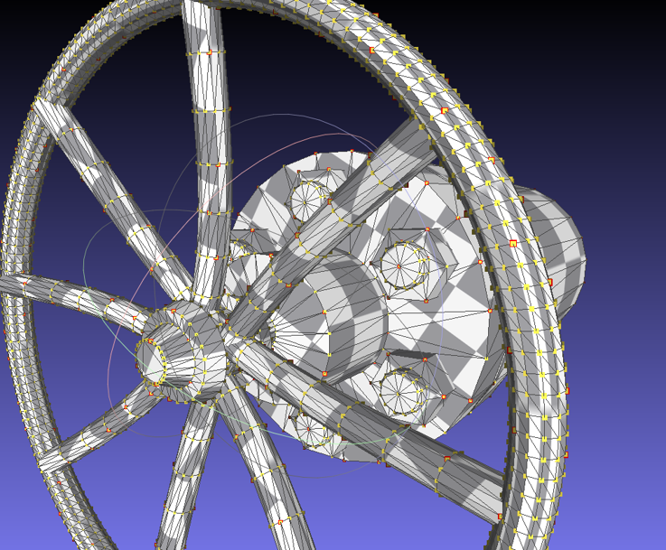

In the figure above, we see recolor our sampled points from the Poisson Sampling Algorithm in red. Overlayed with the original mesh, we are able to quickly observe that the red points completely overlay on top of the original vertices (identified by the stars).

This is good news and promising.

Now, we reconstruct our triangles using this information. 

There are multiple options for reconstruction. We shall attempt these 2 --> Ball-Pivot Method and Screened Poisson.

We observe the following mesh reconstruction using the default parameters of this method.

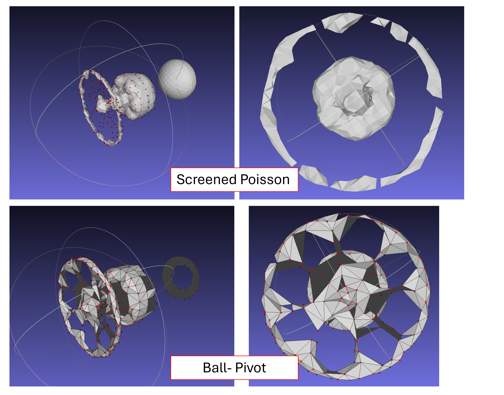

Ball-Pivot appears to have captured better information about the handle of the valve while Screened-Poisson has worked well to maintain closed-form surfaces. We observe that the Ball-Pivot method has created non-manifold geometry in this process- specifically, in the spokes of the handle we see no depth, some vertices are only connected by a line. This is not ideal, but perhaps might be fixed with better sampling.

We observe that neither model was able to consolidate our points into one mesh.

Let's try increasing our sample size. We do so by increasing the parameter `Number of Samples` from 1000 to 2000. Here are the results.

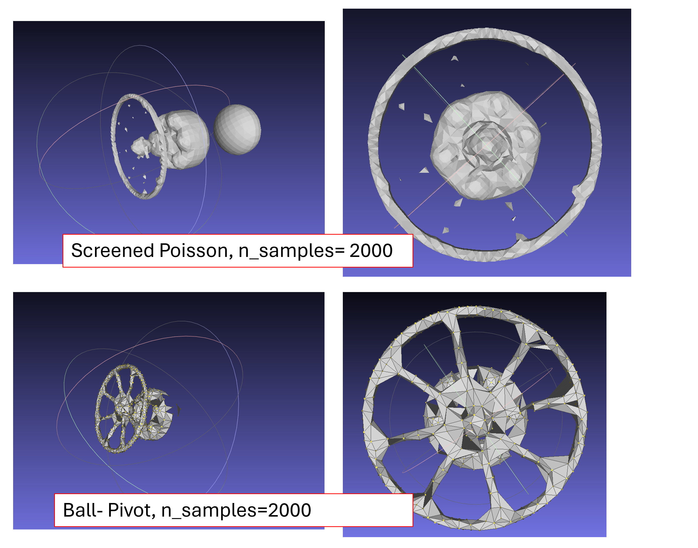

As expected, both methods now have a more accurate reconstruction of the original mesh. The Ball-Pivot method was able to identify our geometry in the handle with increased precision, and the Screened Poisson method was able to identify a closed loop surface for the handle of our valve.

We notice however, that the Ball Pivot method has completely missed the back half of our mesh, instead only reconstructing the front where all the dense vertices are. Observing the original mesh, we see a long distance between the bulk of the valve and the back. This could likely be improved by increasing our clustering distance.

As well, even though we have a high concentration of points in the handle of our valve, the Screened Poisson method was unable to create the surface topology of the handle. We could likely control this, again, with the clustering distance.

The above sampling and decimation techniques appear to be a good starting point and we shall explore this further in a python environment.


## Maintaining Index Order

A point which we brushed over is why do we need to maintain the index order? A key requirement which we stumbled upon when implementing [BatchedMesh with LOD Control](../optimizing-the-scene/batchedmesh-with-LOD.md) was that our LOD containers could only store one array of vertices. This means the LODs must all share the same geometry elements. The vertices are sampled from one vertex buffer and loaded to the screen dynamically.

This is beneficial since it also provides massive memory savings. In [prior LOD implementations](../hosting-3d-model/per-object-lod-control-with-threejs.md), we observed that the overall file size of our scene increased with the addition of LODs. This makes sense- we're essentially tracking an entire duplicate of our model. While not exactly "doubling" our file size, the entire set of vertices was essentially being counted twice.

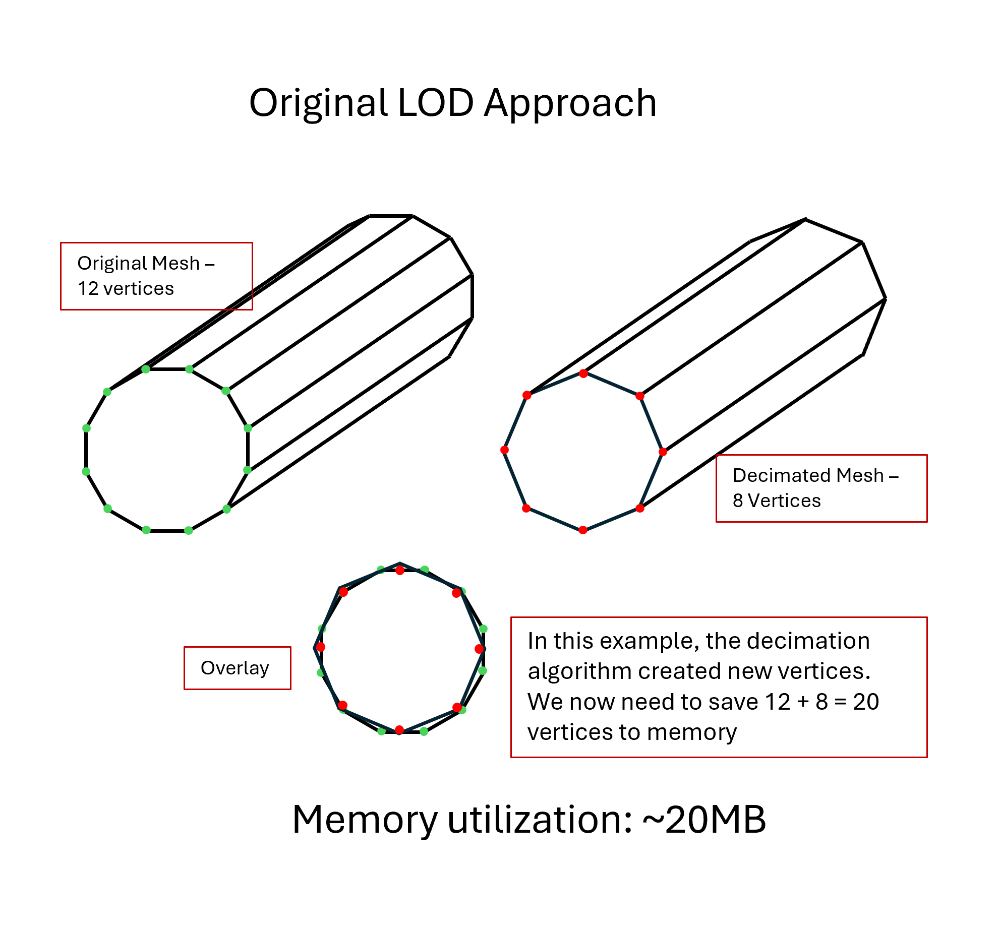

By constructing our LOD's from the original vertex buffer, we now only need one set of vertex buffers across our 2 LOD's, resulting in a high degree of computational savings.

[Diagram showing the benefits of a shared vertex structure in the new LOD appriach](img/mesh-simplification-new-lod-approach.png)

In the diagrams above, note the MB metric is for representation only. Is highly unliely that a single vertex is 1MB in file size.

It's important to note that the faces being constructed using these vertices may be different across our 2 LOD's. This implies that the index buffer will still need to be different across our 2 meshes- but this should not increase our file size by too much.

## Python Implementation

We implemented the Mesh Decimation Algorithm listed above in a [python notebook](notebooks/mesh-simplification.ipynb). The process involved using the `pymeshlab` API to decimate our [human foot model](../../models/foot/human-foot-hires.glb), using the filter `meshing_decimation_quadric_edge_collapse` with the flag `optimalplacement` set to `False`. We determined that setting this flag to False ensured that the decimated mesh shared the same vertex coordinates as the original. However, we were unable to maintain the index order.

The crux of the issue is that MeshLab and other 3D modelling tools create vertex indices on the fly. Looking at the internal format of a wavefront (.OBJ) file, we can see why.

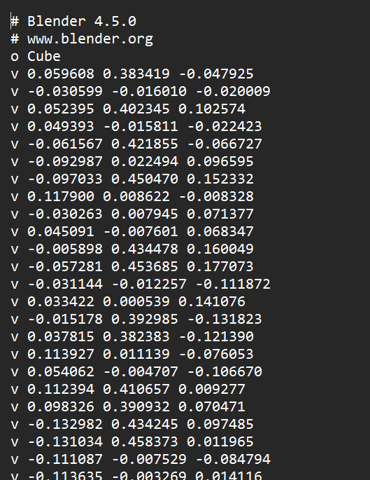

While the vertices follow an order, there is no index applied to them. Hence, when we decimate the mesh, the index structure is created from scratch and there is no guarantee that a vertex in the decimated mesh will share the same index in the original one.


### Applying Decimation

To solve this, we need to manually reindex our 2 meshes. First, let's load our human-foot mesh into `pymeshlab`.

```py
ms = pymeshlab.MeshSet()
ms.load_new_mesh('../../../models/foot/human-foot.obj')
```

Extracting the array of vertices and faces can be done like so.

```py
m = ms.current_mesh()
v_matrix = m.vertex_matrix()
f_matrix = m.face_matrix()
```

The `v_matrix` and `f_matrix` are saved as numpy arrays. They can be converted to dataframe like this.

```py
vertex_df = pd.DataFrame(v_matrix, columns=["X", "Y", "Z"])
vertex_df.head()
```

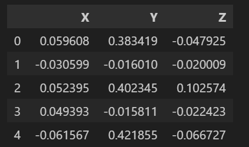

Similarly, this is what the face array looks like when converted to dataframe.

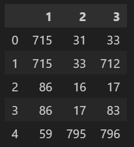

We see another potential issue here. The face matrix refers to how our triangles are constructed, and each cell refers to the index of the vertex used to create it. For example, Face0 (row 0 in the face matrix), is created by joining the vertices at index 715, 31 and 33. However, after decimation this order will be jumbled. We will need to keep track of both the original and decimated indices. More on that later.

These 2 arrays are the basic information we need to create our 3D object. Let's apply a decimation filter on this mesh.

```py
ms.meshing_decimation_quadric_edge_collapse(optimalplacement=False)
```

Here, we are applying the filter `Decimation: Quadric Edge Collapse`, as seen in the MeshLab GUI above. An important flag that needs to be passed is the `optimalplacement=False` flag. This ensures that our new vertices occupy the same location as the original.

With this decimated mesh now in memory, we extract the new vertex and face array as follows.

```py
v_matrix_decimate = m.vertex_matrix()
f_matrix_decimate = m.face_matrix()
```

The length of v_matrix_decimate confirms that we have indeed reduced the density of this mesh- 403 vertices versus the original 800.


### Reindexing

Great, so now we have completed exactly the same steps as we had explored in the section above. However, we still need to address the indexing problem. One solution that popped into my head was to reindex the original mesh based on the index of the decimated one. Let me explain.

Since we can guarantee that the vertex coordinates will be the same across our meshes, we can use this data point as a unique key across the tables. We convert the `X`, `Y` and `Z` columns into a unique tuple for each table.

```py
vertex_df['coords'] = vertex_df[["X", "Y", "Z"]].apply(tuple, axis=1)
vertex_df_decimate['coords'] = vertex_df_decimate[["X", "Y", "Z"]].apply(tuple, axis=1)

vertex_df.head()
```

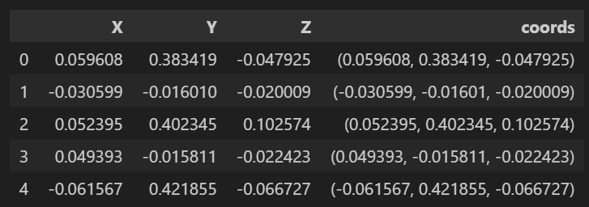

The `coords` column will serve as the unique key across our 2 meshes. We can now compare the relative positioning of vertices across the 2 meshes. Calling `.reset_index()` on both dataframes will give us the current index structure of the vertices.

We now perform a merge on the 2 datasets. Using the `coords` column as the matching key, we merge both tables using an outer join.

```py
merged_df_vertex = pd.merge(vertex_df, vertex_df_decimate, on="coords", how="outer")
merged_df_vertex.head()
```

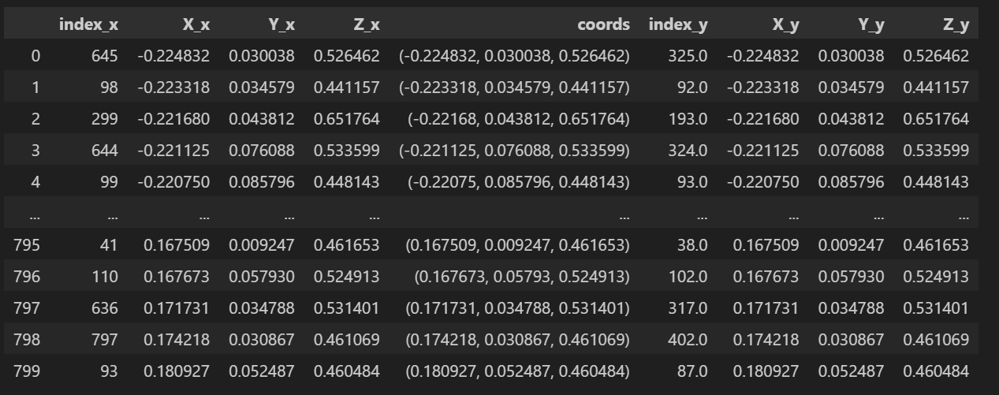

Here we see the power of this approach. The vertex in row 1 has coordinates (-0.224832, 0.030038, 0.526462). In the original vertex array it had an index of 645. In the decimated vertex array it has an index of 325. We have essentially created a map that tracks the index of a vertex before decimation and after.


Since the vertices of the decimated mesh with be an exact subset of the original mesh, we can essentially reorder the original mesh's vertices to follow the same structure as the decimated one. In this case, our decimated mesh has 403 vertices- so the first 403 vertices in our original mesh will follow the same index structure. The remaining 397 (800 - 403) will follow the updated indexing.


Now this means our 2 meshes share the same vertex structure, and we can use the vertex array strictly from our original mesh to construct the decimated one.


To clarify, the overall process looks like this ->

1) acquire original vertex and face arrays
2) acquire decimated vertex and face arrays
3) reorder the original vertex array using the index structure from the decimated mesh.
4) reconstruct the faces with this updated index.

The [python notebook](notebooks/mesh-simplification.ipynb) provides additional details on this reconstruction. For now, this compact modularized code performs the required function.

```py
def decimate_mesh(obj_path, perc_red=0.0):
    # Load mesh into pymeshlab
    ms.load_new_mesh(obj_path)
    m = ms.current_mesh()
    
    # Extract Vertex and Face matrix from original mesh
    v_org = m.vertex_matrix()
    f_org = m.face_matrix()

    # Apply decimation algorithm
    ms.meshing_decimation_quadric_edge_collapse(targetperc=perc_red, optimalplacement=False)
    m = ms.current_mesh()

    # Extract Vertex and Face matrix from decimated mesh
    v_dm = m.vertex_matrix()
    f_dm = m.face_matrix()

    # Create mapping dictionary
    v_dict = { tuple(row): i for i, row in enumerate(v_dm) }

    # Determine sort order based on orginal remapping
    v_remapping = np.argsort(np.array([v_dict.get(tuple(row), np.inf) for row in v_org ]))

    # Remap original vertex and face arrays
    v_org_rmp = v_org[v_remapping]
    f_org_rmp = v_remapping[f_org]

    return v_org_rmp, f_org_rmp, v_dm, f_dm
```

This function is certainly not optimal, as we need to iterate completely through 2 arrays and also sort, resulting in a time complexity of O(N + M + log(N)). However, it does the job. If we struggle for time down the line, we shall revisit this.

The last step is to convert our newly created meshes back into OBJ files. We do this by passing the vertex and face arrays to the function `pymeshlab.Mesh()`.

```py
m_rmp = pymeshlab.Mesh(v_org_rmp, f_org_rmp)
m_dec = pymeshlab.Mesh(v_dm, f_dm)
```

And finally, export to OBJ file.

```py
ms.add_mesh(m_rmp, "OriginalMesh")
ms.save_current_mesh("original_mesh.obj")

ms.add_mesh(m_dec, "DecimatedMesh")
ms.save_current_mesh("decimated_mesh.obj")
```

## Results

Firstly, let's see the results of the decimation.

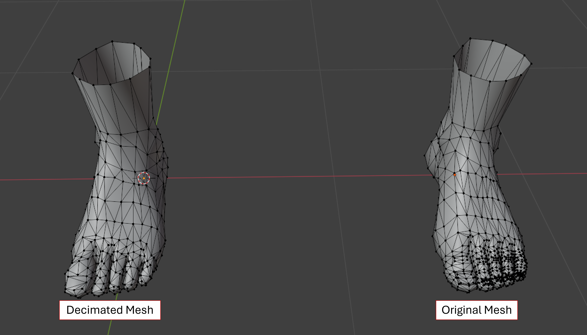

Here is a gif showing the specific areas that were targetted by the decimation algorithm. The vertices in `green` are from the original mesh and the ones in `red` are the ones shared across decimated and original.


We can see that the highly detailed modelling in the toenails has been reduced in the decimated gif, but most importantly, we see that both meshes share the same set of vertices.

And the vertices across both? Let's load the 2 meshes into meshlab.

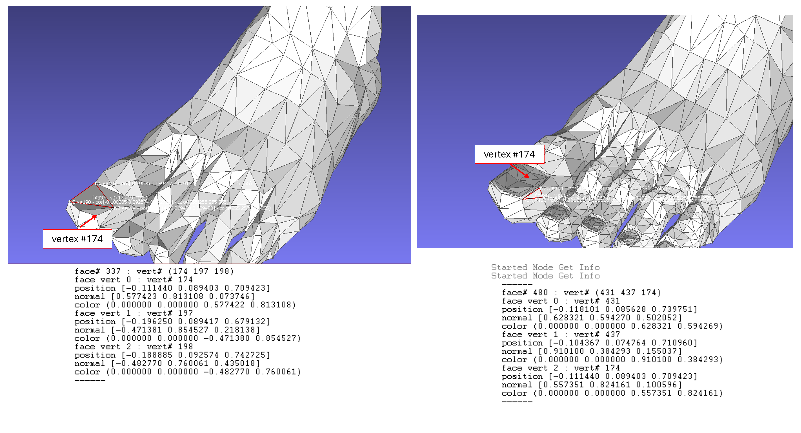

We see that vertex number 174 now shares the same index and location across both our meshes.

Converting both these files to glb and loadinf it to our [BatchedMesh with LOD](../optimizing-the-scene/batchedmesh-with-LOD.md) scene, this is what we're greeted with.


The LOD system now appears to be working as intended. If we zoom into these 2 frames specifically, we can see that the finer details of the toenails are only appearing when we zoom in past a point ->

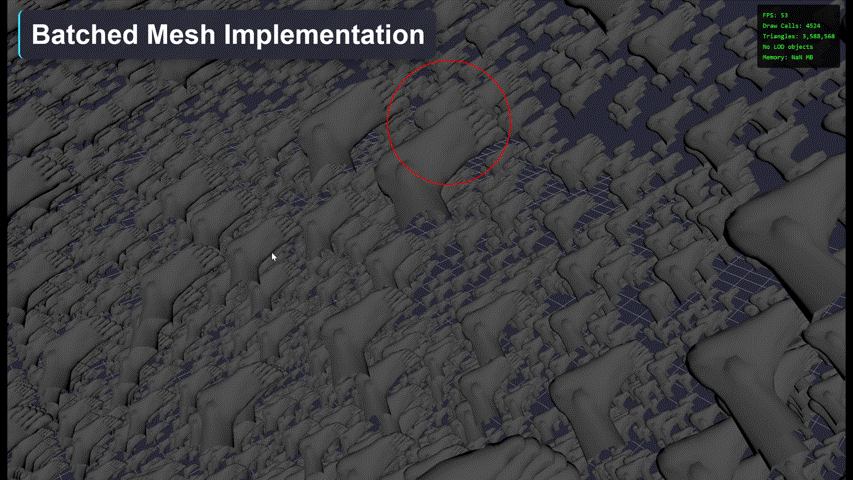

## Conclusion

Through this endeavour, we established that tight control over the vertex structure in 2 meshes can help reduce memory usage in a scene, as well as enable strong LOD control. I was not able to find a one-stop solution for addressing this workflow, hence developing our current implementation into a reproducible package will be one of the next steps.

As well, we extend this knowledge out the the `sixty-5` BIM model being explored in [the batchedMesh with LOD](../optimizing-the-scene/batchedmesh-with-LOD.md) implementation. Successfully implementing this workflow will theoretically have discrete and measureable performance improvements over the original scene.

Lastly, we shall wrap this function within another script that can load a collection of meshes (as is traditionally the case with BIM 3D models), such that we can conduct this operation in bulk on every item in our scene.

## Links

[MeshLab](https://www.meshlab.net/)

[PyMeshLab](https://pymeshlab.readthedocs.io/en/latest/)

[human foot model](../../models/foot/human-foot-hires.glb)

[BatchedMesh with LOD](../optimizing-the-scene/batchedmesh-with-LOD.md)