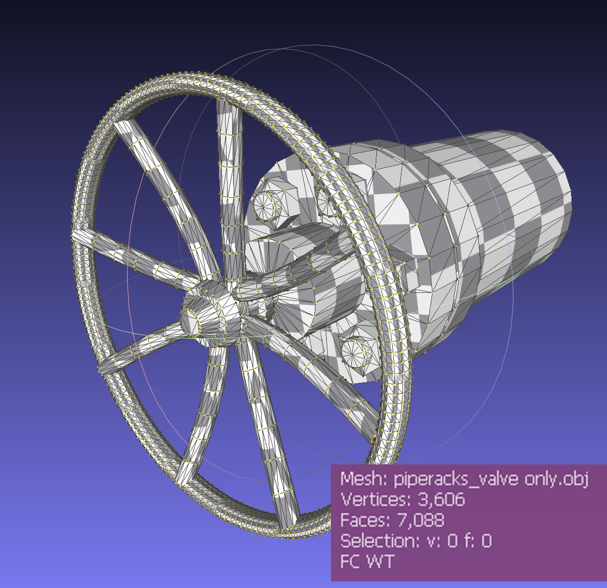
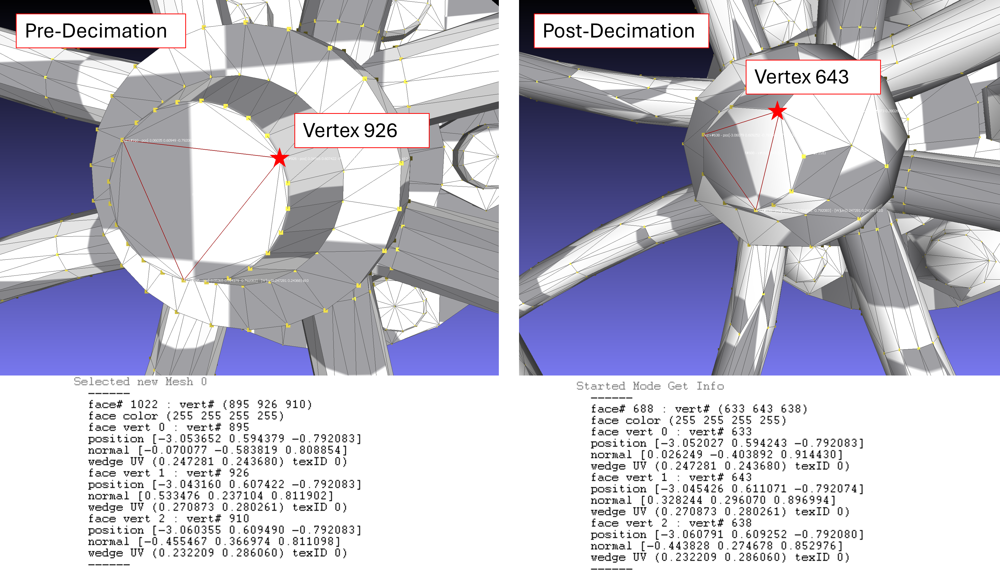

# Mesh Simplification Techniques

In this research we explore the basics of Mesh Simplification. In prior work we have explored the usage of the [edge collapse](analysis_decimate.md) algorithm in `Blender`. While powerful, the algorithm has certain drawbacks, namely that the orginal vertex structure is decimeted in the process and our compressed mesh is essentially treated as a completely new object, and not a subset representation of the original, as intended. As seen in the [batched-mesh-with-LOD](../optimizing-the-scene/batchedmesh-with-LOD.md) example, we require this object to be a subset of the original and so shall explore various techniques to achieve the same.

## Introduction to MeshLab

For the purpose of this work, we shall be working with an open source program known as [MeshLab](https://www.meshlab.net/). This software provides in depth tools for working with meshes and includes a Python based API, [PyMeshLab](https://pymeshlab.readthedocs.io/en/latest/).

## Problem Statement

Here, we load a simple model of a valve handle derived from the original [piperacks.glb](../hosting-3d-model/analysis_threejs.md) model file. Opening this with MeshLab shows the following statistics and image.

From the statistics, we see that the mesh has 3,606 vertices and 7,088 faces. The main handle of the valve hsas some extremely intricate geometry, which will be likely where we see the most decimation and edge compression. An important consideration here is that this model file is a closed-form manifold mesh. This means there are no gaps or open edges. This is likely a best case scenario, since our piping files will likely have open ends or "holes", where they connect to other pipes. We shall also address this form of geometry later.

For the time being, let's apply a simple decimation filter on our mesh. Here, we are using the simple Edge-Collapse with decimate filter, with a ratio of 0.4. These are the results -->

We observe familiar results, and note that our number of vertices in the mesh are down to 1,479 (approximately 40% of the original), as well as the faces down to 2,834 (approximately 40% of the original). However, we notice that the algorithm has created new meshes in this process of simplification.

Here, we track the face right in the center of our mesh before and after compression.

Before compression, our mesh in the center was composed of vertices indexed at (895, 926, 910). After compression, this face is now deformed and composed of the vertices (633, 643, 638). Our algorithm has essentially created a new mesh with different vertex indices.

This is in essence, the problem statement, and we shall explore various methods of compression which preserve the original vertex indices.

## Links

[MeshLab](https://www.meshlab.net/)

[PyMeshLab](https://pymeshlab.readthedocs.io/en/latest/)